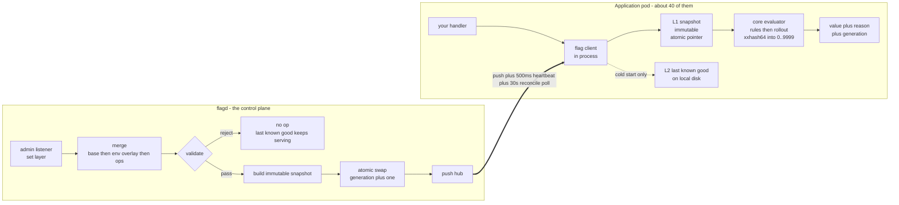

# feature-flag-service

Testing result : 
an operator walks a limit from 70 to 700 in steps of ten, 63 writes back to back. A series fails in ways
one write cannot: a step goes missing, two arrive out of order, a value moves
without its generation, or the client quietly falls back to the caller's default.
`test/e2e/ramp_test.go` asserts on the whole sequence. Two mechanisms, proving
two different things:

- **Completeness** — the foreground loop refuses to advance until the client has
  actually read the value just written. No step can be silently skipped.
- **Ordering** — a watcher goroutine samples the client every 200 µs underneath
  the entire ramp and the record is replayed at the end. Ordering is not a
  property any single read can show.
  
##### Service overview 
A feature flag service for Go backends: boolean, string and integer flags with
attribute targeting, sticky percentage rollouts, and per-environment config that
goes live in under five seconds without a restart.

Evaluation happens **in your process, against a cached snapshot** — an atomic
pointer load, a map lookup, a predicate walk and a hash, about 300 nanoseconds,
no network, and no way for the flag service to become your outage.

> **Status: under construction.** Design is complete and signed off —
> [HLD](docs/02-hld.md), [LLD](docs/03-lld.md), [ADRs](docs/adr/README.md) — and
> the code is landing phase by phase against [`PLAN.md`](PLAN.md). The evaluation
> core, config layer, transport, observability and client packages exist and are
> under active development; treat exported signatures as unfrozen until the phase
> that owns them passes its verification gate.

---

## The numbers the architecture is built for

| | |
|---|---|
| Backend throughput | **12,000 RPS** sustained, 24,000 assumed peak |
| Flags per request `F` | **30 typical, 100 at p99** |
| **Peak evaluation rate** | **2,400,000 evaluations/sec** |
| Evaluation budget | **sub-millisecond**, per call |
| Addressable users | **1,000,000,000** |
| Config propagation | **under 5 seconds**, no restart. Measured worst case **2,040 ms** |
| Availability posture | evaluation must survive a **total** flag-service outage |

**The unit of load is evaluations, not requests.** `F` is invisible in the "12,000
RPS" figure a product team quotes, and multiplying it out is the step most capacity
plans skip. 12,000 x 30 is 360,000 evaluations/sec at steady state; 24,000 x 100 is
2.4 million at peak. The design has to hold at the second number.

## The one insight that explains the whole design

Do the arithmetic on the obvious architecture — the app calls the flag service to
evaluate a flag — and it disqualifies itself twice:

| Path | p50 | p99 | Sub-millisecond? |
|---|---|---|---|
| Remote RPC per evaluation, F=100 | 44 ms | **208 ms** | No. Off by 200x — it is 100 sequential round trips |
| Remote RPC, batched into one call | 0.44 ms | **2.08 ms** | No. Misses by 2x, before any load |
| **Local evaluation on a cached snapshot, F=100** | **~30 µs** | **~340 µs** | **Yes, ~3x margin** |
| Local evaluation, single flag | ~0.3 µs | ~3.4 µs | reference cost |

Those remote numbers are not slow code. They are scheduling, cross-AZ round-trip
time and TLS — irreducible. **No amount of server optimisation moves a network hop
under a millisecond at p99.** And the same design puts **2.4M RPC/sec** on the flag
service at peak, which is a second tier-1 distributed system to build and to be
paged for.

So evaluation is **local, against a snapshot the client caches**, and the flag
service becomes a **control plane** rather than a request-path dependency. Two
things follow, and they are the whole point:

**Caching converts an O(traffic) problem into an O(pods) one.**

| | Without the cache | With the cache |
|---|---|---|
| Flag service RPS | **2,400,000/s** at peak | **~0** |
| Load driven by | user traffic | fleet size and config change rate |
| Scaling trigger | every traffic spike | adding a pod, or editing a flag |
| Capacity plan | a second tier-1 system | a control plane |

At 40 pods serving 12,000 RPS the flag service holds 40 long-lived streams and
pushes on change. **Traffic could grow 100x without it noticing.**

**Availability decouples.** A per-request RPC makes your effective availability
`min(app, flag service)` — a 99.9% flag service caps your app at 99.9% and adds its
outages to yours. Cached, a flag-service outage degrades config *freshness* and
nothing else. That is the stronger argument, stronger than latency, and it is what
"evaluation survives a total outage" actually requires.

Full derivation: [ADR-0006](docs/adr/0006-client-cached-snapshot.md).

## Sticky bucketing is computed, never stored

A percentage rollout must be sticky — the same user in the same bucket on every
call, in every process, forever. The usual implementation stores the assignment.

```
bucket = multiply_shift( xxhash64( namespace + 0x1F + subject ), 10000 )
```

Nothing is read, nothing is written, nothing is remembered.

| Approach | Memory at 1B users | Verdict |
|---|---|---|
| Store user → bucket | 1B x ~16 B = **~16 GB per flag**, replicated, invalidated, kept consistent | non-starter |
| **Compute per evaluation** | **0 bytes. O(1), independent of population** | the design |

**This is why one billion users appears nowhere in the capacity model.** A billion
users and a thousand users cost exactly the same. The bucket space is 10,000 —
basis-point granularity, 100,000 users per bucket at 1B users, so sampling error is
irrelevant and the only real risk is hash quality. Which is why the hash choice got
[its own ADR](docs/adr/0005-xxhash-and-bucket-space.md).

## Quick start

> `internal/core` is implemented. `pkg/client` landed while this was written, so
> treat its signatures as current-but-not-yet-frozen until Phase 8 closes.

```go
import (
    "github.com/HarshSingh21/feature-flag-service/internal/core"
    "github.com/HarshSingh21/feature-flag-service/pkg/client"
)

// Who is being evaluated. Passed by value; a nil Attributes map is valid.
// UserID and TenantID are addressable as attributes, so a targeting rule can
// match on them without a special case in the matcher.
ec := core.EvalContext{
    UserID:   "u-8412",
    TenantID: "acme",
    Attributes: map[string]core.Value{
        "country":     core.String("IN"),
        "plan":        core.String("pro"),
        "app_version": core.String("2.14.0"),
    },
}

// The third argument is YOUR default, and it is the terminal fallback: it is
// what you get if the flag is unknown, mistyped, or if evaluation faults.
// This call cannot return an error and cannot panic.
if c.BoolValue(ctx, "checkout_v2", false, ec) {
    return newCheckout(ctx)
}
return legacyCheckout(ctx)

// When you need to know WHY - for a log line, or during an incident:
res := c.BoolDetail(ctx, "checkout_v2", false, ec)
log.Info("flag",
    "value", res.Value,           // core.Value - typed, never coerced
    "reason", res.Reason,         // RULE_MATCH, ROLLOUT_IN, FLAG_NOT_FOUND, ...
    "rule_id", res.RuleID,        // set when Reason is RULE_MATCH
    "bucket", res.Bucket,         // 0..9999, or -1 if no rollout was consulted
    "generation", res.Generation, // which config version answered
)

// At the p99 request shape of 100 flags, Batch is mandatory rather than a
// convenience: it pins the snapshot ONCE for the whole set, so every flag in
// one request is answered by the same config generation (invariant CACHE-1).
results := c.Batch(ctx, reqs)
```

Every evaluation returns a `Reason`. That is deliberate: *"the flag returned
false"* is not actionable at 3am; *"rule `r-country-in` did not match and the user
bucketed at 7431 against a threshold of 2000"* is. `Reason` is low cardinality by
construction and safe as a metric label — `RuleID` is not, and belongs in the log
line only.

`core.Value` never coerces. `String("true")` is not a bool and `String("1")` is not
an int, because a config file that reads `enabled: "false"` must not switch a flag
on. A JSON number with a fractional part is rejected rather than truncated.

## Architecture



Three invariants hold the read path together:

- **CACHE-1 — pin the snapshot once per request, not once per flag.** Otherwise a
  swap landing mid-request gives you flag A from generation N and flag B from
  generation N+1, and that bug is not reproducible from a report.
- **CACHE-2 — build then swap, never mutate.** A concurrent map read and write in
  Go is a *fatal runtime error*, not a panic, and `recover()` cannot catch it. This
  is a correctness requirement, not a preference.
- **CACHE-3 — the read path performs no I/O.** No network, no disk, no lock. An
  unknown flag is an *answer* (`FLAG_NOT_FOUND` plus your default), never a cache
  miss to be filled. The cache is populated by the write path, as the last stage
  of the merge pipeline.

Propagation is push, plus a 500 ms generation-bearing heartbeat, plus a 1,500 ms
dead-stream threshold, plus a 30 s reconcile poll. Worst case across **all**
delivery paths is 2,040 ms against the 5 s budget. Freshness is asserted by
generation equality, never by connection state — a connected client serving stale
config is the dangerous failure, not a disconnected one.

## Decision log

The five decisions that shaped everything above. Each has an ADR with the
alternatives and what they cost.

| # | Decision | Why it is not arbitrary |
|---|---|---|
| **O1** | **Bucketing key is `bucket_namespace`, a configurable salt that defaults to the flag key.** Empty → every flag buckets independently; the same literal on two flags → deliberately correlated | Independent-by-default stops one unlucky cohort absorbing every canary in the company. The shared salt is the brief's opt-in sharing, expressed as one config field. [ADR-0001](docs/adr/0001-bucketing-key.md) |
| **O2** | **Rules first, rollout on fallthrough.** First matching rule returns and stops; the rollout runs only for subjects that fell through every rule. Written as an explicit `evaluation_order` field, never an implicit default | The orderings accept byte-identical config, so a default would make any later change a silent behavioural migration across every flag at once. [ADR-0008](docs/adr/0008-evaluation-order.md) |
| **O3** | **Both: reject at config time AND fail safe at evaluation time.** Ambiguous config is rejected outright; a rejection is a no-op on the cache, not a flush. Per-flag quarantine so one bad flag cannot freeze an environment | Validation stops bad config entering; fail-safe stops anything that got through — including a corrupted snapshot or a panic — from reaching the caller as an error. Belt and braces, because the never-throw contract has no second chance |
| **O4** | **Hybrid propagation: push, a 500 ms generation-bearing heartbeat, a 1,500 ms dead-stream threshold, and a 30 s reconcile poll** | A 2 s poll loses on worst case, on typical case by 22x, **and** on cost — 2,500 rps versus 167 at 5,000 clients. Dominated on every axis. The heartbeat exists for the silently dead stream, which is the failure the push path cannot see |
| **O5** | **The client caches a resolved snapshot and evaluates locally** | 208 ms p99 and 2.4M RPC/sec, versus ~340 µs and ~0. Decided by arithmetic. [ADR-0006](docs/adr/0006-client-cached-snapshot.md) |

Also recorded: [rule lists merge by replace-or-append](docs/adr/0002-rule-list-merge.md),
[an absent attribute makes a condition false before negation](docs/adr/0003-absent-attribute-is-false.md),
[no REGEX operator](docs/adr/0004-no-regex-operator.md),
[xxhash64 as a wire format](docs/adr/0005-xxhash-and-bucket-space.md),
[stdlib-only metrics](docs/adr/0007-stdlib-only-metrics.md).

## Layout

Imports point inward. Ring N may import ring < N; nothing imports outward, ever.

| Path | Ring | Contract |
|---|---|---|
| `internal/core` | 0–1 | Domain types and the evaluation engine. Imports **nothing that performs I/O** — no logger, no clock, no `net/*`, no `os`. Errors are returned as data (`Result.Reason`) |
| `internal/config` | 2 | Base + environment overlay merge, validation, and resolution to an immutable snapshot. All the cost lives here, on the write path |
| `internal/transport/http` | 3 | Evaluate single and batch, plus `/health`, `/ready`, `/live` |
| `internal/transport/safe` | 3 | The **only two** `recover()` sites in the codebase: the per-request handler and the snapshot-compile goroutine |
| `internal/obs` | 3 | Structured logs, metrics, trace propagation |
| `pkg/client` | — | The importable client. Holds the snapshot, evaluates locally, never blocks, never throws |
| `cmd/flagd` | — | The service binary. Evaluation and admin on **separate listeners**, so a config-push storm cannot starve evaluation |
| `docs/adr/` | — | Decisions that are expensive to reverse |

`internal/core` compiles into **both** the service binary and the client library.
There is one evaluator, so there is no second implementation to diverge — that is
the structural answer to "a client-side cache means two evaluators."

A `recover()` inside `internal/core` is a review reject. The core has nothing to
recover from, and that constraint is what makes the never-throw contract fuzzable
rather than aspirational.

## Build, test, run

Go 1.26 or later. `make` with no target lists everything.

```sh
make build        # compile bin/flagd
make test         # go test -race ./...   <- the merge gate
make test-short   # fast loop, skips distribution and propagation tests
make cover        # race-enabled coverage, HTML report
make bench        # benchmarks with allocation counts
make lint         # golangci-lint (advisory today)
make fmt          # gofmt -s -w .
make ci           # exactly what CI runs, in CI's order
make run          # go run ./cmd/flagd
```

`make test` runs with `-race` and that is not negotiable: the propagation design
rests on an atomic pointer swap under concurrent readers, and a race there is not
a flaky test — it is an uncontainable production failure mode.

Contribution rules, commit format, and the **bucketing golden vector warning** are
in [CONTRIBUTING.md](CONTRIBUTING.md).

## Limitations

Stated plainly, because a README that only lists strengths is marketing.

- **In-memory only. All config is lost on restart.** There is no database and no
  persistence layer. A restarted service has an empty corpus while clients keep
  serving snapshots it can no longer reconcile against. This is the largest
  standing risk in the design; the mitigation is that the config-apply audit log
  ships off-box and is replayable, and it is the first thing Phase 2 addresses.
- **Single region.** No cross-region replication, no geo-distributed control plane.
- **No admin UI.** Config arrives through the admin API (`set`), which is expected
  to be driven by CI. There is no console, no approval workflow, and no
  who-changed-what view beyond the audit log.
- **No persistence for the audit trail** beyond what is shipped off-box.
- **Kill switches do not propagate during a total flag-service outage.** There is
  no hard cache expiry, deliberately — expiring would convert a freshness problem
  into an availability outage. This is the accepted cost of never failing closed.
- **A cold pod during a total outage serves compiled-in defaults.** Startup does
  not block on the flag service, because making it a hard dependency of every
  deploy and every restart is strictly worse than the problem flags solve. The L2
  disk cache narrows this window; it does not close it.
- **Silent fail-open is the characteristic failure mode.** A degraded client
  returns your defaults for everything and nothing errors. `flag_client_fallback_total`
  must be alerted when it is unexpectedly **low** as well as high — a metric that
  is always zero is usually a metric that is not wired up. Without that alert this
  design is a trap.
- **No time-based targeting.** In a client-cached model it is a distributed clock
  problem; as a cron calling `set()` it is a single-machine one. Deferred on
  purpose.
- **No `REGEX` operator** — see [ADR-0004](docs/adr/0004-no-regex-operator.md) for
  why, including the concession that Go's RE2 makes the usual ReDoS argument
  invalid.
- **Bucketing inputs are effectively immutable after the first production
  rollout.** Changing one re-buckets everybody, silently, with every dashboard
  green.

## License

[MIT](LICENSE) — copyright 2026 Harsh Singh.
