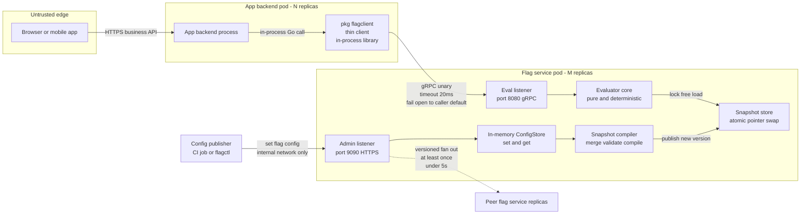
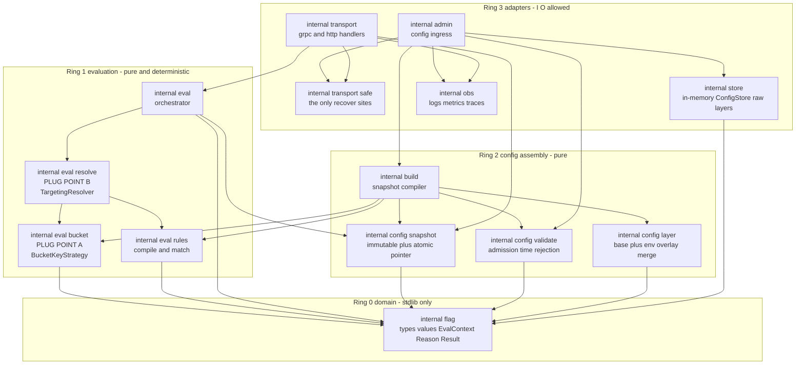
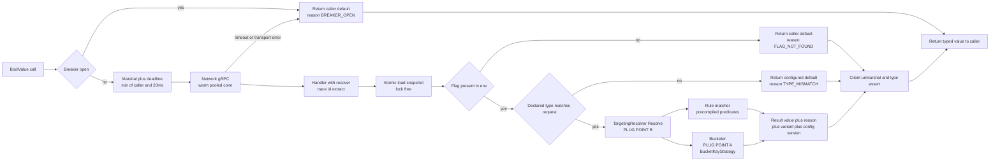
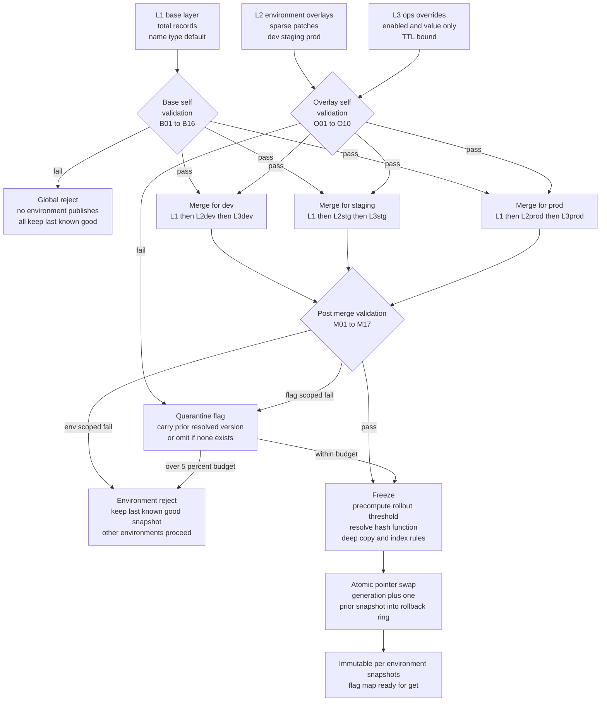
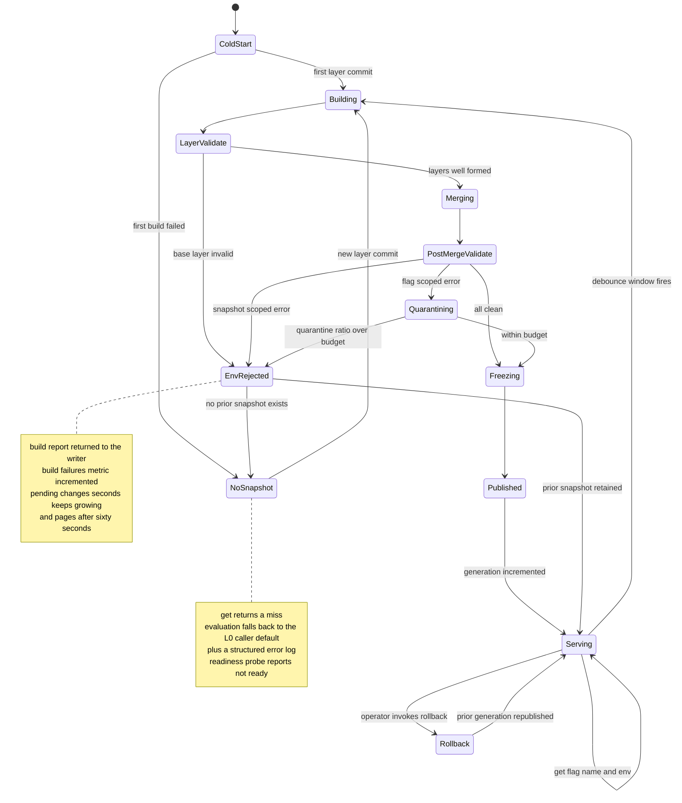
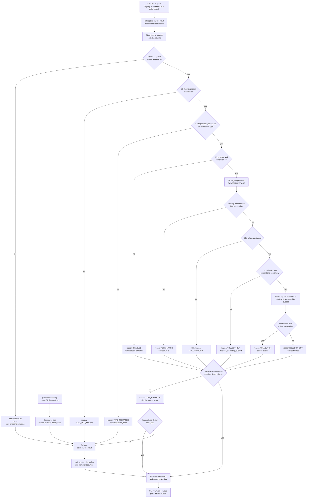
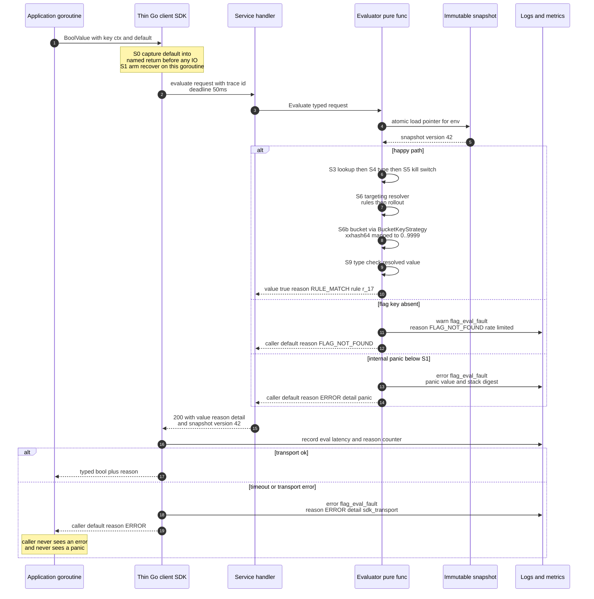
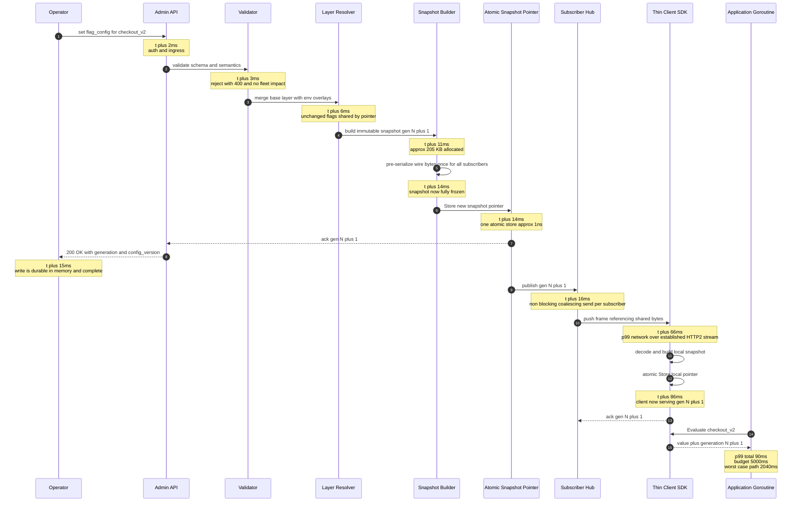
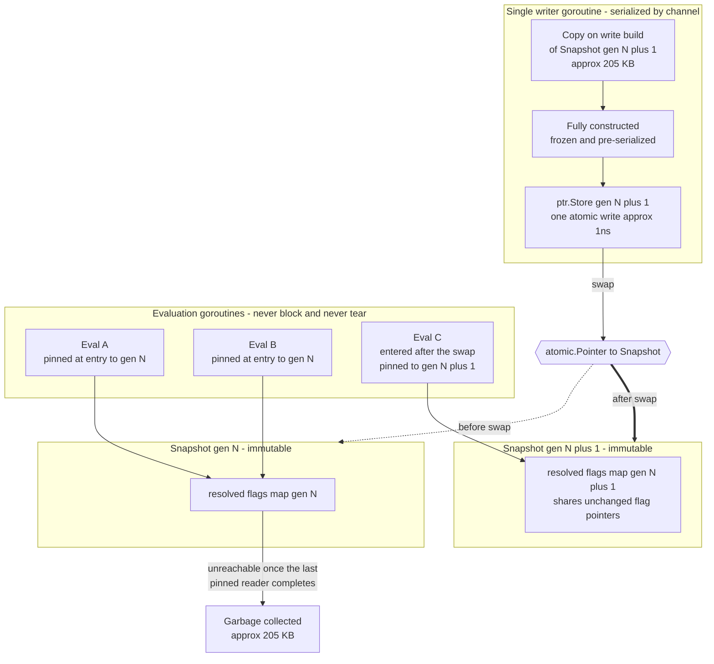
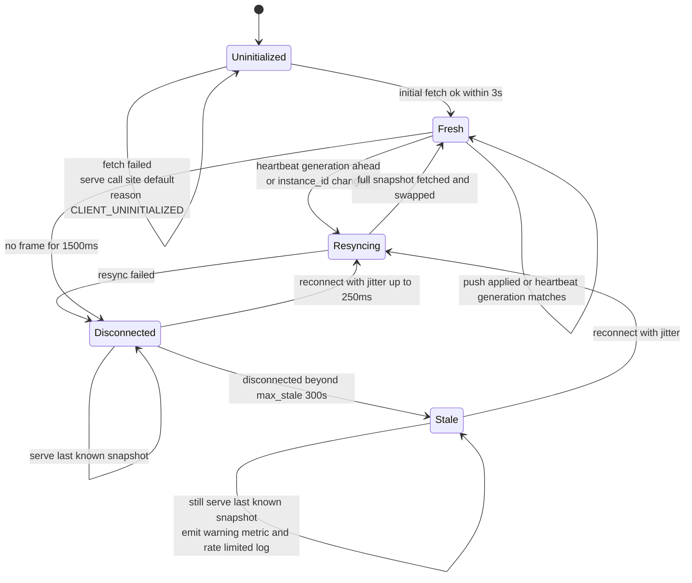

# 02 — High-Level Design: Feature Flag Service

**Status:** DRAFT — pending VERIFICATION GATE 1
**Date:** 2026-08-28 · **Owner:** harsh
**Companion:** [`PLAN.md`](../PLAN.md) Phase 1 · Diagrams also extracted to [`diagrams/hld.md`](diagrams/hld.md)

---

## Locked context

| # | Decision | Value |
|---|---|---|
| L1 | Deployment shape | Standalone Flag Evaluation Service + thin Go client |
| L2 | Language | Go 1.21+ |
| L3 | Evaluation locus | Backend service ONLY — client tier never evaluates |
| L4 | Config layering | Helm-style base layer + per-environment overlays |
| L5 | Persistence | In-memory only |
| L6 | Flag types | boolean, string, integer |
| L7 | Never-throw | Internal error returns the default + structured error log |
| L8 | Propagation | Under 5 seconds, no restart |

## Still open — yours to decide

| # | Question | Where it plugs in |
|---|---|---|
| O1 | Percentage-rollout bucketing key | `BucketKeyStrategy`, stage S6b |
| O2 | Rule vs rollout precedence | `TargetingResolver`, stage S6 |
| O3 | Misconfiguration posture | §B.6 validation table |
| O4 | Update consumption — pull, push, hybrid | §D.2 |
| O5 | **Does the thin client cache config?** — §A and §D disagree | §A.6 vs §D.5 |

**O5 is a conflict this design surfaced, not a question from the brief.** Section A argues
the client must hold no config snapshot, because a client-side snapshot is a second
evaluator that must agree with the first — and with O1 and O2 still open, divergence is
guaranteed. Section D designs a client-cached snapshot with a staleness bound and no hard
expiry. Both are defensible; they imply different propagation protocols. Resolve before Phase 2.

**O1 and O2 must be closed in one ADR, not two** — see §C.9. Rollout-nested-in-rules raises
a question the other orderings never ask: whether two rules on one flag share a bucket space.

---

## Table of contents

| § | Section | Lines |
|---|---|---|
| A | System decomposition and component architecture | ~540 |
| B | Layered configuration model and resolution pipeline | ~820 |
| C | The evaluation engine — targeting, bucketing, type safety, fail-safe | ~820 |
| D | Live update propagation, concurrency, and operability | ~770 |

---

### A. System Decomposition and Component Architecture

#### A.0 The shape in one paragraph

Two deployables. The **app backend** hosts the thin client as an in-process Go library; the **Flag
Evaluation Service** is a separate process holding a compiled, immutable config snapshot behind an
`atomic.Pointer`. Exactly one network hop exists on the read path. The write path (admin ingress →
ConfigStore → snapshot compiler) lives inside the same flag-service binary on a **separate listener**,
and does all expensive work — merging, validating, compiling rules, resolving percentage thresholds —
so the read path is a pointer load, a map lookup, a predicate walk, and a hash. The flag service makes
**no downstream calls of any kind** during evaluation, so its p99 is a function of its own CPU and GC
only.

---

#### A.1 Container view

##### A.1.1 Deployables

| # | Container | Deployable | Replicas | State held | Restart cost |
|---|---|---|---|---|---|
| 1 | App backend | existing service binary | N | none flag-related except a gRPC conn + breaker | none |
| 1a | `pkg/flagclient` thin client | **in-process library inside #1** | — | one `grpc.ClientConn`, one breaker, optional bounded LRU | none |
| 2 | Flag Evaluation Service (`flagd`) | new binary | M ≥ 3 | full in-memory config, all envs | **config lost — see A.1.4** |
| 2a | Eval listener | goroutine/listener inside #2, port 8080 | — | — | — |
| 2b | Admin ingress | goroutine/listener inside #2, port 9090 | — | — | — |
| 2c | ConfigStore + snapshot store | in-process inside #2 | — | raw layers + compiled snapshot | — |
| 3 | Config publisher | CI job or `flagctl` CLI | ad hoc | authoritative config source of truth | — |

The **admin ingress is not a separate deployable.** It is the same binary on a different port. Three
reasons, all operational: (1) network policy can expose 8080 to the service mesh while binding 9090 to
an ops-only path; (2) a separate `http.Server` has its own accept queue and connection limits, so a
config-push storm cannot starve the eval accept queue; (3) different authn — mTLS/SPIFFE peer identity
for eval, signed operator token for admin. Splitting it into its own deployable buys nothing in Phase 1
and adds a second thing to page on.

##### A.1.2 What crosses which boundary

| From → To | In-process or wire | Protocol | Sync | Payload | On failure |
|---|---|---|---|---|---|
| App code → thin client | **in-process** | Go func call | sync | typed args + `EvalContext` | client returns caller default; cannot fail |
| Thin client → eval listener | **wire** | gRPC unary over HTTP/2, warm pooled conn | sync | `EvaluateRequest` / `EvaluateBatchRequest` | **the only hop that can fail** → fail-open to caller default |
| Eval handler → evaluator core | in-process | Go call, `recover()` at the boundary | sync | `(*Snapshot, req)` | pure; returns `Result` with `Reason`, never errors out-of-band |
| Evaluator → snapshot store | in-process | `atomic.Pointer.Load()` | sync | pointer | cannot fail; lock-free, never blocks on a writer |
| Publisher → admin ingress | **wire** | HTTPS + signed token, internal network only | sync | layered flag config doc | 4xx on validation reject; live snapshot untouched |
| Admin ingress → ConfigStore | in-process | `set(flag_config)` | sync | raw layer | — |
| ConfigStore → snapshot compiler → snapshot store | in-process, **async goroutine** | channel + pointer swap | async | compiled `*Snapshot` | compile failure leaves previous snapshot live and increments `config_compile_failed_total` |
| Flag replica → peer replicas | **wire** | async versioned fan-out | async, at-least-once, idempotent by `(flag, env, version)` | config delta | retry with backoff inside the 5s budget; divergence alarm on version skew |

##### A.1.3 The read path touches no wire except one

Browser/mobile never see the flag service — they call the app backend's business API. The flag service
has **zero egress** on the read path: no DB, no cache, no auth service, no downstream flag provider.
That is the property that makes a 20 ms client timeout defensible.

##### A.1.4 The bootstrap property of an in-memory-only store

A fresh replica starts with an **empty** snapshot. An empty snapshot is not a broken state — every
lookup misses, every miss returns the **caller-supplied default**, which is the safe value by
construction. So a total fleet restart degrades to "everything at its compile-time default" rather
than to an outage. The publisher (#3) is the reconciler: it re-applies on replica-added events and on a
slow periodic sweep. This is the honest cost of "in-memory only" and it is worth naming rather than
hiding. Detailed convergence protocol belongs to the config-propagation section.

##### A.1.5 Container diagram



---

#### A.2 Component view inside the Flag Service

##### A.2.1 The dependency rule

**Imports point inward. Ring N may import Ring < N. Nothing imports outward. Ever.**

The core (`internal/flag`, `internal/eval/**`) MUST NOT import: any transport package, the store, the
admin package, the observability package, any logger, any metrics registry, `net/*`, `os`, or a clock.
It may import stdlib data structures and a hash library, nothing else.

This is not aesthetics. It buys four concrete things:

1. **"Never panics" becomes testable.** The evaluator is a pure function `f(snapshot, req) → Result`.
   You can fuzz it to exhaustion in CI with no fixtures, no network, no goroutines.
2. **No hidden I/O in the hot path.** If the core cannot import a client, nobody can accidentally add a
   lookup inside the matcher during a Friday deploy.
3. **Determinism.** Same snapshot + same `EvalContext` → same `Result`, byte for byte. That is what
   makes sticky bucketing provable and makes an incident reproducible from a log line.
4. **Errors become data.** The core cannot log, so it must *return* `Result{Value, Reason, Err}`. The
   transport layer maps `Reason` to a log line and a metric. One place decides how errors surface.

Panic containment is at **exactly two** places, not sprinkled: the per-request transport handler, and
the snapshot-compile goroutine. Both live in `internal/transport/safe`. A `recover()` anywhere in the
core would be a code-review reject — the core has nothing to recover from.

`pkg/flagclient` must not import `internal/*` (Go enforces this for external consumers; enforce it
internally too via a lint rule). It depends only on `api/` — the generated wire contract.

##### A.2.2 Package contracts

| Ring | Package | Contract — one line | Imports | Purity |
|---|---|---|---|---|
| 0 | `internal/flag` | Domain vocabulary — `Flag`, `ValueType`, typed `Value`, `EvalContext`, `Reason`, `Result`. | stdlib only | pure |
| 1 | `internal/eval` | Orchestrates one evaluation — lookup, type check, delegate to the resolver, assemble `Result`. Never errors out-of-band. | ring 0, `snapshot`, `resolve` | pure |
| 1 | `internal/eval/resolve` | **PLUG POINT (b).** `TargetingResolver.Resolve` owns everything between *flag is enabled* and *we have a value* — rule/rollout precedence is entirely its concern. | ring 0, `rules`, `bucket` | pure |
| 1 | `internal/eval/rules` | Compiles a rule set at admission; matches a precompiled predicate tree against an `EvalContext`. | ring 0 | pure |
| 1 | `internal/eval/bucket` | **PLUG POINT (a).** `BucketKeyStrategy` composes the key bytes; hash and mapping are fixed — xxhash64 then multiply-shift into 0–9999 basis points. | ring 0 | pure |
| 2 | `internal/config/layer` | Deterministic Helm-style merge — BASE defaults plus one env OVERLAY, deep merge, last-writer-wins per leaf. | ring 0 | pure |
| 2 | `internal/config/validate` | Admission-time rejection — declared type vs variations vs rule operand types, `basis_points` in `[0,10000]`, name charset, duplicate rule ids, unknown `StrategyName`. | ring 0 | pure |
| 2 | `internal/config/snapshot` | Immutable compiled snapshot + `atomic.Pointer` publish/load. Readers never lock. | ring 0 | pure |
| 2 | `internal/build` | The compiler — drives `store → layer → validate → rules.Compile → snapshot.Publish`. Owns the write-path cost. | rings 0–2 | pure given input |
| 3 | `internal/store` | In-memory `set(flag_config)` / `get(flag_name, env)` over **raw unmerged layers**, plus a version counter and change notification. | ring 0 | stateful |
| 3 | `internal/admin` | Admin ingress — parse, authz, hand to validate, promote version, fan out to peers. | rings 0–3 | I/O |
| 3 | `internal/transport/grpc`, `.../http` | Eval API — decode, deadline check, `recover()`, call `eval`, encode. Maps `Reason` to logs/metrics. | rings 0–3 | I/O |
| 3 | `internal/transport/safe` | The only two `recover()` sites in the codebase. | stdlib | I/O |
| 3 | `internal/obs` | Structured logs, metrics, trace propagation. Imported by ring 3 only. | stdlib + otel | I/O |

**Note the ConfigStore stores raw layers, not merged config.** Merging at write time and storing the
raw layers preserves the ability to answer "what did BASE say vs what did the prod overlay say" — which
is the first question anyone asks in an incident. The merged form only ever exists inside a compiled
snapshot.

**`internal/build` imports `internal/eval/rules`** (ring 2 → ring 1, inward, legal) because rule
compilation is a rules concern executed on the write path. Compile and match live in the same package
so they cannot drift.

##### A.2.3 The two plug points — exactly where each open question lands

Both open questions are deliberately *not* resolved here. Both are designed to be answered by a **config
value**, not a code change, and both ship with all candidate implementations present and
conformance-tested so the decision is cheaply reversible.

**(a) Percentage-rollout bucketing key → `internal/eval/bucket`, interface `BucketKeyStrategy`**

Only the *key composition* varies; hash and mapping are fixed (see section C). Each flag's
`Rollout.StrategyName` names an implementation from a registry built at process start, falling back to a
service-level default. **Snapshot-compile time** resolves the name once and binds the concrete
implementation to the compiled flag, so the read path does no registry lookup. An unknown name is a
snapshot-build rejection, never a silent fallback — a silent fallback is a silent reshuffle of every
live rollout.

> **Open question the user owns:** which strategy is the default. The decomposition is indifferent; the
> shape already supports both halves of the requirement — a flag-name-salted key gives independent
> buckets per flag, a shared-salt key gives one cohort across every flag naming that salt.

**(b) Targeting-rules vs percentage-rollout precedence → `internal/eval/resolve`, interface `TargetingResolver`**

`Resolve` owns everything between "flag is enabled" and "we have a value", so precedence is an
*implementation detail of one interface* rather than a shape baked across the evaluator. Three
implementations ship — `rulesFirstResolver`, `rolloutGateResolver`, `nestedRolloutResolver` — and the
conformance suite runs the golden-fixture set against all three.

> **Open question the user owns:** which resolver is wired. Note the reversibility is *not* uniform:
> swapping rules-first ↔ rollout-gate silently reinterprets identical config and needs an explicit
> `precedence` field to avoid a footgun, while moving to nested rollouts is a config-shape migration.
> Section C carries the full comparison. The decomposition's only job is to ensure all three plug into
> one seam.

Whichever way both land, every `Result` carries a `Reason` — `RULE_MATCH`, `ROLLOUT_IN`, `ROLLOUT_OUT`,
`FALLTHROUGH`, `DISABLED`, `FLAG_NOT_FOUND`, `TYPE_MISMATCH`, `ERROR`, plus the client-side-only
`BREAKER_OPEN` — together with the `config_version` that produced it. That pair is what makes either
choice debuggable after the fact, and it is non-negotiable regardless of how the questions resolve.

##### A.2.4 Misconfiguration posture — both ends

Reject at admission **and** fail safe at evaluation. `internal/config/validate` is pure and cheap, so
running it on every write costs nothing; a rejected config returns 4xx and the **previous snapshot stays
live** — a bad push cannot take the fleet down. Any state that somehow survives validation still hits
the evaluator's type check and returns the configured default with a `Reason`. Defence in depth, because
the validator and the evaluator are written by different people at different times.

##### A.2.5 Component diagram



---

#### A.3 Proposed Go repo layout

```
flagsvc/
├── cmd/
│   ├── flagd/                  # Flag Evaluation Service binary - wires listeners, store, compiler
│   └── flagctl/                # Operator CLI - push config to admin ingress, dry-run a merge
├── api/
│   ├── flag/v1/                # Protobuf wire contract - the ONLY thing pkg and internal share
│   └── gen/                    # Generated Go stubs - checked in, regenerated by make
├── pkg/                        # PUBLICLY IMPORTABLE - semver'd, no internal imports allowed
│   ├── flagclient/             # Thin client SDK - BoolValue StringValue IntValue EvaluateAll
│   │   ├── breaker/            # Circuit breaker - error-rate based, pure atomics
│   │   ├── fake/               # In-memory fake client for consumer unit tests
│   │   └── otel/               # Optional trace and metric wiring - kept out of the core client
├── internal/
│   ├── flag/                   # Ring 0 - domain types, zero dependencies
│   ├── eval/                   # Ring 1 - evaluator orchestrator, pure
│   │   ├── resolve/            # Ring 1 - PLUG POINT B - TargetingResolver rules-vs-rollout precedence
│   │   ├── rules/              # Ring 1 - targeting rule compiler and matcher
│   │   ├── bucket/             # Ring 1 - PLUG POINT A - BucketKeyStrategy registry plus fixed hasher
│   │   └── compiled/           # Ring 1 - the compiled read-optimised flag representation
│   ├── config/
│   │   ├── layer/              # Ring 2 - BASE plus env OVERLAY deterministic merge
│   │   ├── validate/           # Ring 2 - admission-time validation and rejection
│   │   └── snapshot/           # Ring 2 - immutable snapshot plus atomic.Pointer publish and load
│   ├── build/                  # Ring 2 - compiler pipeline store -> merge -> validate -> compile -> publish
│   ├── store/                  # Ring 3 - in-memory ConfigStore, raw unmerged layers, version counter
│   ├── admin/                  # Ring 3 - admin ingress handlers, authz, peer fan-out
│   ├── transport/
│   │   ├── grpc/               # Ring 3 - eval gRPC service
│   │   ├── http/               # Ring 3 - eval HTTP fallback plus health ready live
│   │   └── safe/               # Ring 3 - the two recover boundaries
│   └── obs/                    # Ring 3 - structured logging, metrics, trace propagation
├── test/
│   ├── golden/                 # Config fixtures plus expected Results - run against BOTH strategies
│   ├── conformance/            # Cross-cutting behavioural suite - the contract both plug points obey
│   └── fuzz/                   # Fuzz corpora for rules matcher and config validator
└── deploy/                     # Manifests, network policy separating port 8080 from port 9090
```

Layout calls worth defending:

- **`api/` is separate from both `pkg/` and `internal/`.** The client and the server both depend on the
  contract; neither depends on the other. Without this, the "thin" client acquires a transitive
  dependency on the evaluator and stops being thin.
- **`pkg/flagclient/fake` is shipped, not an afterthought.** It is the honest answer to every request
  for "let me evaluate locally in tests". Consumers get deterministic tests without a second evaluator.
- **`internal/eval/compiled` is its own package.** The compiled representation is shared between the
  write path (which produces it) and the read path (which consumes it), and it must not leak into the
  wire contract. Separating it stops `internal/flag` from accreting read-optimisation fields.
- **`pkg/flagclient/otel` is separate from `pkg/flagclient`.** Consumers who do not want the OTel
  dependency tree in their `go.mod` should not get it.

---

#### A.4 The hot read path, step by step

`client.BoolValue(ctx, "checkout_v2", evalCtx, false)` → `bool`.

| # | Where | Component | Work | Cost p50 | Can fail |
|---|---|---|---|---|---|
| 1 | client | `flagclient` | Validate flag name non-empty; capture caller default | ~50 ns | no — returns default |
| 2 | client | `flagclient/breaker` | Atomic read of breaker state. **Open → return default immediately, no network** | ~20 ns | no |
| 3 | client | `flagclient` | Deadline = `min(caller remaining, 20 ms)`. Zero remaining → return default | ~100 ns | no |
| 4 | client | `flagclient` | Marshal protobuf; attach trace id + env from client config | ~2 µs | no |
| 5 | **wire** | gRPC/HTTP-2, warm pooled conn, same AZ | **the network hop** | **~400 µs** | **yes** → default |
| 6 | server | `transport/grpc` + `transport/safe` | HTTP-2 framing, decode, trace id extract, `defer recover()`, server-side deadline check | ~12 µs | contained |
| 7 | server | `config/snapshot` | `snap := cur.Load()` — one atomic pointer load, **lock-free, never blocks on a writer** | ~1 ns | no |
| 8 | server | `eval` | `snap.Env[env].Flags[name]` — single map lookup on the precompiled per-env map | ~40 ns | miss → caller default, `FLAG_NOT_FOUND` |
| 9 | server | `eval` | Type check: `flag.ValueType == BOOL`. Precomputed enum compare | ~1 ns | mismatch → configured default, `TYPE_MISMATCH` |
| 10 | server | `eval/resolve` | **PLUG POINT (b)** — `TargetingResolver.Resolve` orders matcher vs bucketer | ~5 ns | no |
| 11 | server | `eval/rules` | Walk precompiled predicate tree; attribute keys interned, `IN` sets are maps, regexes precompiled | ~150 ns for 1–5 rules | no — unmatched is a normal outcome |
| 12 | server | `eval/bucket` | **PLUG POINT (a)** — compose key via the flag's bound `BucketKeyStrategy` into a stack scratch buffer, xxhash64, multiply-shift to 0–9999, compare to the precomputed basis-point threshold | ~80 ns | subject absent → deterministic `ROLLOUT_OUT`, never a random bucket |
| 13 | server | `eval` | Assemble `Result{Value, Reason, Variant, ConfigVersion}` | ~40 ns | no |
| 14 | server | `transport/grpc` + `obs` | Marshal, framing, emit metric, emit structured log **only** on an error `Reason` | ~12 µs | no |
| 15 | **wire** | return leg | included in the ~400 µs of step 5 | — | — |
| 16 | client | `flagclient` | Unmarshal; assert `BoolValue`; increment fallback counter if `Reason` is an error class | ~2 µs | no — returns default |

**Server CPU per evaluation: ~25 µs, of which the evaluator itself is ~0.3 µs — about 1 %.** Per-RPC
cost (HTTP-2 framing, decode, encode, flow control, goroutine scheduling, syscalls) is roughly
**eighty times** the evaluation cost. That single fact determines the optimisation strategy — see A.6.

##### Precomputed on the write path vs computed per request

| Precomputed at snapshot-compile time (write path, once per config version) | Computed per request (read path, every call) |
|---|---|
| BASE + env OVERLAY deep merge, per environment | `atomic.Pointer` load of the current snapshot |
| Flat per-env `map[flagName]*compiled.Flag` — no env indirection at read time | One map lookup |
| Rule predicate tree → interned attribute keys, `IN` lists → `map[string]struct{}`, `regexp.MustCompile` | Attribute extraction from `EvalContext` |
| Percentage → integer `basis_points` in `[0,10000]` — **no float arithmetic on the read path** | Predicate walk over the compiled tree |
| `Rollout.StrategyName` → concrete `BucketKeyStrategy` bound to the flag | Key bytes into a stack buffer, xxhash64, multiply-shift |
| Bucketing salt resolution | Integer compare against the precomputed threshold |
| Type validation, default coercion to the declared `ValueType` | `Result` assembly |
| Resolver selection → concrete `TargetingResolver` bound to the flag | — |

**No allocation on the happy path** is a design goal, not an aspiration: the compiled flag is read-only,
the `Result` is a value type, and the response buffer comes from a `sync.Pool`. Enforced by a
`testing.AllocsPerRun` assertion in CI, not by hope.

**Snapshot lifecycle and GC.** Publishing is copy-on-write: the compiler builds a whole new `*Snapshot`
and swaps the pointer. In-flight readers hold their own pointer and finish against the old version — a
request never sees a half-applied config. The old snapshot is freed once the last reader drops it, and
Go's GC handles reclamation for free. In C++ or Rust this would need hazard pointers or epoch-based
reclamation; in Go it is one line. That is a genuine reason the language choice fits the problem.

##### Hot-path decision flow



---

#### A.5 The thin client — responsibilities and non-responsibilities

##### A.5.1 Responsibilities

| Responsibility | Mechanism | Why it belongs in the client |
|---|---|---|
| Connection lifecycle | One shared `grpc.ClientConn`, HTTP/2 multiplexed, keepalive 30 s, **lazy connect — never `WithBlock()`** | App must boot with the flag service down |
| Deadline enforcement | `min(caller remaining, 20 ms)`; zero remaining → default without a call | The caller's budget is the real constraint |
| Fail-open | Any error — transport, deadline, decode, type mismatch, panic — returns the **caller-supplied** default | The API contract says it never throws |
| Circuit breaker | Error-rate breaker, ~10 consecutive failures or >50 % over a 10 s window, 5 s half-open probe | Stops an outage adding 20 ms × N to every request |
| Bounded concurrency | Semaphore capping in-flight calls; saturation sheds to default immediately | Protects the **app's** goroutine budget, not the flag service's |
| Batch and prefetch | `EvaluateAll(ctx, evalCtx, flags...)` returning a request-scoped result set | The single highest-leverage mitigation — see A.6 |
| Self-observation | `flag_client_fallback_total{reason}`, `flag_client_latency_seconds`, breaker state gauge | **The fallback counter is the most important metric in the system** |
| Trace propagation | Injects the caller's trace id into gRPC metadata | One trace id across the hop into the flag service's logs |

`flag_client_fallback_total` deserves emphasis. A fail-open design's characteristic failure is
**silence**: the flag service degrades, every call quietly returns defaults, the product behaves as if
every flag were off, and nobody is paged because nothing errored. That counter, alerted at a low
threshold, is what converts a silent behavioural outage into a page. Without it, this design is a trap.

##### A.5.2 Non-responsibilities — explicitly out

- **No rule matching, no bucketing, no precedence logic.** Not a line of it.
- **No config parsing or layer merging.**
- **No background config polling.** Zero goroutines beyond gRPC's own and one breaker ticker.
- **No retries on timeout.** A call that already blew its 20 ms budget must not be given another 20 ms;
  that converts one slow call into a slower one. Retry only on immediate connection-level failure
  (`UNAVAILABLE` before any bytes were sent), once, against the *same* shared deadline.
- **No blocking on construction.** `New()` never does network I/O.

##### A.5.3 Position: no local config snapshot in the client — a bounded decision cache instead

**Rejected: a full config snapshot cached in the client.** It is the same design as an embedded SDK
wearing a different hat, and it reintroduces exactly what the "evaluation happens only in the backend"
constraint was chosen to eliminate:

1. **Two evaluators that must agree.** Client and server would both implement bucketing and precedence.
   The first time they disagree — and they will, because the two plug points above are explicitly still
   open — you get a bug where the same user sees different values depending on which code path answered.
   That class of bug is close to unreproducible.
2. **A rules-engine fix becomes a fleet-wide binary rollout.** The whole point of a flag service is
   changing behaviour without a deploy. A client that evaluates locally can only get a matcher fix by
   redeploying every app backend that imports it.
3. **A second config propagation path** to build, monitor, and reason about the freshness of, with its
   own 5 s budget.
4. **Version skew becomes permanent.** Ten app services on eight different client versions means eight
   evaluator semantics live in production simultaneously.

**Accepted: an opt-in, bounded, short-TTL *decision* cache.** Keyed by
`(flagName, env, hash(evalCtx subset used))`, bounded LRU (default 10 k entries), TTL ≤ 5 s to match the
config propagation SLO. This is categorically different from a config cache: it memoises *answers*, not
*rules*. It cannot diverge in logic — only in freshness — and freshness is already bounded by the
propagation budget the system commits to anyway.

**Default posture: cache off; stale-serving per-flag opt-in.** When the breaker is open, the naive move
is to serve the last known good decision. That is wrong as a blanket default. Consider a kill switch: its
configured default is "feature off", which is the *safe* state, and serving a stale "on" during an
outage is precisely the wrong behaviour. So the flag config carries a `staleOnOutage` boolean, the server
returns it alongside the value, and the client honours it per flag. The operator who wrote the flag
decides whether stale or default is safer for that flag — because only they know.

| Client cache mode | Default | Behaviour when the flag service is unreachable |
|---|---|---|
| Off | **yes** | caller-supplied default, `Reason = BREAKER_OPEN` |
| Decision cache, `staleOnOutage = false` | — | caller-supplied default (cache is a latency optimisation only) |
| Decision cache, `staleOnOutage = true` | — | last known good decision if within a bounded staleness window, else default |

---

#### A.6 The critical trade-off — a network hop in the caller's hot path

This is the price of "evaluation in the backend service only", and it must be paid explicitly.

##### A.6.1 Failure modes, in order of danger

| # | Mode | Why it hurts | Mitigation |
|---|---|---|---|
| 1 | **Flag service slow, not down** | The dangerous one. Nothing errors; every caller goroutine simply *waits*. The app backend's own concurrency budget is consumed holding open requests. Cascades outward. | Hard 20 ms timeout; error-rate breaker treats slow as failed; **bounded in-flight semaphore in the client that sheds to default when saturated**; server-side admission control that returns a fast degraded response rather than queueing |
| 2 | **N flags per request → N round trips** | 8 flags at 0.4 ms = 3.2 ms added per request in the *good* case; at a 20 ms stall it is 8 × 20 ms of blocked goroutine-time | `EvaluateAll` batch at request entry; results held request-scoped |
| 3 | Flag service down | Loud and obvious | Fail-open to caller default + breaker; `flag_client_fallback_total` alert |
| 4 | Cross-AZ scheduling | RTT roughly doubles, silently, after an unrelated rebalance | Topology-aware routing; alert on p99 client latency, not just error rate |
| 5 | Silent fail-open | Everything "works", every flag reads as its default, product behaviour regresses, no alert fires | `flag_client_fallback_total` alerted at a low threshold — the single most important detector in this design |

##### A.6.2 The arithmetic that decides where to optimise

Per-RPC overhead (framing, decode, encode, syscalls) is ~30 µs. Evaluation is ~0.3 µs. For a request
needing 10 flags:

```
unbatched : 10 x (30 us overhead + 0.3 us eval) + 10 x 400 us network  = 4.3 ms
batched   :  1 x (30 us overhead + 10 x 0.3 us) +  1 x 420 us network  = 0.45 ms
```

Roughly a **10x reduction**, and it comes entirely from call count. Micro-optimising the matcher would
move ~0.3 µs of a ~450 µs budget. **Batching is the design; evaluator speed is a rounding error.**

Little's Law on blocked goroutines in the app backend, 2 000 req/s each needing 8 flags, during a full
20 ms stall:

```
unbatched : L = 16 000 calls/s x 0.020 s = 320 goroutines blocked
batched   : L =  2 000 calls/s x 0.020 s =  40 goroutines blocked
```

Batching is not a latency nicety — it is an **8x reduction in blast radius** when the dependency
degrades. Alongside that: server capacity is trivial. One core at ~10 µs per evaluation serves ~100 k
evals/s, so 16 000 evals/s costs ~0.16 core. **The flag service is network- and syscall-bound, never
evaluation-bound.** Size it for connections and RPC overhead, not for CPU.

##### A.6.3 Latency budget split

Target: **added p99 latency per request ≤ 3 ms** for a batched evaluation, p50 ≤ 1 ms.

| Segment | p50 | p99 | Notes |
|---|---|---|---|
| Client overhead — validate, breaker, marshal, unmarshal, type assert | 15 µs | 80 µs | pure CPU, zero allocation on the happy path |
| **Network — gRPC over warm pooled conn, same AZ** | **400 µs** | **1 800 µs** | **the dominant term.** Cross-AZ adds 0.8–1.5 ms |
| Server — transport + queueing + snapshot load + eval | 25 µs | 200 µs | evaluation itself is ~0.3 µs; the rest is RPC handling and queueing |
| **Total added** | **~0.44 ms** | **~2.08 ms** | **vs 3 ms budget — 0.9 ms headroom (31 %)** |
| Client timeout | — | 20 ms | ~10x p99 — trips on genuine stalls, not on jitter |
| Breaker-open path | 20 ns | 100 ns | no network at all |

At p50, network is **~16x** the server's own cost and **~1 300x** the evaluator's. Three consequences:

1. **Co-locate.** Schedule flag-service pods in the same AZ as callers with topology-aware routing.
   Cross-AZ alone consumes most of the remaining headroom.
2. **Keep connections warm.** A cold TLS handshake is 3–10 ms — an order of magnitude over the whole
   budget. Keepalive and a minimum idle connection count are load-bearing, not tuning.
3. **The server must fail fast, not slowly.** Server-side admission control that sheds at a queue-depth
   threshold and returns a fast degraded response is *better* for the caller than a successful response
   at 20 ms, because a fast shed lets the client fall back to the default inside its budget instead of
   burning the whole budget and timing out.

##### A.6.4 What we are knowingly accepting

- Every app request now has a **synchronous dependency** it did not have before. Mitigated to
  fail-open-with-default, but a fail-open default is still a **behavioural** change during an outage,
  not a no-op. Product owners must be told that "flag service degraded" means "everything reads as its
  default", and the defaults must be chosen with that in mind.
- **The 5 s propagation SLO plus the 20 ms timeout means a rollout percentage change is visible fleet-wide
  in under ~5 s** — genuinely better than any client-cache design would give. That is what we bought with
  the hop.
- **Flag service down does not equal app down**, but flag service *slow and unmitigated* does. Items 1
  and 2 in A.6.1 are not optional hardening; they are the design.


---

### B. Layered Configuration Model and Resolution Pipeline

> Scope of this section: how flag configuration is **layered, merged, validated, and frozen** into
> per-environment snapshots. Evaluation semantics (rule matching, hashing, precedence) belong to the
> evaluation section; this section only guarantees that evaluation is handed a **prebuilt, immutable,
> type-correct, per-environment** view and never has to merge anything on the hot path.

---

#### B.1 Layer Stack

Layers are ordered lowest to highest precedence. The split criterion is **change rate + writer identity + lifecycle**, not convenience.

| # | Layer | Lives in | Writer | Change rate | Shape | Purpose |
|---|---|---|---|---|---|---|
| **L0** | Compiled-in caller default | **Caller binary** (not the config store) | App developer | Per deploy | Literal argument at the call site | Terminal fallback. The only value that exists when the service, the snapshot, or the flag itself does not. |
| **L1** | Base layer | Config store | Flag owner | Per flag change | **Total record** — every field required | Flag identity: name, type, default, shared rules/rollout. One entry per flag, environment-agnostic. |
| **L2** | Environment overlay (`dev` / `staging` / `prod`) | Config store | Flag owner / CI | Per promotion | **Sparse patch** | Per-environment divergence. Raise a rollout, add a rule, disable in one env. |
| **L3** | Ops override | Config store | **On-call**, not the flag owner | Seconds, under incident | Sparse patch, **2-field whitelist**, TTL-bound | Kill switch. Restores itself by expiry. |

##### L0 is not a merge layer — say it out loud

L0 lives in a **different process** from the merge pipeline. The caller writes:

```go
on := client.BoolValue(ctx, "checkout.new_pricing_engine", /* L0 default */ false, evalCtx)
```

The config service cannot see `false`. Therefore **L0 participates in resolution but not in the merge**: it is applied by the SDK/evaluator as the terminal fallback when `get(flag_name, env)` misses or when evaluation errors. Modelling L0 as a merge input would be a lie about where the value lives, and would imply the service can synthesise a default for a flag it has never heard of — it cannot, because it would not know the *type* either. Keeping L0 outside the merge is what makes "evaluation never throws" implementable with no magic.

##### Why L3 earns its place (and what would delete it)

The alternative is: on-call edits the **prod overlay** to set `enabled: false`. Two things break, and the second is a correctness bug, not an inconvenience:

1. The pre-incident value is destroyed. Recovery depends on someone remembering what it was.
2. `set(flag_config)` is a **programmatic API driven by CI**. A pipeline run mid-incident silently re-applies the owner's overlay and **resurrects the flag you just killed**. Nobody gets an alert; the incident reopens.

L3 sits *above* L2, so a concurrent overlay write cannot outrank it. Cost: one extra map, ~40 lines of merge code, one whitelist check. That is cheap insurance for the exact scenario the whole product exists to serve.

- **Restricted on purpose**: L3 may set only `enabled`, `value`, and carry `expires_at` / `reason` / `owner`. It cannot add rules, cannot change rollouts, cannot change types. An unbounded emergency layer is just a second config system with worse review.
- **TTL is mandatory** (`expires_at` required, reject if > 30d, warn if > 72h). Expired entries are dropped at build time with a warning. This is what stops L3 becoming a permanent shadow config that nobody can explain six months later.
- **Revisit if**: after 90 days in production no L3 entry has ever been written → delete the layer and its merge code.

##### Layers explicitly rejected

| Rejected layer | Why deleted |
|---|---|
| Global/org defaults below L1 | Nothing concrete to put in it. A layer with no content is a layer that will accumulate accidental content. |
| Per-service or per-tenant overlay | Tenancy is a **targeting-rule** concern, not a layer concern. As a layer it multiplies snapshots by tenant count and destroys the O(1) `get`. |
| Per-region overlay | Multi-region is out of scope. |
| Per-user overlay | That is a targeting rule with one condition. |

---

#### B.2 Merge Semantics

##### B.2.1 The three-state problem, head on

Go zero values cannot distinguish `enabled: false` from "field absent". Options considered:

| Approach | Distinguishes absent vs null? | Verdict |
|---|---|---|
| Pointer fields `*bool` | **No.** `encoding/json` and `yaml.v3` both leave a pointer `nil` for absent *and* for explicit `null`. | Rejected — it silently collapses the two states we need. |
| Presence set `_set: [enabled, percentage]` | Yes | Rejected — authors forget to update it; the document and its presence list drift. |
| `yaml.Node` / `json.RawMessage` per field | Yes | Rejected — every consumer re-decodes; type errors surface late. |
| **Generic tri-state wrapper `Opt[T]`** | **Yes** | **Chosen.** |

The mechanic: `encoding/json` and `yaml.v3` call a field's custom unmarshaler **only when the key is present**, and *do* call it for an explicit `null`. So the unmarshaler sets `Present = true` unconditionally and `Null = true` only for a literal null. Three states, no ambiguity, no author bookkeeping.

```go
// Opt is the tri-state carrier for every overlay field.
//   {Present:false}                -> key absent   -> INHERIT from the layer below
//   {Present:true, Null:true}      -> explicit null -> UNSET  (composite fields only)
//   {Present:true, Null:false, ..} -> explicit value -> OVERRIDE
type Opt[T any] struct {
    Present bool
    Null    bool
    Value   T
}

func (o *Opt[T]) UnmarshalJSON(b []byte) error {
    o.Present = true                                  // only called when key exists
    if string(b) == "null" { o.Null = true; return nil }
    return json.Unmarshal(b, &o.Value)
}

func (o *Opt[T]) UnmarshalYAML(n *yaml.Node) error {
    o.Present = true
    if n.Tag == "!!null" { o.Null = true; return nil }
    return n.Decode(&o.Value)
}
```

**Structural consequence — base and overlay are different Go types.** `BaseFlag` uses plain values (total record, every field required). `OverlayFlag` uses `Opt[T]` (sparse patch). You *cannot* accidentally author a partial base layer, because the type will not let you. Reusing one struct for both layers is the single most common way this class of system rots.

**What `null` actually means per field kind** — for a plain scalar in a strict precedence chain, `null` and absent are semantically identical (both mean "take the layer below"). So `null` on a scalar is always author confusion and is **rejected**, not silently accepted. `null` earns its keep only on composite/nullable fields, where "this environment has none at all" is genuinely different from "inherit":

- `rollout: null` — **prod has no percentage rollout stage at all**. Distinct from `percentage: 0`, which means the rollout stage runs and puts everyone in the off cohort. Different code path, different observability, different meaning.
- `targeting_rules: null` — this environment has no rules. Equivalent to `[]`.
- `tags: {owner: null}` — delete that one map key.

##### B.2.2 Policy per field kind

| Field kind | Fields | Merge policy | Absent | Explicit `null` |
|---|---|---|---|---|
| **Identity** | `name`, `type` | **Base only. Immutable.** Overlay declaring `type` is rejected even if it matches. | n/a | reject |
| **Scalar** | `enabled`, `default_value`, `off_value`, `evaluation_order`, `rollout.percentage` | Higher layer wins if `Present` | inherit | **reject** |
| **Nullable object** | `rollout` | **Recursive deep merge, field by field** | inherit whole block | delete whole block |
| **Map** | `tags` | Per-key merge; per-key `null` deletes that key | inherit all keys | delete whole map |
| **Ordered list** | `targeting_rules` | **Whole-list replace, or whole-list append. Never element-wise.** | inherit whole list | equivalent to `[]` |

**Why `rollout` deep-merges rather than replaces.** Raising a percentage is the single most common overlay edit. Under whole-block replace, `rollout: {percentage: 25}` in prod would silently blank `bucket_by`, `bucket_namespace`, and `bucket_salt`. Blanking the bucketing key **reshuffles every user's bucket**, so a routine 5%→25% bump flips an arbitrary set of already-enrolled users *off* while enrolling strangers. That is a production incident produced by a merge rule. Deep merge makes the common edit safe; `rollout: null` remains available for the rare "no rollout here" case.

##### B.2.3 The list decision — targeting rules

This is the load-bearing call in this section. `targeting_rules` is **ordered and first-match-wins**, so position *is* semantics.

| Strategy | What breaks |
|---|---|
| **Index-wise deep merge** | Catastrophic. Inserting a rule at base position 0 silently re-pairs every overlay patch with the wrong base rule. Index is not stable identity. **Rejected outright.** |
| **Keyed merge by rule `id`** (Kubernetes strategic-merge-patch style) | Solves identity, leaves **order undefined**. Where does a new overlay rule land relative to base rules? Under first-match-wins, that position decides whether the rule can ever fire. SMP's answer is a reorder heuristic that nobody can predict from reading the files. You have to *simulate the merge* to know prod behaviour. |
| **Patch directives** (`$patch: replace` / `insert-before: rule-id` / prepend) | Maximum expressiveness, and you have now invented a patch DSL. Diffs become unreadable, the validation surface explodes, and the 2am question "what rules are live in prod, in what order?" requires running an interpreter. |
| **Whole-list replace only** (Helm's actual list behaviour) | Zero ambiguity, but prod must restate every base rule to add one. Base rule fixes never reach an environment that replaced the list — silent divergence, the classic Helm footgun. |

**Chosen: replace-or-append, exactly two operators, mutually exclusive.**

```yaml
targeting_rules:        [...]   # REPLACE the base list wholesale
targeting_rules_append: [...]   # base list first, IN ORDER, then these
```

- Present **both** in one overlay flag → **reject**. There is exactly one way to express any given outcome.
- `targeting_rules` **absent** → inherit the base list unchanged.
- **No prepend, no insert-at, deliberately.** A prepended overlay rule can shadow every base rule — that is a replace wearing a disguise. If you want an overlay rule to outrank base rules, write the full replace and *look at the whole ordering while you do it*. This is the design forcing the author to see the blast radius.
- Rule `id` is **mandatory and unique in the resolved list**. It is not a merge key — it is an observability key (`matched_rule_id` on the eval result) and the input to the divergence lint below.
- Because append is compositional, a base rule edit **does** reach appending environments. That is the accepted cost, and it is visible at the append site rather than hidden in a key-matching algorithm. For replacing environments, the drift is caught by lint **M10**.
- Rules have **no `priority` field**. Order is positional. Adding `priority` would reintroduce exactly the ordering ambiguity that keyed merge suffers from, one abstraction layer up.

> **ADR-B1 — Targeting-rule list merge**
> **Chose** replace-or-append with two mutually exclusive operators **because** rule order is
> first-match-wins semantics and the operational requirement is that the resolved order be readable
> from two files with no mental simulation.
> **Rejected** index merge **because** index is not stable identity; **rejected** keyed merge by `id`
> **because** it defines content but not order, and order is the semantics; **rejected** patch
> directives **because** the diff stops being reviewable.
> **Costs us** duplication whenever an environment needs a rule ahead of a base rule, and base-rule
> drift for replacing environments — mitigated by lint M10, not by cleverness.
> **Revisit if** replaced-list duplication exceeds ~30% of overlay flags, or lint M10 fires on more
> than 5 flags per week. The upgrade path is a keyed merge **plus** an explicit total `rule_order`
> declaration, not a keyed merge alone.

##### B.2.4 Merge algorithm

```
resolve(flag, env):
  out := deepcopy(L1[flag])                     # total record; deep copy, never alias
  for layer in [L2[env][flag], L3[env][flag]]:  # ascending precedence
      if layer absent: continue
      for each field f in layer:
          switch kind(f):
            identity : reject                    # O02
            scalar   : if f.Null -> reject       # O04
                       if f.Present -> out.f = f.Value
            object   : if f.Null -> out.f = nil
                       else if f.Present -> recurse(out.f, f.Value)
            map      : if f.Null -> out.f = nil
                       else for k,v in f: v.Null ? delete(out.f,k) : out.f[k]=v.Value
            list     : if replace op  -> out.rules = f.Value
                       if append  op  -> out.rules = concat(out.rules, f.Value)
  return out
```

Deep copy is unconditional. Snapshots for different environments **never share a backing array, slice, or map**, even when the resolved content is byte-identical. Interning would save single-digit megabytes and create a class of bug where a future in-place optimisation corrupts prod from dev. One writer per entity, no aliasing across environment boundaries.

---

#### B.3 Config Schema

##### B.3.1 Base layer — annotated YAML

```yaml
schema_version: 1
layer: base                        # base layers are environment-agnostic
flags:
  - name: checkout.new_pricing_engine
    type: bool                     # IMMUTABLE. base-only. overlays may never restate it.
    description: Routes checkout through the v2 pricing engine
    owner: payments-team
    enabled: true                  # master on/off for the flag definition
    default_value: false           # served when enabled and nothing else matches
    off_value: false               # served when enabled == false; omit -> default_value

    tags:                          # map: per-key merge, per-key null deletes
      tier: "1"
      slack: payments-oncall

    attributes:                    # declared context schema -> powers rule lint M07
      - {name: user_id,     type: string}
      - {name: tenant_id,   type: string}
      - {name: tenant_tier, type: string}
      - {name: country,     type: string}
      - {name: email_domain,type: string}

    targeting_rules:               # ORDERED. first match wins. order is semantics.
      - id: internal-staff         # id mandatory, unique, stable
        conditions:
          - {attribute: email_domain, op: eq, value: acme.com}
        value: true
      - id: block-sanctioned
        conditions:
          - {attribute: country, op: in, value: [KP, IR]}
        value: false

    rollout:
      percentage: 5
      # ---- OPEN QUESTION (a): bucketing key. Fields present for EVERY candidate. ----
      bucket_by: [user_id]         # ordered context attributes forming the bucket key
      bucket_namespace: ""         # "" => defaults to flag name => buckets INDEPENDENT per flag.
                                   #        set to a shared literal => flags SHARE buckets.
      bucket_salt: ""              # rotate to deliberately reshuffle without changing the key
      hash_fn: xxhash64
      sticky_fallback: default     # behaviour when a bucket_by attribute is missing
      on_value: true
      off_value: false

    # ---- OPEN QUESTION (b): rules vs rollout precedence. MUST be explicit while unresolved. ----
    evaluation_order: rules_then_rollout
```

##### B.3.2 Prod overlay — annotated YAML

```yaml
schema_version: 1
layer: overlay
environment: prod
flags:
  - name: checkout.new_pricing_engine
    # type            : ABSENT — base-only and immutable. Present => reject (O02).
    # enabled         : ABSENT — inherits base true.
    # default_value   : ABSENT — inherits base false.
    # targeting_rules : ABSENT — base list inherited, then appended to below.

    rollout:                       # object => DEEP MERGE. only percentage changes.
      percentage: 25               # bucket_by / namespace / salt / hash_fn all inherited.

    targeting_rules_append:        # base rules first, then this one, in order
      - id: prod-enterprise-early-access
        conditions:
          - {attribute: tenant_tier, op: eq, value: enterprise}
        value: true

    tags:
      change_ticket: CHG-4471      # added; base tags tier and slack survive
```

##### B.3.3 Resolved prod flag with provenance

| Field | Value | Won from |
|---|---|---|
| `name` / `type` | `checkout.new_pricing_engine` / `bool` | L1 |
| `enabled` | `true` | L1 |
| `default_value` | `false` | L1 |
| `rules[0]` | `internal-staff` | L1 |
| `rules[1]` | `block-sanctioned` | L1 |
| `rules[2]` | `prod-enterprise-early-access` | **L2 prod (append)** |
| `rollout.percentage` | `25` | **L2 prod** |
| `rollout.bucket_by` | `[user_id]` | L1 (deep merge preserved it) |
| `rollout.bucket_namespace` | `""` → flag name | L1 |
| `tags` | `{tier, slack, change_ticket}` | L1 + L2 |

The same base with an **empty dev overlay** resolves to the identical flag at `percentage: 5` with two rules. One base, three divergent snapshots, no restatement.

##### B.3.4 Go types

```go
type ValueKind uint8
const ( KindBool ValueKind = iota + 1; KindString; KindInt )

// Value is a closed union, not `any`. Boxing an int64 in `any` allocates;
// this struct does not. Evaluation reads it on the hot path.
type Value struct {
    Kind ValueKind
    B    bool
    I    int64
    S    string
}

type Condition struct {
    Attribute string `yaml:"attribute" json:"attribute"`
    Op        string `yaml:"op"        json:"op"`
    Value     Value  `yaml:"value"     json:"value"`
}

type Rule struct {
    ID          string      `yaml:"id"          json:"id"`
    Description string      `yaml:"description" json:"description,omitempty"`
    Conditions  []Condition `yaml:"conditions"  json:"conditions"`
    Value       Value       `yaml:"value"       json:"value"`
    // OPEN QUESTION (b), candidate "rollout nested inside a rule".
    Rollout     *Rollout    `yaml:"rollout,omitempty" json:"rollout,omitempty"`
    // NOTE: deliberately no Priority field. Order is positional.
}

type Rollout struct {
    Percentage      float64  `yaml:"percentage"       json:"percentage"`
    BucketBy        []string `yaml:"bucket_by"        json:"bucket_by"`         // OPEN (a)
    BucketNamespace string   `yaml:"bucket_namespace" json:"bucket_namespace"`  // OPEN (a)
    BucketSalt      string   `yaml:"bucket_salt"      json:"bucket_salt"`       // OPEN (a)
    HashFn          string   `yaml:"hash_fn"          json:"hash_fn"`           // OPEN (a)
    StickyFallback  string   `yaml:"sticky_fallback"  json:"sticky_fallback"`   // OPEN (a)
    OnValue         *Value   `yaml:"on_value"         json:"on_value,omitempty"`
    OffValue        *Value   `yaml:"off_value"        json:"off_value,omitempty"`
}

type EvalOrder string // OPEN QUESTION (b) — no default. Explicit or rejected.
const (
    EvalOrderUnset             EvalOrder = ""
    EvalOrderRulesThenRollout  EvalOrder = "rules_then_rollout"
    EvalOrderRolloutThenRules  EvalOrder = "rollout_then_rules"
    EvalOrderRolloutGatesRules EvalOrder = "rollout_gates_rules"
    EvalOrderRulesOnly         EvalOrder = "rules_only"
    EvalOrderPerRuleRollout    EvalOrder = "per_rule_rollout"
)

// ---------- L1: total record. Plain values. Every field required. ----------
type BaseFlag struct {
    Name           string            `yaml:"name"            json:"name"`
    Type           ValueKind         `yaml:"type"            json:"type"`
    Description    string            `yaml:"description"     json:"description"`
    Owner          string            `yaml:"owner"           json:"owner"`
    Enabled        bool              `yaml:"enabled"         json:"enabled"`
    DefaultValue   Value             `yaml:"default_value"   json:"default_value"`
    OffValue       *Value            `yaml:"off_value"       json:"off_value,omitempty"`
    Tags           map[string]string `yaml:"tags"            json:"tags"`
    Attributes     []AttributeDecl   `yaml:"attributes"      json:"attributes"`
    TargetingRules []Rule            `yaml:"targeting_rules" json:"targeting_rules"`
    Rollout        *Rollout          `yaml:"rollout"         json:"rollout,omitempty"`
    EvaluationOrder EvalOrder        `yaml:"evaluation_order" json:"evaluation_order"`
}

// ---------- L2: sparse patch. Every field tri-state. ----------
type OverlayFlag struct {
    Name                 string                `yaml:"name"                   json:"name"`
    Type                 Opt[ValueKind]        `yaml:"type"                   json:"type"`   // present => reject
    Enabled              Opt[bool]             `yaml:"enabled"                json:"enabled"`
    DefaultValue         Opt[Value]            `yaml:"default_value"          json:"default_value"`
    OffValue             Opt[Value]            `yaml:"off_value"              json:"off_value"`
    Tags                 map[string]Opt[string]`yaml:"tags"                   json:"tags"`
    TargetingRules       Opt[[]Rule]           `yaml:"targeting_rules"        json:"targeting_rules"`        // REPLACE
    TargetingRulesAppend Opt[[]Rule]           `yaml:"targeting_rules_append" json:"targeting_rules_append"` // APPEND
    Rollout              Opt[OverlayRollout]   `yaml:"rollout"                json:"rollout"`                // DEEP MERGE
    EvaluationOrder      Opt[EvalOrder]        `yaml:"evaluation_order"       json:"evaluation_order"`
}

// Sparse mirror of Rollout so partial overrides deep-merge instead of blanking bucketing.
type OverlayRollout struct {
    Percentage      Opt[float64]  `yaml:"percentage"       json:"percentage"`
    BucketBy        Opt[[]string] `yaml:"bucket_by"        json:"bucket_by"`
    BucketNamespace Opt[string]   `yaml:"bucket_namespace" json:"bucket_namespace"`
    BucketSalt      Opt[string]   `yaml:"bucket_salt"      json:"bucket_salt"`
    HashFn          Opt[string]   `yaml:"hash_fn"          json:"hash_fn"`
    StickyFallback  Opt[string]   `yaml:"sticky_fallback"  json:"sticky_fallback"`
    OnValue         Opt[Value]    `yaml:"on_value"         json:"on_value"`
    OffValue        Opt[Value]    `yaml:"off_value"        json:"off_value"`
}

// ---------- L3: ops override. Whitelisted fields only. TTL mandatory. ----------
type OpsOverride struct {
    Name      string     `yaml:"name"       json:"name"`
    Enabled   Opt[bool]  `yaml:"enabled"    json:"enabled"`
    Value     Opt[Value] `yaml:"value"      json:"value"`
    ExpiresAt time.Time  `yaml:"expires_at" json:"expires_at"` // REQUIRED
    Reason    string     `yaml:"reason"     json:"reason"`     // REQUIRED
    Owner     string     `yaml:"owner"      json:"owner"`      // REQUIRED
}
```

##### B.3.5 Open questions — schema coverage (deliberately unresolved)

**(a) Bucketing key.** Every candidate is expressible without a schema change:

| Candidate semantics | `bucket_by` | `bucket_namespace` | `bucket_salt` |
|---|---|---|---|
| User ID, buckets independent per flag | `[user_id]` | `""` (→ flag name) | `""` |
| Hash of user ID + flag name | `[user_id]` | `""` (→ flag name) | `""` — identical to the row above; the namespace default *is* the flag name |
| Shared cohort across several flags | `[user_id]` | `checkout-cohort-a` | `""` |
| Tenant + user | `[tenant_id, user_id]` | either | either |
| Tenant only (whole-tenant rollout) | `[tenant_id]` | either | either |
| Arbitrary attribute (device, session) | `[device_id]` | either | either |
| Deliberate reshuffle, same key | unchanged | unchanged | `2026-q3` |

The requirement "share buckets only if the flag is configured to" reduces to a single field: `bucket_namespace` defaults to the flag name (independent) and is set to a shared literal to correlate. **No default is applied while (a) is open** — see rule B08.

**(b) Rules vs rollout precedence.** Every candidate maps to an `evaluation_order` enum value; only one needs an extra field:

| Candidate | `evaluation_order` | Extra schema |
|---|---|---|
| Rules win; rollout only when no rule matched | `rules_then_rollout` | none |
| Rollout runs first; rules apply only to the off cohort | `rollout_then_rules` | none |
| Rollout gates entry; rules apply inside the on cohort | `rollout_gates_rules` | none |
| Rules only; rollout ignored when any rule exists | `rules_only` | none |
| Each rule carries its own rollout | `per_rule_rollout` | `Rule.Rollout` (already present) |

**No implicit default.** While (b) is open, a flag resolving with both rules and a rollout and no explicit `evaluation_order` is **rejected** (rules B09 / M15). Shipping a silent default here would decide the question by accident.

---

#### B.4 Resolution to a Snapshot

**Position: merge eagerly at config-write time into a per-environment immutable `ResolvedSnapshot`. Never merge per evaluation.**

##### B.4.1 The decisive argument is not latency — it is the fail-safe posture

Several validation rules (**M01–M17**) are only decidable *after* the merge. If merging is lazy, then either:

- validation is also lazy → a type mismatch is discovered **on the hot path, inside an evaluation**, which is exactly the situation the "evaluation must never throw" requirement forbids; or
- validation is eager → you have already built the merged object, so throwing it away and rebuilding it 50,000 times a second is pure waste.

Eager merge is therefore **required**, not merely faster. The latency win is a bonus.

##### B.4.2 The arithmetic

| Quantity | Value |
|---|---|
| Flags per environment | `F ≈ 5,000` |
| Rules per flag | `R ≈ 3` |
| Evaluations | `≈ 5 × 10⁴ / s` |
| Config commits | `≈ 1 / min` (budget allows far more) |
| **Eval-to-rebuild ratio** | **≈ 3 × 10⁶ : 1** |

```
Eager (chosen)
  Rebuild:  F × (fields + R × cond) ≈ 5,000 × 35 ≈ 1.75×10^5 field copies
            ≈ 5-15 ms per env, ≈ 15-45 ms for all three, ~5-15 MB churn per rebuild
  Eval:     1 atomic pointer load + 1 map lookup + rule scan
            ≈ 30-60 ns, ZERO allocations
  Amortised merge cost per eval = 45 ms / (5×10^4 × 60) ≈ 15 ns

Lazy (rejected)
  Eval:     3-layer merge of one flag ≈ 1-3 us + 2-4 allocations
            (rules slice, tags map, rollout struct, provenance)
  At 5×10^4 eval/s -> ~125 ms CPU per wall-clock second (~12.5% of a core)
                      -> 1-2 ×10^5 allocs/s -> sustained GC assist -> p99 tail
  ≈ 150x worse per evaluation, and unbounded p99 exposure to GC
```

> **ADR-B2 — Eager resolution**
> **Chose** eager per-environment resolution at write time **because** post-merge validation must
> complete before anything is servable, and the eval-to-write ratio is ~10⁶:1.
> **Rejected** lazy per-request merge **because** it moves type-mismatch discovery onto the hot path
> and adds allocations to every evaluation; **rejected** memoised lazy merge **because** it is eager
> resolution with an unbounded cache and a cold-start cliff, i.e. strictly worse.
> **Costs us** a full rebuild for a one-field change and steady-state memory for retained
> generations. **Revisit if** flag count exceeds ~50k per environment, at which point the fix is
> incremental per-flag rebuild with generation stamping — not lazy merge.

##### B.4.3 Snapshot structure

```go
type Environment uint8
const ( EnvDev Environment = iota; EnvStaging; EnvProd; numEnvs )

// Frozen, evaluation-ready. Read-only by contract after publish.
type ResolvedFlag struct {
    Name        string
    Type        ValueKind
    Enabled     bool
    Default     Value
    OffValue    Value
    Rules       []CompiledRule     // ordered, first match wins
    Rollout     *CompiledRollout   // nil => no rollout stage in this env
    EvalOrder   EvalOrder
    Provenance  map[string]LayerID // field -> winning layer. build-time only, debug endpoint.
    Warnings    []string
    Quarantined bool               // true => carried from a prior generation
    SourceGen   uint64             // generation this flag's content came from
}

type CompiledRollout struct {
    Threshold uint32   // percentage/100 * 2^32 — integer compare on the hot path, no float math
    BucketBy  []string
    Namespace string   // resolved: bucket_namespace or flag name
    Salt      string
    HashFn    HashFnID // resolved to a function pointer index, not a string compare
}

type ResolvedSnapshot struct {
    Env         Environment
    Generation  uint64
    BuiltAt     time.Time
    LayerRev    LayerRevisions   // content hashes of L1 / L2[env] / L3[env] that produced it
    flags       map[string]*ResolvedFlag
    Quarantined int
}

type SnapshotSet struct {
    byEnv [numEnvs]*ResolvedSnapshot // dense array: env is an index, not a map lookup
}

type Store struct {
    cur     atomic.Pointer[SnapshotSet]      // readers: lock-free
    mu      sync.Mutex                       // writers only; builds are serialised
    history [numEnvs][3]*ResolvedSnapshot    // rollback ring, N=3
    // raw layers L1 / L2 / L3 held here, plus a debounce timer
}

func (s *Store) Get(name string, env Environment) (*ResolvedFlag, bool) {
    ss := s.cur.Load()
    if ss == nil { return nil, false }              // cold start, no snapshot yet
    snap := ss.byEnv[env]
    if snap == nil { return nil, false }
    f, ok := snap.flags[name]
    return f, ok                                     // pointer, not copy: no per-eval allocation
}
```

##### B.4.4 Build step

| # | Step | Failure mode |
|---|---|---|
| 1 | **Stage** — `set()` writes into pending layers under `mu`. Build is **debounced ~250 ms**, so a base and its overlay arriving in separate calls do not race into a spurious orphan reject. 250 ms + build ≪ the 5 s propagation budget. | none |
| 2 | **Layer self-validation** — B01–B13, O01–O09 against each raw layer independently. | Base failure ⇒ **global reject**. |
| 3 | **Merge per environment** — three independent merges over the same L1, deep copy throughout. | isolated per env |
| 4 | **Post-merge validation** — M01–M17. | flag quarantine or env reject |
| 5 | **Freeze** — precompute `Threshold = uint32(pct/100 * 2^32)`, resolve `HashFn` string → function index, resolve `bucket_namespace` default → flag name, build the flag map at exact capacity, attach provenance. | none |
| 6 | **Publish** — build a new `SnapshotSet`, `cur.Store(newSet)`. Single atomic pointer swap. Push the superseded snapshot into the rollback ring. | none |

**Snapshot-level read consistency comes free** — provided the evaluator loads `s.cur` **once per request** and passes the `*SnapshotSet` down, rather than calling `Get` against `cur` per flag. Then a request that reads five flags sees five flags from *one* generation, even if a publish lands mid-request. Reading `cur` per flag reintroduces torn cross-flag reads for zero benefit. **This is a hard contract on the evaluation section.**

An in-flight reader holding `*ResolvedFlag` from generation *N* keeps that object alive through the GC after generation *N+1* publishes. No use-after-free, no reference counting, no epoch reclamation needed.

##### B.4.5 Memory

```
Resolved flag        ≈ 1 KB   (struct + 3 rules + provenance map ≈ 200 B)
Per env              5,000 × 1 KB ≈  5 MB
Live set             3 envs        ≈ 15 MB
Rollback ring (N=3)  3 × 15 MB     ≈ 45 MB
Peak during build    live + one env under construction ≈ 20 MB
TOTAL steady state   ≈ 60 MB
```

Comfortably in-process. `N=3` retained generations is the cheapest rollback mechanism available: an operator can revert without needing the source layers, which matters precisely when the source layers are what broke.

---

#### B.5 Environment Isolation

| Property | Mechanism |
|---|---|
| Independent merges | Three merges over the same L1 with disjoint L2/L3 inputs. No shared intermediate state. |
| Independent publish | **Per-environment transactionality, not global.** A prod post-merge failure keeps prod on its LKG while dev and staging publish normally. |
| No memory aliasing | Unconditional deep copy. Environment snapshots never share a slice backing array or map, even when byte-identical. |
| `get(flag, env)` | `cur.Load().byEnv[env].flags[name]` — array index by dense enum, then one map lookup. An environment can only read its own snapshot; there is no code path from one environment's snapshot to another's. |
| Rule divergence | Replace-by-default means an environment that replaced its rule list is **structurally immune** to base rule edits. That is the DRY cost from ADR-B1, paid back as isolation. |

**Why per-environment and not global transactionality.** Global atomicity would buy "all environments agree" — which is worthless, since environments are *supposed* to differ. It would cost "a typo in the prod overlay blocks an urgent dev fix". Per-environment wins.

**The one shared layer is L1, and it is gated hardest.** A malformed base layer is the only global blast radius, so a base self-validation failure (B01–B13) publishes **nothing anywhere** and every environment keeps its LKG. Everything downstream of a valid base is per-environment.

**The residual risk this creates: layer version skew.** Because publishes are independent, a base edit can land in dev and staging while prod stays quarantined on its LKG. Environments then disagree about the base revision. This is correct behaviour but must not be silent — `flagconfig_base_revision{env}` is exported per environment and alerted on divergence lasting > 10 min.

---

#### B.6 Validation

Severity model:

| Severity | Effect |
|---|---|
| **reject-global** | Nothing publishes in any environment. All environments keep LKG. |
| **reject-env** | That environment does not publish. It keeps its LKG snapshot. Other environments proceed. |
| **reject-flag** (quarantine) | That flag carries forward its **previous resolved version** with `Quarantined = true`. If it has no previous version it is **absent** from the snapshot, and evaluation falls through to the L0 caller default plus a structured error log. Everything else in the environment publishes. |
| **warn** | Publishes. Emits a structured warning and increments a metric. |

**Why flag-level quarantine rather than all-or-nothing per environment.** One bad overlay out of 5,000 flags should not block an unrelated urgent change from shipping. The risk of quarantine is *silent partial application* — mitigated by (i) the quarantined flag keeping a known-good previous value, itself a valid servable state, (ii) a metric and a per-flag warning, and (iii) a safety valve: **if quarantined flags exceed `max(20, 5% of flags)`, escalate to reject-env**. Mass quarantine means the input is systematically broken, not a typo, and partial application of a systematically broken input is how you get a half-configured production.

##### B.6.1 Checkable at layer-write time — base (L1)

| ID | Rule | Severity | Note |
|---|---|---|---|
| B01 | `name` matches `^[a-z0-9][a-z0-9._-]{0,127}$` | reject-global | |
| B02 | `type` is one of bool / string / int | reject-global | |
| B03 | `default_value` parses as `type` | reject-global | |
| B04 | `off_value`, if present, parses as `type` | reject-global | |
| B05 | Rule `id` non-empty and unique within the list | reject-global | id is the observability key |
| B06 | Condition `op` is a known operator | reject-global | |
| B07 | Condition `value` matches operator arity and the declared attribute type | reject-global | `in` needs a list; `gt` needs a number |
| B08 | `rollout.percentage` ∈ [0, 100] | reject-global | |
| B09 | `rollout` present ⇒ `bucket_by` non-empty | reject-global | **Blocked on open question (a). No default bucketing key.** |
| B10 | Rules **and** rollout both present ⇒ `evaluation_order` explicit | reject-global | **Blocked on open question (b). No implicit precedence.** |
| B11 | `hash_fn` is a supported function | reject-global | |
| B12 | Duplicate flag `name` in the base layer | reject-global | snapshot-scoped |
| B13 | `owner` set | warn | ownership gap, not a correctness gap |
| B14 | Condition references an attribute absent from `attributes` | warn | context is open-world; a typo'd attribute silently never matches |
| B15 | Rule can never match — e.g. `in []`, or contradictory conditions | warn | dead rule |
| B16 | `bucket_namespace` shared by flags with different `bucket_by` | warn | authors expect correlation and get none |

##### B.6.2 Checkable at layer-write time — overlays (L2 / L3)

| ID | Rule | Severity | Note |
|---|---|---|---|
| O01 | Flag `name` well-formed | reject-flag | |
| O02 | `type` present in an overlay | **reject-flag** | Type is base-only and immutable, even when it matches. Allowing a matching restatement invites a future non-matching one. |
| O03 | Both `targeting_rules` and `targeting_rules_append` present | reject-flag | exactly one way to express an outcome |
| O04 | Explicit `null` on a non-nullable scalar | reject-flag | `null` ≡ absent for scalars, so it is always author confusion |
| O05 | `rollout.percentage` ∈ [0, 100] | reject-flag | |
| O06 | Appended rule `id`s unique within the appended list | reject-flag | base collision is post-merge, see M03 |
| O07 | L3 field outside `{enabled, value, expires_at, reason, owner}` | reject-flag | an unbounded emergency layer is a second config system |
| O08 | L3 entry missing `expires_at`, `reason`, or `owner` | reject-flag | a kill switch with no expiry becomes permanent config |
| O09 | L3 `expires_at` more than 30 days out | reject-flag | |
| O10 | L3 `expires_at` more than 72 hours out | warn | |

##### B.6.3 Decidable ONLY after the merge

This is the set that makes eager resolution mandatory. **A base layer that is valid alone can merge into an invalid resolved flag.**

| ID | Rule | Severity | Why it needs the merge |
|---|---|---|---|
| M01 | Overlay `default_value` / `off_value` type ≠ base `type` | reject-flag | The overlay does not carry a type; only the base knows it |
| M02 | Overlay flag has **no base entry** (orphan overlay) | **reject-flag** | Unservable, not merely wrong — no type and no default, so no `ResolvedFlag` can be constructed. Ordering races are handled by the debounce in B.4.4 step 1, so this fires only on genuine orphans. |
| M03 | Appended rule `id` collides with a base rule `id` | reject-flag | Requires both lists |
| M04 | Duplicate rule `id` in the resolved list | reject-flag | |
| M05 | Resolved `percentage` outside [0, 100] after all layers | reject-flag | Each layer can be individually valid |
| M06 | Rule `value` type ≠ resolved flag `type` | reject-flag | Overlay rules do not know the base type |
| M07 | Resolved rule references an attribute absent from resolved `attributes` | warn | Base declares attributes; overlay adds rules |
| M08 | `bucket_by` attribute not in resolved `attributes` | warn | Every request would hit `sticky_fallback` |
| M09 | Resolved flag has rules **and** rollout with `evaluation_order` unset | **reject-flag** | **Open question (b). Fail loud rather than pick a default.** |
| M10 | Overlay **replaces** the rule list and shares ≥1 `id` with base but differs in content | warn | The Helm divergence footgun made visible. Primary early-warning for ADR-B1's accepted cost. |
| M11 | L3 entry `expires_at` in the past at build time | warn + drop entry | Self-healing kill switch |
| M12 | L3 sets `value` whose type ≠ base `type` | reject-flag | |
| M13 | Resolved flag count > 20,000 per env | reject-env | memory guard |
| M14 | Estimated snapshot memory > 128 MB | reject-env | memory guard |
| M15 | Quarantined flags > `max(20, 5% of flags)` | **escalate to reject-env** | systematically broken input |
| M16 | Duplicate resolved flag name within an env | reject-env | invariant violation, indicates a merge bug |
| M17 | `rollout` resolved present with empty `bucket_by` | reject-flag | **Open question (a).** Can occur if an overlay nulls it |

---

#### B.7 Failure Posture

**Position: a failed build never becomes servable. The last-known-good snapshot continues to serve, and the staleness is made loud.**

##### B.7.1 Mechanism

The pointer swap is the last step of the build. **A failed build simply never reaches it.** There is no rollback path, no compensating action, no partially applied state — readers keep loading the same `*SnapshotSet` they were already loading. The fail-safe property is structural, not a code path that has to be correct under stress.

##### B.7.2 Signalling — never silent

`set()` / `Commit()` returns a **`BuildReport`**, never a bare error:

```go
type BuildReport struct {
    PerEnv map[Environment]EnvResult
}
type EnvResult struct {
    Published        bool
    Generation       uint64   // unchanged if not published
    Rejected         []Finding
    Quarantined      []Finding
    Warnings         []Finding
    ServingGeneration uint64  // what is ACTUALLY serving right now
    ServingAge        time.Duration
}
type Finding struct {
    RuleID   string   // "M01"
    Flag     string
    Layer    LayerID  // which layer contributed the offending field
    Field    string   // dotted path, e.g. rollout.percentage
    Message  string
    Severity Severity
}
```

Every finding names the **rule ID, the flag, the layer, and the field path** — enough to fix it without reading the merge code.

##### B.7.3 Observability

| Signal | Type | Alert |
|---|---|---|
| `flagconfig_snapshot_generation{env}` | gauge | — |
| `flagconfig_snapshot_age_seconds{env}` | gauge | — |
| **`flagconfig_pending_changes_seconds{env}`** | gauge | **> 60 s ⇒ page.** Layers changed but no publish. "We shipped the fix and it never took effect" is the worst outcome here and is otherwise invisible. |
| `flagconfig_build_failures_total{env,rule_id}` | counter | any increase ⇒ warn |
| `flagconfig_quarantined_flags{env}` | gauge | > 0 ⇒ warn; > 5% ⇒ page |
| `flagconfig_base_revision{env}` | gauge | divergence across envs > 10 min ⇒ warn (B.5 skew) |
| `flagconfig_ops_overrides_active{env}` | gauge | any override older than 24 h ⇒ warn |
| `flagconfig_last_successful_build_timestamp{env}` | gauge | — |

**Serving stale config is silent by design. Staleness must therefore be loud.** `pending_changes_seconds` is the single most important signal in this section — everything else describes a state you can see, that one describes a state you cannot.

##### B.7.4 Cold start — the case designs forget

At boot there is **no LKG to fall back to**. If the very first build fails:

- `cur` stays `nil`; `Get` returns a miss for every flag.
- Evaluation returns the **L0 caller default** plus a structured error log. It still does not throw.
- **`/ready` reports NOT READY until every environment has published a generation ≥ 1.** The instance is not routed traffic. This is the one place where fail-safe is not good enough — serving a full fleet on compiled-in defaults after a deploy is an incident, and readiness is what turns it into a stalled rollout instead.
- `/live` remains healthy — the process is fine, the config is not. Restarting will not help.

##### B.7.5 Operator actions

| Situation | Action |
|---|---|
| New config rejected | Read the `BuildReport`; the finding names the rule, layer, and field path. Fix and re-commit. LKG serves throughout. |
| Bad config **published** (valid but wrong) | `Rollback(env)` → previous generation from the ring, no source layers required, single pointer swap. |
| Need to kill a flag right now | Write an **L3** entry. Outranks L2, survives concurrent CI overlay writes, self-expires. |
| Rollback ring exhausted (> 3 generations back) | Re-author the layers. Ring depth is a deliberate memory-bounded limit, not an accident. |

---

#### B.8 Diagrams

##### B.8.1 Layer-merge pipeline



##### B.8.2 Validation and rejection state flow — per environment



---

#### B.9 Contracts This Section Exports

| Contract | Consumer | Guarantee |
|---|---|---|
| `Get(name, env) (*ResolvedFlag, bool)` | Evaluation | O(1), lock-free, zero-allocation, never blocks, never errors |
| `*ResolvedFlag` is immutable after publish | Evaluation | Read without copying or locking. Mutation is a contract violation, not a race |
| Snapshot pointer loaded **once per request** | Evaluation | Cross-flag read consistency within a request. Loading per flag forfeits it |
| `Rollout.Threshold` is a `uint32` | Evaluation | Integer compare, no float math on the hot path |
| `HashFn` resolved to an index | Evaluation | No string comparison on the hot path |
| Miss ⇒ caller applies L0 default | SDK | The only correct behaviour when a flag is unknown, quarantined-with-no-prior, or the snapshot is absent |
| `set()` is staged and debounced ~250 ms | Config delivery | Ordering races between base and overlay writes do not produce spurious orphan rejects. Budget: 250 ms + ~45 ms build ≪ 5 s |
| `BuildReport` returned on every commit | Config delivery / operator | No silent rejection, ever |

#### B.10 Risks Knowingly Accepted

| Risk | Why accepted | Detection |
|---|---|---|
| Replace-mode overlays drift from base rule fixes | The alternative — keyed merge — makes resolved rule *order* unreadable, which is worse for a first-match-wins list | Lint M10 |
| Append-mode overlays inherit base rule edits, changing prod without a prod edit | This is the intended semantic of `append`, and it is explicit at the append site | Provenance table; change review |
| L3 could become permanent shadow config | Bounded by mandatory TTL, 30-day hard cap, and an active-override age alert | `flagconfig_ops_overrides_active` |
| Full rebuild for a one-field change | ~45 ms at 5k flags; ~10⁶:1 amortisation makes it irrelevant | `build_duration_seconds` |
| Rollback limited to 3 generations | Memory-bounded deliberately; deeper history belongs in the source of truth, which Phase 1 does not have | documented in the runbook |
| Base layer is a global single point of failure | It is the only shared layer, and it is gated by the strictest validation set with a global-reject posture | B01–B16 are reject-global |


---

### C. The Evaluation Engine — targeting, bucketing, type safety, fail-safe

**Scope of this section.** Everything that happens between "the service has a resolved snapshot in
memory" and "a typed value plus a reason leaves the process." Snapshot construction, config
delivery, and transport live in other sections. This section owns the hot path, and the hot path
has exactly one hard rule: **it returns a value. Always. For every input. Forever.**

Design stance: the evaluator is a **pure function** of `(snapshot, flagKey, context, callerDefault)`.
No IO, no locks, no allocation-heavy work, no goroutines, no clock reads that affect the result.
That purity is not aesthetic — it is what makes the never-throw contract enforceable and what makes
a 3am "why did user 88231 get `true`" question answerable by replaying the inputs.

---

#### C.1 The evaluation pipeline

Eleven stages. Every stage has a defined input, output, and a failure behaviour that is *always* a
terminal value, never an exception. Stages are ordered; a terminal stage short-circuits the rest
except for S9 (type check) and S10 (reason assembly), which run on every path.

| # | Stage | Input | Output | Failure behaviour |
|---|---|---|---|---|
| S0 | **Capture caller default** | caller default value, requested type | named return pre-seeded with the caller default | Cannot fail. This is the whole point — the value we return under total collapse is captured before we touch anything that can break. |
| S1 | **Panic boundary armed** | — | `defer recover` installed on the calling goroutine | Cannot fail. See C.7. |
| S2 | **Resolve environment snapshot** | `env` string | `*Snapshot` (immutable, atomically loaded pointer) | env unknown or snapshot nil → terminal `ERROR` / `env_snapshot_missing`, return caller default |
| S3 | **Look up flag** | `snapshot.flags[key]` | `*FlagConfig` | miss → terminal `FLAG_NOT_FOUND`, return caller default |
| S4 | **Requested-type check** | requested type vs `flag.ValueType` | pass | mismatch → terminal `TYPE_MISMATCH`, return caller default (C.6) |
| S5 | **Kill switch / enabled check** | `flag.Enabled`, `flag.KillSwitch` | pass, or terminal | disabled → terminal `DISABLED`, return `flag.OffValue` (falls back to `flag.DefaultValue` if `OffValue` unset). **Never** the caller default — a disabled flag is a configured state, not an error. |
| S6 | **Targeting resolution** *(swappable — C.5)* | flag rules, rollout, context | `resolution{value, reason, ruleID}` | any internal error → terminal `ERROR`, return `flag.DefaultValue` |
| S6a | ├─ Rule evaluation | ordered `[]Rule`, context | first matching rule's variation, or no-match | a condition that cannot be decided is **false**, not an error (C.3) |
| S6b | ├─ Rollout evaluation | rollout config, bucket key | `ROLLOUT_IN` / `ROLLOUT_OUT` | missing bucketing subject → deterministic `ROLLOUT_OUT` (C.4) |
| S6c | └─ Fallthrough | flag default variation | `FALLTHROUGH` | cannot fail |
| S9 | **Result type check** | resolved value vs `flag.ValueType` | typed value | mismatch → `TYPE_MISMATCH`, return `flag.DefaultValue`; if *that* is also mistyped, return caller default |
| S10 | **Reason assembly** | stage outcome, rule id, bucket, snapshot version | `EvaluationReason` + detail | cannot fail — reason is a value type, assembled from data already in hand |
| S11 | **Emit** | result + reason | response, metrics, optional eval event | emission failure must never affect the returned value. Metrics via non-blocking counters; event emission via a **bounded, drop-on-full** channel. |

**Ordering rationale for the two non-obvious placements:**

- **S4 before S5.** A caller asking `BoolValue` on a string flag is a *code* bug, not a config
  state. We want it surfaced identically whether the flag is currently on or off — otherwise the
  bug hides until someone flips the kill switch, which is precisely the worst moment to discover it.
- **S9 runs even on the `DISABLED` path.** A malformed `OffValue` is a real and common config
  defect. Type-checking only the "interesting" paths is how a type error ships to prod behind a
  kill switch and detonates during an incident.

**Critical-path latency arithmetic** (service-side, excluding transport):

| Stage | Cost | Note |
|---|---|---|
| S2 snapshot load | ~2 ns | `atomic.Pointer[Snapshot].Load()` — no mutex, no RCU stall |
| S3 flag lookup | ~25 ns | read-only `map[string]*FlagConfig`, no lock (immutable) |
| S6a rules | ~40 ns × conditions | typed comparison, pre-resolved attribute index |
| S6b hash + bucket | ~15 ns | xxhash64 over a ≤64-byte key, multiply-shift map |
| S9–S10 | ~10 ns | no allocation; reason is a `string` constant + `uint32` |

Worst realistic flag (20 rules × 4 conditions): **~3.4 µs**. Service-side p99 target **< 50 µs**,
which leaves the entire remaining budget to transport and serialisation. The engine is not the
latency risk; the network hop is. This is the arithmetic that justifies "do the work inline, do not
cache evaluation results" — an evaluation cache would cost more in invalidation correctness than it
saves in 3 µs.



---

#### C.2 Evaluation reason — the debuggability contract

Every result carries a reason. Not optional, not debug-mode-only, not sampled. It is returned to
the SDK, logged on the error paths, and exported as a metric dimension. A flag system without
reasons forces on-call to reconstruct the decision by reading config and guessing; that costs
15 minutes at 3am, every time.

```go
type Reason string

const (
    ReasonRuleMatch     Reason = "RULE_MATCH"     // a targeting rule matched
    ReasonRolloutIn     Reason = "ROLLOUT_IN"     // percentage rollout included the subject
    ReasonRolloutOut    Reason = "ROLLOUT_OUT"    // percentage rollout excluded the subject
    ReasonFallthrough   Reason = "FALLTHROUGH"    // no rule, no rollout -> flag default variation
    ReasonDisabled      Reason = "DISABLED"       // flag off or kill switch engaged
    ReasonFlagNotFound  Reason = "FLAG_NOT_FOUND" // key absent from this env snapshot
    ReasonTypeMismatch  Reason = "TYPE_MISMATCH"  // requested type != declared, or value != declared
    ReasonError         Reason = "ERROR"          // internal fault, panic, or missing snapshot
)

// Detail is a low-cardinality machine-readable qualifier. Never free text.
type Detail string

type Result[T Value] struct {
    Value           T
    Reason          Reason
    Detail          Detail    // "" when not applicable
    RuleID          string    // set iff Reason == RULE_MATCH
    Bucket          uint32    // set iff Reason in {ROLLOUT_IN, ROLLOUT_OUT} and subject present
    VariationKey    string    // which named variation produced Value
    SnapshotVersion uint64    // which config generation decided this
    UsedDefault     bool      // true iff Value is the caller-supplied default
}
```

| Reason | Detail values | Fires when | Value returned | Logged as |
|---|---|---|---|---|
| `RULE_MATCH` | — | S6a: first rule whose conditions all resolve true | that rule's variation | — |
| `ROLLOUT_IN` | — | S6b: `bucket < basisPoints` | rollout's *in* variation | — |
| `ROLLOUT_OUT` | `no_bucketing_subject` | S6b: `bucket >= basisPoints`, **or** subject missing | rollout's *out* variation | `debug` only for `no_bucketing_subject` |
| `FALLTHROUGH` | — | S6c: no rule matched and no rollout configured | `flag.DefaultValue` | — |
| `DISABLED` | `flag_disabled`, `kill_switch` | S5 | `flag.OffValue`, else `flag.DefaultValue` | — |
| `FLAG_NOT_FOUND` | `unknown_key` | S3 miss | **caller default** | `warn`, rate-limited per key |
| `TYPE_MISMATCH` | `requested_type`, `resolved_value`, `off_value` | S4 or S9 | `flag.DefaultValue` if well-typed, else caller default | `error` |
| `ERROR` | `env_snapshot_missing`, `panic`, `nil_flag_config`, `sdk_transport` | S2, or recover at S1, or SDK-side transport failure | caller default | `error` |

**Deliberately excluded reasons and why.** No `CACHED` (there is no evaluation cache). No `STALE`
(staleness is carried by `SnapshotVersion` plus a snapshot-age gauge — a boolean staleness flag
invites people to branch on it). No `PREREQUISITE_FAILED` (flag prerequisites are out of Phase 1
scope; when added, it lands as a new reason between S5 and S6, not as a `DISABLED` sub-detail —
overloading `DISABLED` would make "who turned this off" unanswerable).

**Cardinality discipline.** `Reason` × `Detail` is a bounded set of ~16 pairs. `RuleID` and
`VariationKey` are returned to the caller and put in logs, but are **not** metric label values —
rule ids are unbounded and would blow up the metrics store. Metrics carry `flag_key` (bounded by
config), `env`, `reason`. `rule_id` is a log field and a response field only.

---

#### C.3 Targeting rule model

##### Structure

```go
type Flag struct {
    Key          string
    ValueType    ValueType            // Bool | String | Int
    Enabled      bool
    KillSwitch   bool
    Variations   map[string]Value     // named, all of ValueType
    DefaultVar   string               // fallthrough variation key
    OffVar       string               // variation returned when disabled
    Rules        []Rule               // ORDERED. first match wins.
    Rollout      *Rollout             // optional
}

type Rule struct {
    ID           string               // stable, config-authored, appears in RULE_MATCH
    Description  string               // never used in evaluation
    Conditions   []Condition          // implicit AND across the slice
    VariationKey string
}

type Condition struct {
    Attribute string       // "country", "plan", "app_version", or "$user_id" / "$tenant_id"
    Op        Operator
    Values    []TypedValue // pre-parsed at snapshot build, never parsed at eval time
    Negate    bool         // explicit polarity, see below
}
```

**AND/OR composition — the position.** `Conditions` are ANDed. OR is expressed by writing multiple
rules, or by the multi-value operators (`IN` is an OR over a set). **Phase 1 ships no arbitrary
nested boolean tree.** Reasons: (a) a flat AND-of-conditions with ordered rules is a decision list —
it is trivially explainable in a UI and in a `RULE_MATCH` reason; (b) a nested tree needs an
expression evaluator, a recursion depth limit, and a whole class of "why did this match" tooling to
stay debuggable; (c) every practical rule we can name is expressible as a decision list. Revisit if
we see real configs with >20 rules that are obviously a cross-product expansion of one nested
expression.

**Rule ordering — first match wins, evaluation order = config array order.** Not "most specific
wins" (undefinable), not "highest priority field" (a second ordering source that inevitably
disagrees with the array). The array *is* the priority. Reordering rules is a config change with a
diff, which is what you want in a review.

##### Operator set — what earns its place

| Operator | Applies to | Verdict | Reasoning |
|---|---|---|---|
| `EQUALS` | string, int, bool | **ship** | The 80% case. Typed, no coercion. |
| `IN` | string, int | **ship** | Set membership. Compiled to a `map[TypedValue]struct{}` at snapshot build when `len(Values) >= 8`, linear scan below — avoids map alloc for the common 1–3 value case. |
| `EXISTS` | any | **ship** | The *only* correct way to express "attribute is present." Required because absent-attribute semantics make `NOT_EQUALS` unable to mean this (see below). |
| `SEMVER_GT/GTE/LT/LTE/EQ` | string | **ship** | Earns its place decisively. `app_version >= "2.14.0"` is the single most common mobile targeting need, and string comparison gets it catastrophically wrong: `"2.9.0" > "2.14.0"` lexically. Parse to a struct at snapshot build; a version string that fails to parse is a **config-time rejection**, and an unparseable *context* value makes the condition false. |
| `NUM_GT/GTE/LT/LTE` | int | **ship** | Ordered comparison on integers. No float attributes in Phase 1 — floats bring NaN, epsilon comparison, and JSON precision loss into the hot path for no named use case. |
| `STARTS_WITH` | string | **ship** | Covers the real prefix needs — email domain, path prefix, locale family `en-`. |
| `CONTAINS` | string | **ship, reluctantly** | Widely requested, cheap (`strings.Contains`, no allocation). But it is a substring match users mistake for a semantic match — `plan CONTAINS "pro"` also matches `"unprofitable"`. Ships with a config-time **lint warning**, not a rejection. |
| `ENDS_WITH` | string | **ship** | Same cost class as `STARTS_WITH`; the email-domain case is real. |
| `REGEX` | string | **do not ship in Phase 1** | Argument below. |
| `NOT_*` variants | — | **replaced by `Negate`** | Argument below. |
| `BEFORE` / `AFTER` (time) | — | **defer** | Needs a clock in the evaluator, which breaks purity and makes results non-reproducible. If scheduled rollouts are needed, they belong in the *config* layer flipping a flag at time T, not in the evaluator. |

**Why `REGEX` is a footgun even in Go.** Go's `regexp` is RE2 — linear time, no catastrophic
backtracking — so the usual ReDoS argument does not apply, and I want to be honest about that. The
real objections are different and still decisive:

1. **Compilation cost and lifecycle.** A regex must be compiled at snapshot build, not at eval time
   (`regexp.MustCompile` in the hot path would be a ~10 µs allocation per call — 3× the entire
   evaluation budget). That means compile failures become a snapshot-build failure mode, and a bad
   regex in one flag can poison a whole environment's snapshot unless the builder isolates it.
2. **Match cost is unbounded in input length.** RE2 is linear in *input size*, and context
   attributes are attacker-influenced (user agent, referrer). Linear on a 64 KB attribute is still
   ~100 µs — 30× budget. Requires an attribute length cap, which is another rule nobody remembers.
3. **It is unreviewable.** `^(?:a|b)+c$` in a flag config gets rubber-stamped in review. The
   operators above are readable by a PM.
4. **It hides missing operators.** Every regex in a real flag config is a `STARTS_WITH`, an `IN`, or
   a genuinely missing operator we should add explicitly.

**Revisit if**: we accumulate ≥3 concrete rules that cannot be expressed with the shipped set. Then
add `REGEX` with a compiled-at-build-time `*regexp.Regexp`, a hard 1 KB input cap, and a
`regexp.Regexp.Longest`-free configuration.

**Why `Negate` instead of `NOT_EQUALS` / `NOT_IN` operators.** Doubling the operator table doubles
the truth-table test matrix and, worse, hides the absent-attribute question inside each operator's
implementation, where it will be answered inconsistently. One `Negate bool` applied at a **single
point** in the condition evaluator means the absent-attribute rule is written once. See the next
subsection — this is the whole reason.

##### Absent attribute — the rule that prevents the classic leak

> **An absent attribute makes the condition FALSE, regardless of `Negate`.**
> Negation is applied to the *match*, never to the *undecidable*.

This is three-valued logic collapsed at the condition boundary: `evaluate → {TRUE, FALSE, UNKNOWN}`,
then `UNKNOWN → FALSE` after negation is applied, not before.

```go
func (c *Condition) Eval(ctx *EvalContext) bool {
    raw, present := ctx.Lookup(c.Attribute)
    if !present {
        if c.Op == OpExists {
            return c.Negate // NOT EXISTS is the one operator that is TRUE on absence
        }
        return false // <-- UNKNOWN collapses to false BEFORE negation
    }
    matched, decidable := c.match(raw)
    if !decidable {
        return false // wrong type: also UNKNOWN, also false, also before negation
    }
    return matched != c.Negate
}
```

**Why this matters concretely.** Rule: "block users NOT in India" → `country EQUALS "IN"` with
`Negate: true`. A request arrives with no `country` attribute — a geo-IP lookup failed upstream.

- Naive implementation (`!equals(nil, "IN")` → `!false` → **true**): every request with a broken
  geo lookup gets blocked. A single upstream degradation silently flips a targeting rule for the
  entire population. This is the bug. It is in production at more companies than you would like.
- Our rule: condition is **false**, the rule does not match, evaluation falls through to the flag
  default. The blast radius of a missing attribute is "the rule does not apply," which is the only
  safe reading of "I do not know."

**The cost we are accepting:** "everyone except users with `country == IN`" is now *inexpressible in
one condition* for contexts where `country` may be absent. The author must write
`[country EXISTS] AND [country EQUALS "IN" negated]`. That is more verbose and it is **correct** —
it forces the author to state what they want for the unknown case. We surface this in the config
linter: any condition with `Negate: true` and no sibling `EXISTS` on the same attribute emits a
warning naming the ambiguity.

##### Present but wrong type

**No implicit coercion. One documented exception.**

| Context value | Condition expects | Behaviour |
|---|---|---|
| `"42"` (string) | int | **not decidable** → condition false, `attribute_type_mismatch` counter |
| `42` (JSON number, integral) | int | **coerced** — this is the one exception. JSON has no int type; `encoding/json` gives `float64`. Integral float64 within int64 range → int. Non-integral or out of range → not decidable. |
| `42.7` | int | not decidable → false |
| `true` (bool) | string | not decidable → false |
| `"true"` (string) | bool | not decidable → false. Never string-to-bool. |
| `["IN","US"]` (array) | string with `IN` op | not decidable → false. Phase 1 has scalar attributes only. |
| `"2.14"` | semver | not decidable → false. `"2.14"` is *not* rejected as invalid semver at eval time — it simply does not compare. (Config-side semver values *are* rejected at build time.) |

**Why false and not error.** A type-mismatched attribute is a *caller* data-quality problem, not a
service fault. Escalating it to `ERROR` would collapse the flag to the caller default and take the
whole flag down for one bad attribute; making it `false` degrades exactly one condition. But it must
be **visible**: `flag_eval_attribute_type_mismatch_total{flag_key,attribute}` is a counter with a
dashboard and, at sustained nonzero, an alert. A silent false is the leak; a counted false is a
signal.

**Rule value type vs flag declared type.** A rule whose `VariationKey` names a variation not of the
flag's `ValueType` is **rejected at snapshot build** — that snapshot version does not become live,
and the previous snapshot stays serving. Belt and braces: S9 re-checks at eval time and yields
`TYPE_MISMATCH`. Both, not either. Config-time rejection is how you avoid the incident; eval-time
checking is how you survive the config-time check having a bug.

---

#### C.4 Percentage rollout and sticky bucketing

##### Hash function — xxhash64 (`github.com/cespare/xxhash/v2`)

| Candidate | Speed (short key) | Uniformity | Cross-version stability | Verdict |
|---|---|---|---|---|
| **xxhash64** | ~1 ns/byte, ~12–15 ns for a 40-byte key, zero alloc | Excellent avalanche across all 64 bits; passes SMHasher | Algorithm is a published spec with fixed constants. Output is a function of bytes only. Stable across Go versions, architectures, and the library's own major version. | **CHOSEN** |
| FNV-1a (`hash/fnv`) | ~2–3 ns/byte | **Weak low-bit diffusion.** Byte-wise `xor`-then-multiply propagates changes upward; the low bits are near-XOR of input low bits. `h % 10000` reads exactly those bits. Fixable by xor-folding the high half down, but that is a hand-rolled step nobody will document. | Stable (stdlib, spec'd) | rejected — uniformity risk in the exact bits we use |
| MD5 / SHA-1 | ~200–400 ns for a short key, allocates | Excellent | Stable | rejected — 15–30× the cost of the entire rest of evaluation, for a property we do not need. Bucketing is not a security boundary. |
| `maphash` | fast | excellent | **CATASTROPHIC — randomly seeded per process.** | **rejected, and called out as the trap.** A reviewer will suggest it because it is stdlib and fast. It re-seeds on every process start, so every deploy reshuffles every rollout. |
| `crc32` | very fast | 32-bit output, visible clustering on structured keys | stable | rejected — insufficient output width for a 10 000-bucket space with low collision structure |

**Stability is non-negotiable — here is why, concretely.** The bucketing hash is not an
implementation detail; it is a **persisted semantic**. A 10% rollout means "this specific 10% of
users." If the hash output changes for any reason, the membership of that 10% changes, and:

- Users who were in the experiment silently leave it, invalidating any metrics computed over the
  exposure window.
- Users who had a feature lose it mid-session. For a UI feature that is a bug report; for a data
  migration flag it can be data corruption — a user writing in the new format for one request and
  the old format the next.
- A canary that looked healthy at 1% is now a *different* 1%, so the canary proved nothing.

Therefore the hash is pinned by three mechanisms:
1. A **golden test vector file** — 500 `(key, expected_bucket)` pairs checked into the repo. Any
   change to the hash, the key construction, or the bucket mapping fails this test loudly.
2. The dependency is **version-pinned with a comment naming the reason**, and covered by a
   `go.mod` review rule.
3. An **ADR** (`ADR-00x: bucketing hash and key construction are a wire format`) stating that this
   is a compatibility surface. Changing it requires a versioned `bucket_algo` field on the rollout
   config and a migration, not a patch release.

##### Hash → bucket mapping

```go
const BucketSpace = 10_000 // basis points

// Multiply-shift (Lemire). No division, no modulo bias worth naming,
// and it consumes the high 32 bits where xxhash avalanche is strongest.
func bucketOf(h uint64) uint32 {
    hi := h >> 32                          // < 2^32
    return uint32((hi * BucketSpace) >> 32) // in [0, 10000)
}

// Inclusion test. Strictly less-than. This is the monotonicity guarantee.
func inRollout(bucket uint32, basisPoints uint32) bool { return bucket < basisPoints }
```

`h % 10000` would also be acceptable (modulo bias at 2^64 is ~5×10⁻¹⁶ relative), but multiply-shift
avoids a 64-bit division (~20–40 cycles) and, more importantly, reads the *high* bits — which keeps
the mapping correct even if someone later swaps the hash for one with weaker low-bit diffusion.

**Why 0..9999 and not 0..99.** Three named reasons:

1. **Sub-1% canaries.** "Roll to 0.1% of traffic first" is the single most valuable rollout step and
   is inexpressible in a 100-bucket space.
2. **Population granularity.** With 100 buckets and 8 000 tenants, one bucket is 80 tenants — you
   cannot ramp in increments smaller than 80. Basis points give ~0.8.
3. **Quantisation error at small N.** With a 100-bucket space and 5 000 users, each bucket holds ~50
   users and the realised percentage for a 3% rollout has a relative error of several percent purely
   from bucket-boundary rounding, before any hash non-uniformity. Basis points push that error below
   the noise floor of anything we would measure.

Cost: none measurable. The config field is `basis_points uint32` with a `0..10000` validator;
percent-valued APIs multiply by 100 at the config boundary, never at eval time.

##### The stickiness guarantee

> For a fixed `(bucket key, BucketSpace, hash algorithm)`, the computed bucket is **byte-identical
> across processes, restarts, deploys, hosts, Go versions, and CPU architectures, forever.**

Consequences that follow from it:

- **Monotone ramp.** Because inclusion is `bucket < basisPoints` and `bucket` is fixed per subject,
  raising `basisPoints` can only *add* subjects. **Nobody ever loses the feature during a ramp-up.**
  This property is destroyed by any scheme that re-derives the bucket from the current percentage
  (e.g. `hash(key + ":" + pct)`), which is a real and common mistake. Ramp-down does evict, which is
  correct and intended — that is what a rollback is.
- **Reproducibility.** `flagctl bucket --flag=X --user=Y` reproduces the production decision from a
  laptop. This is the single highest-value debugging tool in the system.

**What would break stickiness** — the exhaustive list, each with its guard:

| Breaker | Guard |
|---|---|
| Changing the hash function or library | Golden vector test + pinned dep + ADR |
| Changing key construction — separator, ordering, salt | Golden vectors include the *composed key*, not just the hash |
| Changing `BucketSpace` | Constant, covered by golden vectors |
| Non-deterministic key material — timestamp, request id, random | `BucketKeyStrategy` implementations are pure; enforced by review and a test that calls each strategy 1 000× on the same context and asserts identity |
| Case or whitespace drift in the subject value — `"User123"` vs `"user123"` | **Explicit position: do NOT normalise.** Normalisation is itself a semantic that can change later. The subject is used as raw bytes. Document it; lint for it at the SDK boundary. |
| Unicode normalisation of the subject | Same — raw bytes, no NFC/NFD folding |
| Switching bucketing strategy for a live flag | Config-time guard: changing `bucket_strategy` on a flag with a live rollout requires an explicit `acknowledge_reshuffle: true` field. This is the loaded gun in the room. |
| Missing subject handled non-deterministically | C.4 position below — deterministic OUT, never random |

##### `BucketKeyStrategy` — the plug point (decision deferred to the user)

The strategy is the **only** thing that varies. Hash, mapping, and comparison are fixed. This is
deliberate: it confines an unresolved decision to one interface with one method.

```go
// BucketKeyStrategy composes the byte string that is hashed to produce a bucket.
// Implementations MUST be pure: same inputs -> same bytes, forever.
// Returning ok=false means "no bucketing subject available" -> deterministic ROLLOUT_OUT.
type BucketKeyStrategy interface {
    Name() string // stable identifier, persisted in config and in eval logs
    Key(flag *Flag, ctx *EvalContext, dst []byte) (key []byte, ok bool)
}
```

`dst []byte` is a caller-supplied scratch buffer (`[64]byte` on the stack in the evaluator) so key
composition is **zero-allocation** — string concatenation here would be the only allocation in the
hot path.

**Where it plugs in:** stage **S6b**, and nowhere else. The evaluator holds a
`map[string]BucketKeyStrategy` built at process start; `flag.Rollout.StrategyName` selects one per
flag, falling back to a service-level default. An unknown strategy name is a **snapshot-build
rejection**; if one somehow reaches eval time, it yields `ERROR` / `unknown_bucket_strategy` and the
flag default — never a silent fallback to a different strategy, because a silent fallback is a
silent reshuffle.

**Candidate strategies:**

| # | Strategy | Key bytes | Correlation across flags | Sharing support | Blast radius of a bad ramp | Anonymous traffic |
|---|---|---|---|---|---|---|
| **A** | User ID only | `user_id` | **Total.** Every flag at 10% hits the *same* 10% of users. | Sharing is the only mode; cannot opt out | **Worst.** One cohort of users absorbs every canary of every flag simultaneously. A bad day for them is a bad day for all experiments. | out |
| **B** | Flag key + user ID | `flag_key + 0x1F + user_id` | **None.** Independent per flag. | Impossible without changing strategy | **Best.** Each flag's canary hits an independent cohort; failures do not stack on the same users. | out |
| **C** | Configurable salt, defaults to flag key | `salt + 0x1F + user_id`, `salt = rollout.Salt ?? flag.Key` | **Opt-in.** Default independent; set the same salt on N flags to correlate them. | **Yes — explicit and per-flag.** | Best by default; author opts into correlation deliberately | out |
| **D** | Configurable subject attribute | `salt + 0x1F + ctx[subject_attr]` where `subject_attr ∈ {user_id, tenant_id, session_id, device_id}` | Opt-in via salt, orthogonal to subject | Yes, plus **tenant-level stickiness** — the whole tenant flips together | Best by default; but a 1% *tenant* rollout is a much coarser and lumpier 1% of *traffic* | Depends on chosen subject |

**Analysis the user needs in order to choose:**

- **A** is what people build first and regret. It is not just an experiment-design flaw ("your
  treatment groups are the same people every time"); it is an *operational* flaw — the same unlucky
  cohort is the guinea pig for every risky change in the company.
- **B** fixes correlation but makes the stated requirement — "the same user must get the same bucket
  across different flags **only if the flag is configured to share the bucketing key**" —
  inexpressible. The requirement explicitly asks for opt-in sharing, so B is under-powered on its
  own.
- **C** is the strategy that literally satisfies the stated requirement: independent by default,
  shared by setting a common salt. Its cost is one more config field that can be set wrong, and the
  reshuffle hazard when a salt is edited on a live rollout (guarded above).
- **D** is a superset of C. Its real question is not technical but semantic: **is a "10% rollout"
  10% of users or 10% of tenants?** For B2B they are wildly different — 10% of tenants may be 60% of
  traffic if one tenant is large. If tenant-level rollout is required, D is required, and the config
  must make the unit of rollout explicit in its naming so nobody misreads it.
- **C and D are compatible with each other and with B** at the interface level; a later migration
  from B to C is a *reshuffle* for every live rollout, so this choice is expensive to reverse.
  **It warrants an ADR.**

##### Missing bucketing subject — position and defence

> **Position: a missing or empty bucketing subject yields a deterministic `ROLLOUT_OUT` with
> `Detail = no_bucketing_subject`. Never random. Never hash-of-empty-string. Never in.**

Alternatives and why they lose:

| Alternative | Failure |
|---|---|
| Random assignment | Destroys stickiness for exactly the population that has none to begin with. The same anonymous session flips on every request — a UI that flickers between old and new on every page load. Also makes the system non-reproducible and untestable. Disqualifying. |
| Hash the empty string | *All* anonymous traffic lands in **one** bucket. So the rollout is 0% or 100% of anonymous traffic — a cliff, not a ramp — and *which* one flips arbitrarily as the flag key or salt changes. Worse than deterministic-out because it is deterministic *and* arbitrary. |
| Treat as IN | Fail-open on an unknown subject. A 1% rollout silently becomes 1% of logged-in traffic plus 100% of anonymous traffic. Exactly inverts the safety property a canary exists to provide. |
| Return `ERROR` and the caller default | Defensible, and rejected: this is a *normal* condition on any public endpoint, not a fault. Turning routine anonymous traffic into an error-rate signal destroys the usefulness of the error rate. |

**Why deterministic-OUT is right:** it is the conservative choice (a rollout is an *addition* of new
behaviour; excluding an untargetable subject is the safe direction), it is reproducible, and the
distinct `Detail` makes it *visible* — a `flag_eval_no_bucket_subject_total` counter that jumps tells
you your context propagation broke, which is information the other options destroy.

**Escape hatch, because "anonymous users never see anything new" is a real product problem:**
`rollout.anonymous_policy` with three values —
`out` (default), `fallthrough_subject: <attr>` (fall back to `session_id`, then `device_id`,
accepting weaker stickiness that is *documented* as session-scoped), and `in` (explicit, requires a
config comment, exists for flags whose new behaviour is strictly safer than the old).

---

#### C.5 Rule vs rollout precedence — **decision deferred**

The evaluator does not hard-code this. Stage **S6** is an interface with three shipped
implementations; the choice is a config-level or service-level selection, and switching it is a
one-line wiring change plus a config-shape migration.

```go
// TargetingResolver owns everything between "flag is enabled" and "we have a value".
// This is the single swappable stage. Rules and rollout are BOTH inputs to it;
// their relative precedence is entirely an implementation concern of this interface.
type TargetingResolver interface {
    Resolve(flag *Flag, ctx *EvalContext, bk BucketKeyStrategy) resolution
}

type resolution struct {
    VariationKey string
    Reason       Reason
    Detail       Detail
    RuleID       string
    Bucket       uint32
    HasBucket    bool
}
```

Shipped implementations: `rulesFirstResolver`, `rolloutGateResolver`, `nestedRolloutResolver`. Each
is ~40 lines. The *entire* cost of deferring this decision is the interface plus two extra
implementations plus their tests — cheap, and far cheaper than picking wrong and migrating live
config later.

| | **1. Rules first, rollout on fallthrough** | **2. Rollout gates, then rules** | **3. Rollout nested inside each rule** |
|---|---|---|---|
| **Semantics** | Try rules in order. On no-match, apply the rollout. Rollout is the "everyone else" clause. | Bucket first. If OUT, return the off/default variation immediately and never look at rules. If IN, evaluate rules. | Each rule may carry its own rollout. A rule "matches" only if its conditions pass **and** its rollout includes the subject. |
| **Config shape** | `{rules: [...], rollout: {...}}` — two sibling fields, rollout at flag level | `{rollout: {...}, rules: [...]}` — same shape, different reading order. **Ambiguous on the wire**: identical JSON, different meaning. Requires an explicit `precedence` field or it becomes a footgun. | `{rules: [{conditions, rollout?, variation}], default_rollout?}` — rollout moves *inside* `Rule`. Structurally different config; a migration, not a re-read. |
| **Reads as** | "Beta users get it. Everyone else, 10%." | "10% of everyone is eligible. Among those, beta users get variant B." | "Beta users: 50% of them. India users: 10% of them. Everyone else: off." |
| **Expressiveness gained** | Rules act as **allowlist overrides** that bypass the rollout. Cannot express "ramp within a segment." | Rollout is a **global throttle** on the entire flag — one number caps total exposure regardless of rules. Strong safety property. Cannot express "always on for internal users." | **Strictly the most expressive**: superset of 1 (rule with no rollout = 100%) and largely of 2. Per-segment ramps, the actual thing product teams ask for. |
| **Interaction with kill switch** | Kill switch at S5 covers both | Kill switch is nearly redundant with `basisPoints = 0`, which invites two ways to turn a flag off — bad | Kill switch at S5 covers all |
| **Reason semantics** | Clean: `RULE_MATCH` xor `ROLLOUT_IN/OUT` | Muddy: an included subject that then matches a rule needs a **compound** reason. Either add `ROLLOUT_IN + RULE_MATCH` (breaks the single-reason model) or lose information. | Compound by nature: needs `RULE_MATCH` carrying both `rule_id` and `bucket`, or a distinct `RULE_ROLLOUT_IN` / `RULE_ROLLOUT_OUT` pair. **Adds ≥2 reason values.** |
| **Test burden** | **Lowest.** Rule paths and rollout paths are independent; ~2 interaction tests (rule matches → rollout not consulted; no rule → rollout consulted). | **Low-medium.** Must test that rules are *not* evaluated when bucketed out — an easy bug to ship, since the natural code shape evaluates rules first. | **Highest.** Cartesian product: per-rule rollout × match/no-match × subject present/absent × fallthrough rollout. Realistically 4–6× the test cases of option 1, and stickiness must be verified *per rule* — including that two rules on the same flag with the same percentage do or do not correlate, which loops back into the `BucketKeyStrategy` decision. |
| **Ramp safety** | Rules bypass the ramp. An over-broad rule can expose 100% while the ramp reads 10%. **The dial lies.** | The ramp is a true ceiling. Exposure ≤ `basisPoints`, always. Best safety story. | Ramp is per-segment; total exposure is a sum you must compute. No single number to read. |
| **Industry precedent** | LaunchDarkly, Unleash default | Rare as a default; appears as an explicit "global rollout" feature | LaunchDarkly's rule-level rollout, OpenFeature-compatible |

**Coupling to note before choosing:** option 3 makes the `BucketKeyStrategy` choice materially
harder, because per-rule rollouts raise a question the other options never ask — should two rules on
the same flag share a bucket space or not? Under strategy C, they share unless you add the rule id
to the salt. **Decide C.4's strategy and C.5's ordering together, in one ADR.** They are not
independent.

**Migration cost if we change our mind later:** 1 ↔ 2 is a config *reinterpretation* — same JSON,
different behaviour, so every existing flag silently changes meaning. That is the expensive one and
the reason an explicit `precedence` discriminator should be written into the config schema **now**,
even if only one value is legal in Phase 1. 1 → 3 is an additive schema change and is
comparatively cheap.

---

#### C.6 Type safety

##### Position: separate typed accessors. Not a generic accessor. Not `interface{}`.

```go
// The SDK surface. Note: caller-supplied default is REQUIRED, positionally, on every call.
func (c *Client) BoolValue(ctx context.Context, key string, ec EvalContext, def bool) bool
func (c *Client) StringValue(ctx context.Context, key string, ec EvalContext, def string) string
func (c *Client) IntValue(ctx context.Context, key string, ec EvalContext, def int64) int64

// Detail-carrying variants for tooling, debug endpoints, and tests. Same engine.
func (c *Client) BoolDetail(ctx context.Context, key string, ec EvalContext, def bool) Result[bool]
func (c *Client) StringDetail(...) Result[string]
func (c *Client) IntDetail(...) Result[int64]
```

The load-bearing Go argument: **Go does not permit type parameters on methods.**
`func (c *Client) Value[T any](...) T` does not compile in Go 1.21 and there is no accepted proposal
to change it. A generic accessor must therefore be a free function — `flags.Value[bool](client, ...)` —
which reads worse than `client.BoolValue(...)`, cannot be discovered by editor completion on the
client, and cannot be mocked by satisfying an interface. Three concrete losses for one saved method.
Six methods is not a burden; three value types is the entire domain and is not going to grow.

Additional properties this buys:

| Property | Typed accessors | Generic / `any` accessor |
|---|---|---|
| Compile-time caller correctness | Yes — `if c.BoolValue(...)` cannot compile against a string flag by accident at the *call site* | No — `any` requires a runtime assertion at every call site, and every call site will get it wrong once |
| Default type matches flag type | Enforced by signature | Runtime only |
| No allocation | Yes — no boxing into `any` on the return path | Boxing on every call for non-pointer types |
| Return-value safety | The zero value of `T` is a valid `T`; a caller who ignores everything still gets a usable bool | `nil` interface → panic on assertion — directly violates the never-throw contract |

**The caller-supplied default is mandatory and positional.** Not optional, not a functional option.
It is the value returned when the service is unreachable, the flag is unknown, or the world has
ended. Making it a required positional argument forces the author to answer "what happens if this
system is down?" at the moment they write the call — which is the only moment they will think about
it.

##### Caller asks bool, flag is typed string

Stage **S4**. Result:

- Return the **caller-supplied default** (`def`), not the flag's configured default — the flag's
  default is a `string` and is not assignable to `bool`; there is nothing sane to convert.
- `Reason = TYPE_MISMATCH`, `Detail = requested_type`, `UsedDefault = true`.
- Structured **error** log (not warn — this is a code defect), rate-limited to 1/sec per
  `(flag_key, requested_type)` to prevent a hot-path log storm from a bad deploy.
- Counter `flag_eval_type_mismatch_total{flag_key, declared, requested}`.
- **No coercion, ever.** Not `"true"` → `true`. Not `1` → `true`. Not `42` → `"42"`. Coercion here
  turns a loud, fixable-in-minutes bug into a silent, wrong-behaviour-in-prod bug. The single most
  expensive class of feature-flag incident is a flag that returned a plausible-but-wrong value.

Additionally, this class of bug is caught **before** eval time by a repo-side check: the config
declares `value_type`, and a `flagctl lint` CI step cross-references flag keys found in Go source
against the config's declared types. Eval-time `TYPE_MISMATCH` is the second line of defence.

##### Rule value type does not match the flag's declared type

**Both layers. This resolves the ambiguity in the brief explicitly.**

| Layer | Behaviour |
|---|---|
| **Config time** (snapshot build) | **Reject.** The candidate snapshot is not published; the previously-good snapshot keeps serving; a `snapshot_build_rejected_total{env,reason}` counter fires and a loud error log names the flag key, the rule id, and the offending variation. Validated: every `Variations` entry matches `ValueType`; every `Rule.VariationKey` and `Rollout` variation key exists; `basis_points ∈ [0,10000]`; semver literals parse; `IN` value sets are type-homogeneous. Rejection is **per-environment snapshot**, and — importantly — **per-flag where isolable**: one malformed flag quarantines *that flag* to its last-known-good definition rather than freezing the whole environment. A single bad flag must not be able to freeze config propagation for every other flag. |
| **Eval time** (S9) | **Fail safe.** Re-check the resolved value against `ValueType`. Mismatch → `TYPE_MISMATCH` / `resolved_value`, return `flag.DefaultValue`. If the flag's own default is *also* mistyped, return the caller default and set `UsedDefault = true`. |

Why both: config-time rejection is how the defect never reaches production. Eval-time checking is
how we survive the config-time validator having a bug, a hand-edited snapshot, or a future code path
that bypasses the builder. Validators have bugs. The hot path must not assume otherwise.

---

#### C.7 The never-throw contract — how it is actually enforced

Asserting "never panics" is worthless. Here is the mechanism.

##### The panic-recover boundary

**Placement: one boundary per exported entry point, in the same function that owns the named return
values, immediately after the caller default is captured.** Not in a middleware. Not one global
recover. Not deep inside the evaluator.

```go
func (c *Client) BoolValue(ctx context.Context, key string, ec EvalContext, def bool) (out bool) {
    out = def // S0: the fail-safe answer exists BEFORE anything can break
    defer func() {
        if r := recover(); r != nil {
            out = def // S0's value is what we return; explicit for the reader
            c.logPanic(ctx, key, ec, r, debug.Stack())
            c.metrics.PanicTotal.WithLabelValues(key).Inc()
        }
    }()
    res := c.evaluateBool(ctx, key, ec, def) // everything fallible lives below here
    return res.Value
}
```

Why **every** exported entry point and not one place:

1. `recover()` only works when called directly from a function deferred by the panicking
   goroutine's stack. There is no process-wide handler.
2. The correct fallback value is **different per entry point** — it is that call's `def`, with that
   call's type. A shared handler cannot know it.
3. Named return values are the only way to mutate the result from a deferred function. That forces
   the recover into the same function signature that declares the return type.
4. A panic that crosses an unguarded exported boundary kills the process. In a service that means
   every in-flight request dies — a single malformed flag config becomes a full outage.

**Enforced, not hoped for:** a table-driven test enumerates every exported method via reflection and
asserts each one survives a deliberately corrupted snapshot (nil maps, nil `*Flag` entries, a
variation key pointing nowhere, a rule with a nil condition slice, a `basis_points` of 4 billion).
New exported method without a boundary → the reflection test fails. This is a CI gate, not a
convention.

##### The trap: recover is per-goroutine

`recover()` catches only panics on the goroutine executing the deferred function. A panic in a
goroutine spawned by the evaluator is **completely uncatchable from the caller** and terminates the
whole process.

**Mitigation is architectural, not defensive: the evaluation path spawns no goroutines. Ever.**
It is a pure, single-goroutine function. Enforced by:

- A custom `go vet`-style analyser (or a `forbidigo`/`semgrep` rule) that fails CI on `go ` and
  `errgroup` inside the `internal/eval` package.
- Package structure: `internal/eval` imports nothing that can start a goroutine — no `net/http`, no
  `context` cancellation goroutines, no timers.

The **only** goroutines in the service are the snapshot refresher and the async event emitter, both
of which live *outside* the request path and carry their own recover boundaries. The event emitter
writes to a bounded channel with a non-blocking send; a full channel drops the event and increments
a counter. It cannot block, and it cannot panic into the evaluator.

##### What `recover` cannot save you from — and the design consequence

| Uncatchable | Consequence for the design |
|---|---|
| **Concurrent map read/write** — a *fatal* runtime error, not a panic. `recover` does nothing. | **This is why the snapshot is immutable and swapped by `atomic.Pointer`.** It is not a performance optimisation; it is the only structure that makes the fatal-error class impossible. A "just take a mutex and update the map in place" design has a fatal-error failure mode that no amount of `recover` can contain. This single fact justifies the immutable-snapshot decision on its own. |
| Stack exhaustion (unbounded recursion) | Rules are a flat list, conditions are a flat list, no nested boolean tree (C.3). Depth is structurally bounded at 2. |
| OOM | Snapshot size is bounded and validated at build time; the eval path allocates nothing. |
| `runtime.Goexit`, `os.Exit` | Not reachable from the eval path; the goroutine ban above covers the practical case. |
| A panic in a `defer` running *after* our recover | Our deferred function does only field assignment, a bounded log write, and a counter increment. It touches no map, dereferences no config pointer, and formats no config-derived value. |

##### Structured error log schema

One schema, emitted on every non-happy path. JSON, one line, no stack traces to the caller — ever.

| Field | Type | Notes |
|---|---|---|
| `ts` | RFC3339 nanos | |
| `level` | `error` \| `warn` \| `debug` | `ERROR`/`TYPE_MISMATCH` → error; `FLAG_NOT_FOUND` → warn; `no_bucketing_subject` → debug |
| `msg` | string | constant per site — greppable, never interpolated |
| `trace_id` / `span_id` | string | propagated from the request; the join key to the caller's trace |
| `event` | `flag_eval_fault` | fixed |
| `flag_key` | string | |
| `env` | string | |
| `reason` | `Reason` | |
| `detail` | `Detail` | low-cardinality qualifier |
| `requested_type` / `declared_type` | string | on `TYPE_MISMATCH` |
| `rule_id` | string | when a rule was involved |
| `bucket_strategy` | string | strategy `Name()` — essential for stickiness forensics |
| `bucket` | uint32 | when computed |
| `snapshot_version` | uint64 | *which config* decided this. Non-negotiable — without it, "we fixed the config 4 minutes ago" is unverifiable |
| `snapshot_age_ms` | int64 | catches a stalled refresher masquerading as a flag bug |
| `returned_default` | bool | |
| `default_source` | `caller` \| `flag` \| `off_value` | precisely which fallback fired |
| `panic_value` | string | truncated to 256 B, **only** on the recover path |
| `stack_digest` | string | SHA-256 prefix of the normalised stack — groups repeated panics without logging megabytes |
| `ctx_attr_keys` | []string | **attribute KEYS only, never values.** Values are user data — PII risk with no debugging payoff that the keys do not already provide |
| `subject_hash` | string | first 8 hex chars of `xxhash(subject)`. Correlates "this same user, again" across log lines without logging the user id |

**Rate limiting.** Every error site is behind a per-`(flag_key, reason)` token bucket at 1/sec with
a burst of 5, plus a `suppressed_count` field on the next emitted line. A bad config on a 50k-RPS
flag must not turn the logging pipeline into the outage.

##### The default must be resolvable when config is entirely broken

The strongest statement of the contract, and how each layer holds:

| World state | What is returned | Why it holds |
|---|---|---|
| Snapshot healthy, flag healthy | evaluated value | — |
| Flag's `OffValue` malformed | `flag.DefaultValue` | S9 catches it |
| Flag's `DefaultValue` malformed | caller default | S9's fallback branch |
| Flag absent | caller default | S3 |
| Whole env snapshot nil | caller default | S2 |
| **Snapshot pointer nil, client half-constructed, memory corrupt** | caller default | **S0** — `out = def` executed before any dereference |
| **Panic anywhere below S1** | caller default | S1 recover, restoring S0's value |

Every row terminates in a value the caller supplied and typed themselves. There is no reachable
state in which the evaluator has nothing to return, because the thing it returns was decided before
it began.

---

#### C.8 Sequence — one evaluate call



---

#### C.9 Open decisions this section deliberately leaves to the user

| # | Decision | Where it plugs in | Reversibility | Needs ADR |
|---|---|---|---|---|
| **D1** | Bucketing key strategy — A, B, C, or D from C.4 | `BucketKeyStrategy` at S6b | **Expensive.** Changing it reshuffles every live rollout. | **Yes** |
| **D2** | Rule vs rollout precedence — ordering 1, 2, or 3 from C.5 | `TargetingResolver` at S6 | 1↔2 silently reinterprets existing config — expensive. 1→3 is additive — cheap. | **Yes, jointly with D1** |
| **D3** | Rollout unit — users or tenants | Follows from D1; only strategy D makes it configurable | Expensive if wrong for B2B | Covered by D1's ADR |

Decisions made in this section and **not** open: xxhash64 as the hash; 0..9999 basis-point bucket
space; `bucket < basisPoints` inclusion; absent attribute → false before negation; wrong-type
attribute → false plus counter; no implicit coercion; missing bucket subject → deterministic
`ROLLOUT_OUT`; typed accessors with mandatory caller defaults; per-entry-point recover with named
returns; no goroutines in the eval path; both config-time rejection and eval-time fail-safe.

#### C.10 Risks knowingly accepted

| Risk | Why accepted | Trigger to revisit |
|---|---|---|
| No `REGEX` operator — some rule will be inexpressible | Cost of the operator exceeds its value today; the escape hatch is adding a specific operator | ≥3 concrete rules that need it |
| No nested boolean expressions — verbose configs for complex targeting | Decision lists stay explainable and debuggable | A flag exceeding ~20 rules that is clearly a flattened cross-product |
| Absent-attribute-is-false makes negative targeting verbose | The alternative silently inverts rules during upstream degradation | Never — this one is not for trading |
| No evaluation cache | Evaluation is ~3 µs; a cache would cost more in invalidation correctness than it saves | Service-side p99 exceeding 50 µs from rule-set growth |
| Deferring D1 and D2 costs two extra resolver implementations plus tests | Far cheaper than migrating live rollouts after choosing wrong | — |
| Raw-bytes subject — `"User1"` and `"user1"` bucket differently | Normalisation is itself a semantic that can drift and reshuffle | A real incident traced to case drift; then normalise behind a versioned `bucket_algo` field, never silently |


---

### D. Live Update Propagation, Concurrency, and Operability

Scope: how a config change becomes a live evaluation result in under 5 seconds, how readers stay
lock-free while that happens, and what we watch to know it is still true at 3am.

Sizing assumptions used for every number below. If these move by 10x, re-derive.

| Parameter | Phase 1 value | Stress value |
|---|---|---|
| Flags | 500 | 5 000 |
| Environments | 5 | 20 |
| Resolved entries per snapshot | 2 500 | 100 000 |
| Connected SDK clients | 200 | 5 000 |
| Config changes | 10 per hour typical, 1 per second burst | same |
| Evaluations | ~1M per second fleet-wide, client-local | same |

---

#### D.1 The Propagation Chain and Latency Budget

Every hop a change traverses from `set(flag_config)` to a client returning the new value.

| # | Hop | p50 | p99 | Notes |
|---|---|---|---|---|
| 1 | Admin HTTP ingress plus authn/authz | 1 ms | 2 ms | in-cluster, mTLS session reused |
| 2 | Schema plus semantic validation | 0.3 ms | 1 ms | single flag config, not whole corpus |
| 3 | Layer merge and resolve, base plus per-env overlays | 1 ms | 3 ms | 5 envs, unchanged flags shared by pointer |
| 4 | Snapshot construction, map spines only | 2 ms | 5 ms | ~205 KB allocated per change |
| 5 | Wire pre-serialization, once, shared by all subscribers | 1 ms | 3 ms | amortized across the whole fleet |
| 6 | `atomic.Pointer[Snapshot].Store` | ~1 ns | ~1 ns | recorded as 0 ms |
| 7 | Hub fan-out enqueue, 200 subscribers, non-blocking | 0.05 ms | 1 ms | coalescing buffer depth 1 |
| 8 | Network push server to client, HTTP/2 stream | 8 ms | 50 ms | same region, TLS already established |
| 9 | Client decode plus local snapshot build | 1 ms | 5 ms | |
| 10 | Client `atomic.Pointer.Store` plus scheduler and GC jitter | 2 ms | 20 ms | client GC pause dominates this line |
| | **Total, push fast path** | **16.4 ms** | **90 ms** | |

That is the happy path. The number that must be defended is the **worst case across all delivery
paths**, because a guarantee conditional on the network behaving is not a guarantee.

| Delivery path | Worst-case staleness | Margin vs 5 000 ms |
|---|---|---|
| Push frame delivered | 90 ms | 55x |
| Frame lost, stream alive, next heartbeat exposes generation mismatch | 500 + 200 + 90 = **790 ms** | 6.3x |
| Stream silently dead, 3 missed heartbeats then reconnect | 1 500 + 250 jitter + 200 fetch + 90 apply = **2 040 ms** | **2.45x, 59 percent margin** |
| Flag service unavailable | unbounded, serves last-known snapshot | SLO breach, see D.8 |

**Binding constraint: 2 040 ms. Safety margin 2 960 ms.**

**Which hop is the actual risk.** None of the compute hops. Hops 1 through 7 sum to 15 ms against a
5 000 ms budget; we could make resolve 100x slower and still ship. Hops 8 and 10 are 70 of the 90 ms
but are also not the risk, because they are bounded and observable.

The risk is **delivery liveness**, and it has exactly two shapes:

1. **The silently dead stream.** Half-open TCP, an L7 load balancer reaping an idle HTTP/2 stream, a
   NAT rebind. Both ends believe the connection is healthy. The server's `subscribers` gauge still
   counts it. Pushes are written into a socket that goes nowhere. Without an active liveness signal
   this client is stale forever and nothing in the system says so.
2. **The slow subscriber.** One client on a saturated link back-pressures the fan-out and blocks the
   publisher, converting one bad client into fleet-wide propagation failure.

The entire complexity budget of this design is therefore spent on liveness detection and
back-pressure isolation, not on making the pipeline faster. Optimising hops 3 and 4 would be
engineering effort aimed at the wrong problem.

##### Sequence: a config change end to end



##### Design call: `set()` returns before fleet convergence

`set()` returns 200 the moment the in-service swap lands, at roughly t plus 15 ms. It does **not**
wait for clients to ack.

Blocking the admin write on fleet convergence would couple the availability and latency of the
control plane to the slowest client in the fleet. One wedged pod would make every config change
appear to fail, and operators would start retrying, which is how you get duplicate and interleaved
writes during an incident.

Convergence is made **observable** instead of blocking:

- `set()` response body carries `{generation, config_version, subscribers_notified}`.
- `GET /convergence?generation=N` returns `{acked, total, laggards[]}` for deploy pipelines and
  humans to poll.
- A deploy gate that genuinely needs fleet-wide convergence polls that endpoint with its own timeout
  and its own failure semantics. That is the caller's policy decision, not ours.

---

#### D.2 Push vs Pull vs Hybrid

**Position: hybrid, and the hybrid is not "push plus a slow poll". It is push plus a
generation-bearing heartbeat plus a slow reconcile poll.** Three layers, each catching a failure
class the layer above cannot see. Show the work.

##### Why pure pull fails on cost, not on correctness

Worst-case staleness for polling is `interval + fetch_latency`. To fit a 5 s budget with any real
margin the interval has to be around 2 s, and the tail is then structurally floored at the interval
no matter how fast the service is.

| Design | Worst-case staleness | Typical staleness | Cost at 200 clients | Cost at 5 000 clients |
|---|---|---|---|---|
| Poll 30 s | 30.2 s | 15 s | 6.7 rps | 167 rps |
| Poll 5 s | 5.2 s — **violates the requirement** | 2.5 s | 40 rps | 1 000 rps |
| Poll 2 s | 2.2 s | 1.0 s | 100 rps | 2 500 rps |
| Poll 500 ms | 0.7 s | 250 ms | 400 rps | 10 000 rps |
| Push only | 90 ms — **unbounded on a dead stream** | 90 ms | ~0 | ~0 |
| **Push plus 500 ms heartbeat plus 30 s reconcile** | **2.04 s** | **90 ms** | 400 frames/s plus 6.7 rps | 10 000 frames/s plus 167 rps |

The decisive comparison is the 2 s poll row against the hybrid row. The 2 s poll has a **worse**
worst case (2.2 s vs 2.04 s), a **22x worse** typical case (1.0 s vs 90 ms), and costs 2 500 requests
per second at 5 000 clients where the hybrid costs 167. Polling is dominated on every axis.

Per-event cost is roughly 100x apart and that is why:

| | Conditional poll | Heartbeat frame |
|---|---|---|
| Connection setup | TCP plus TLS handshake or a pool slot | none, stream already open |
| Server work | route, authn, generation compare, response encode | write ~30 bytes |
| Bytes on wire | ~250 B request plus response | ~30 B |
| Head-of-line effect | consumes an inbound request slot | flow-controlled, isolated per stream |

##### Why pure push fails on correctness

Push has no self-check. A client that stops receiving frames cannot distinguish "no config has
changed" from "my stream is dead". In a system whose entire value proposition is a 5 s guarantee,
"probably fine" is not an answer.

##### The three layers

| Layer | Mechanism | Catches | Detection bound |
|---|---|---|---|
| 1. Push | gRPC server-stream `Subscribe`, snapshot event carries shared pre-serialized bytes | normal case | 90 ms p99 |
| 2. Heartbeat | server sends `{instance_id, generation, server_time}` every **500 ms** on the same stream | dropped or corrupted frame while stream is alive; client generation behind heartbeat generation triggers immediate resync | ≤ 500 ms plus 290 ms resync |
| 3. Dead-stream detection | client declares stream dead after **3 missed heartbeats = 1 500 ms**, reconnects with jitter, fetches full snapshot | silently dead stream, LB reap, NAT rebind | ≤ 2 040 ms |
| 4. Reconcile poll | unary `GetSnapshot` every **30 s** with client's `(instance_id, generation)`; server returns `up_to_date` or a full snapshot | bug class — client believes it is current but its local state is wrong | ≤ 30 s |

Layer 4 exists for defects, not events. It is deliberately slow because it is not on the 5 s
critical path; the event path is fully covered by layers 1 to 3. If it ever fires with a real diff,
that is a bug report, and it is alerted as such.

##### Missed-update detection: `SnapshotID`, not a bare counter

```
SnapshotID = { instance_id: ULID (generated at process boot),
               generation:  uint64 (monotonic, starts at 1, never reused) }
```

The `instance_id` is not optional garnish, it is a correctness requirement created by the
in-memory-only design. **The generation counter is process-local and resets on restart.** A client
sitting at generation 900 that reconnects to a freshly restarted service advertising generation 3
would, with a bare counter, conclude it is ahead of the server and skip the resync — and then serve
stale config indefinitely with every health signal green.

Rule: **if `instance_id` differs, resync unconditionally and ignore the generation entirely.**
Generation comparison is only meaningful within a single `instance_id`.

##### Snapshots are absolute state, not deltas

This single property makes the whole fan-out design safe:

- A subscriber channel of depth 1 with **drain-and-replace on full** is correct. A slow subscriber
  skips intermediate generations and converges directly to the latest. No gap-fill, no replay log,
  no sequence-number reassembly.
- The publisher's send is **non-blocking**. One saturated client cannot back-pressure the hub, which
  eliminates the slow-subscriber failure mode structurally rather than by timeout tuning.
- Coalescing under a burst of `set()` calls is a feature: 20 changes in 200 ms deliver as one frame.

Note the scope: the `sync.RWMutex` guarding the **subscriber registry** map is fine and intended.
It is written on connect and disconnect (rare) and read once per publish (rare). That is a
completely different access profile from the evaluation hot path in D.3 and the ban there does not
apply here.

##### Transport

| Choice | Decision |
|---|---|
| **gRPC server-streaming over HTTP/2** | **Chosen** because it gives keepalive, per-stream flow control, multiplexing, binary framing, and Go-native codegen with zero hand-rolled protocol. |
| SSE | Rejected: text-only, no client-to-server ack on the same channel, weak reconnect semantics. |
| WebSocket | Rejected: we would hand-build framing, keepalive, and backpressure that HTTP/2 already provides. |
| Raw TCP | Rejected: no reason to own a wire protocol here. |

Costs we accept: some L7 load balancers reap idle HTTP/2 streams. The 500 ms heartbeat doubles as
LB keepalive, which is a deliberate second job for that frame. Revisit if browser clients are ever
needed.

##### Thundering herd on service restart

5 000 clients reconnecting simultaneously. Four mitigations, in order of importance:

1. **Generation-conditional reconnect.** The reconnecting client sends its last-known `SnapshotID`.
   On a rolling restart the config content is unchanged, so the server replies `up_to_date` in ~30
   bytes instead of a ~2 MB snapshot. This alone converts a 10 GB burst into a 150 KB burst. It is
   the mitigation that matters; the rest are backstops.
2. **Pre-serialized shared bytes.** Wire encoding happens once per generation and is held alongside
   the snapshot. N concurrent full fetches become N writes of one shared `[]byte`, zero per-client
   marshalling. The herd is network-bound, never CPU-bound.
3. **Client reconnect backoff.** First retry at `uniform(0, 250 ms)`, then exponential with full
   jitter to a 10 s cap. The 250 ms first-retry window is chosen to stay inside the 2 040 ms
   worst-case budget; full jitter from zero would risk a slow first reconnect.
4. **Server admission control.** Connection accept rate limit with `503` plus `Retry-After`, so an
   overwhelmed service sheds load deterministically instead of OOMing.

The non-obvious memory number: at 5 000 subscribers the snapshots are irrelevant (a few MB) but
HTTP/2 per-stream buffers at a 64 KB initial window are **320 MB**. Tune
`grpc.InitialWindowSize` down to 16 KB above roughly 1 000 subscribers. This, not the config data,
is what sizes the pod.

---

#### D.3 Concurrency Model: Immutable Snapshot plus Atomic Pointer Swap

**Rule: there is no mutex anywhere on the evaluation data path.** One writer goroutine, serialized
by channel. All readers do a single atomic pointer load.

```
type store struct { ptr atomic.Pointer[Snapshot] }   // the only shared mutable state
writes: single goroutine consuming chan setRequest   // monotonic generation without CAS loops
reads:  s := st.ptr.Load()                           // ~1ns, no contention, no blocking
```

##### Why not `sync.RWMutex` around a mutable map

Three independent arguments. Any one of them is sufficient.

**1. Writer starvation blocks every reader.** Go's `RWMutex` blocks *new* readers once a writer is
waiting, to prevent writer starvation. So a config write stalls every concurrent evaluation for the
full duration of the map mutation. At a 5 ms rebuild and 1M evaluations per second fleet-wide, one
config change stalls roughly **5 000 in-flight evaluations**. That directly violates the
"synchronous, low-latency, never blocks" contract. With an atomic swap the rebuild happens entirely
off to the side and is invisible to readers — this is the argument that ends the discussion.

**2. Reader cacheline contention does not scale.** `RLock` and `RUnlock` are atomic
read-modify-writes on a single shared `readerCount` word. Every reader on every core invalidates
that cacheline in every other core's L1. Cost per lock/unlock pair goes from roughly 20 ns
uncontended to several hundred ns at 32 goroutines across cores, and it gets **worse** as you add
cores.

`atomic.Pointer.Load` compiles to a plain `MOV` on amd64 and `LDAR` on arm64. The pointer word is
written once per config change — seconds apart — so it stays resident in Shared state in every
core's L1 and is never invalidated. Read cost is ~1 ns and is **flat** in core count.

| Load | RWMutex overhead per eval | Atomic pointer overhead per eval |
|---|---|---|
| 1 core | ~20 ns | ~1 ns |
| 8 cores | ~60 ns | ~1 ns |
| 32 cores | 150 ns and rising | ~1 ns |
| Fraction of a 5 µs evaluation at 32 cores | 3 percent and degrading | 0.02 percent, flat |

**3. Torn reads across a single evaluation.** A rule chain that consults flag A then flag B under a
mutable map can observe two different config states if a write lands between the two lookups. That
produces evaluation results that correspond to no configuration that ever existed. Snapshot pinning
makes this structurally impossible.

##### Invariant SNAP-1 — pin once at entry

> **Every evaluation loads the snapshot pointer exactly once, at the top-level entry point, into a
> local variable. Every subsequent read in that evaluation uses the local. No code path below the
> entry point may call `store.Load()`.**

Enforcement, not just documentation:

- The store is package-private; the loaded `*Snapshot` is threaded through as an explicit parameter
  to all downstream rule and targeting code, which has no way to reach the global.
- An architecture test asserts `store.Load()` appears at exactly **one** call site in the evaluation
  package. Adding a second is a build failure.

Consequence: a swap landing mid-request is invisible. An evaluation that entered at generation N
completes against generation N even after N plus 1 is live. The "wrong answer" window equals one
evaluation duration, under 1 ms. **This is correct, not a bug** — the system is linearizable at the
granularity of a single evaluation, which is the only granularity that has meaning to a caller.

##### Copy-on-write build cost and garbage

Structural sharing: a `set()` usually touches one flag across all environments. We rebuild the map
spines but share the 2 495 unchanged `*ResolvedFlag` pointers by reference.

| Quantity | Full rebuild | Single-flag `set()` with sharing |
|---|---|---|
| `*ResolvedFlag` allocated | 2 500 | 5, one per env |
| Bytes allocated | ~2.0 MB | **~205 KB**, dominated by map spines |
| Wall time | ~5 ms | ~2 ms |

Garbage analysis, stated as arithmetic rather than reassurance:

- **Realistic rate**, 10 changes per hour: 2 MB per hour of garbage. Below measurement noise.
- **Pessimistic rate**, 1 change per second sustained: 205 KB/s. That is less allocation than a
  single moderately busy HTTP handler produces. Go's GC does not notice this.
- **Live heap**: one live snapshot (~2 MB) plus generations still pinned by in-flight evaluations.
  Evaluations last under 1 ms and changes are seconds apart, so at most 1 to 2 extra generations are
  retained. **Ceiling ~6 MB.**

No GC tuning. Default `GOGC`. Revisit only if flag count exceeds ~50 000 (snapshot passes 40 MB) or
the sustained change rate exceeds ~10 per second. Explicitly rejected: persistent copy-on-write
trees or immutable HAMTs. They would reduce a 205 KB allocation that already does not matter, at the
cost of code nobody on call can reason about.

##### Publish is all-or-nothing

The new snapshot is fully constructed, frozen, and pre-serialized **before** the store. If any stage
fails, the pointer is never written, the previous generation stays live, and `set()` returns an
error with zero fleet impact. There is no partially-applied state, which is what makes "invalid
config pushed" a contained failure in D.8.

##### Diagram: readers pinned across a swap



---

#### D.4 Version and Generation Semantics

Three distinct identifiers. They are not interchangeable and conflating them is a recurring source
of bad debugging.

| Field | Type | Scope | Purpose |
|---|---|---|---|
| `instance_id` | ULID, generated at process boot | process lifetime | Disambiguates generation counters across restarts. Different `instance_id` means generations are incomparable. |
| `generation` | `uint64`, starts at 1, monotonic, never reused | within one `instance_id` | **Ordering.** Answers "am I behind?" Assigned by the single writer goroutine, so monotonicity needs no CAS. |
| `config_version` | `sha256(canonical_json(resolved_config))[:12]` | global and stable | **Identity.** Answers "what content am I serving?" A rollback to previously-seen content reproduces the same `config_version` at a new `generation`. |

Both fields are needed. Generation alone cannot tell you a rollback restored the exact prior state.
`config_version` alone cannot tell you which of two snapshots is newer.

##### Where these appear

**In the evaluation response**, always, not behind a debug flag:

```
Detail {
  value, reason, variant,
  snapshot: { instance_id, generation, config_version },
  bucketing_scheme_hash,     // see D.8 row 5
  evaluated_at
}
```

**Why it belongs in the response.** The single most common question during a flag incident is
"was this request served before or after the flip?" Without the version in the response you answer
it by correlating wall-clock timestamps across hosts with unknown skew, which is guesswork. With it,
it is an exact equality join between the request log and the config-apply log. Second reason: a
canary or deploy gate can assert `config_version == abc123def456` before proceeding, turning
propagation from something you hope happened into something you verify.

**In every evaluation log line and every config-apply log line** — see D.6.

**As metrics** `flagsvc_snapshot_generation` and `flagclient_generation`, so
`max(server) - min(client)` across the fleet is a one-expression staleness detector.

---

#### D.5 Client-Side Caching Posture

**Position: the thin client caches a full local snapshot and evaluates locally.**

Evaluating over the network per call would make evaluation latency a function of network health and
would put the flag service on the critical path of every request in the fleet. Neither is compatible
with "synchronous, low-latency, never throws". A useful consequence: 10x application traffic
produces **zero** additional load on the flag service, because evaluations never leave the process.
The only axis that scales the service is subscriber count.

| Property | Value |
|---|---|
| Staleness bound while connected | **2.04 s** worst case, 90 ms typical (D.1) |
| Staleness bound while disconnected | unbounded by design, observable via `flagclient_staleness_seconds` |
| `max_stale` warning threshold | **300 s** default — starts warning, **never stops serving** |
| Hard expiry | **none, deliberately** |

##### Why there is no hard expiry

Expiring the cache converts a control-plane outage into a data-plane outage across the entire fleet
simultaneously. That is the single most common way a feature flag system causes the exact incident
it was bought to prevent. Serving a six-minute-old flag value is strictly better than failing an
evaluation.

**Accepted risk, stated explicitly:** a killswitch flipped during a total flag-service outage will
not propagate. If a control needs a hard freshness guarantee, it must not be a feature flag. That is
a different mechanism with different availability requirements, and this design does not pretend to
provide it.

##### Startup vs mid-life unreachability

| Situation | Behaviour |
|---|---|
| **Mid-life disconnect** | Serve last-known snapshot. Reconnect with jittered backoff. `flagclient_connected=0`, `flagclient_staleness_seconds` climbs. Zero evaluation-path impact. Straightforward. |
| **Startup, never fetched** | The hard case. Resolved below. |

**Startup, no config ever fetched — bounded blocking, then fail-open to the call-site default:**

1. `NewClient()` blocks for up to `initial_fetch_timeout`, default **3 s**, waiting for the first
   snapshot. This is init-time, not request-time. Blocking here is safe and gets the overwhelmingly
   common case a correct answer before a single request is served.
2. On timeout, `NewClient()` returns a **usable client, not an error**, in `UNINITIALIZED` state, and
   keeps fetching in the background. Returning an error would push every application into writing
   its own ad-hoc fallback, and they would all write it differently and most would write it wrong.
3. `Evaluate` in `UNINITIALIZED` state returns the **caller-supplied default from the call site**,
   `reason = CLIENT_UNINITIALIZED`, and logs at WARN with rate limiting. It never blocks and never
   throws.

##### The API constraint this forces

Because there is no config in the uninitialized state, there is no configured default to read.
Therefore **the default must arrive from the call site**:

```go
BoolValue(name string, defaultVal bool, ctx EvalContext) (bool, Detail)
```

This is the only signature under which the never-throw contract is actually satisfiable in the
uninitialized state. It is OpenFeature-shaped, which is a happy accident rather than the reason.
This is a client API constraint that falls out of the failure model, and it should be recorded as
such so nobody later "simplifies" it to `BoolValue(name, ctx)`.

##### Fail-open, with a named caveat

**Stance: fail open to the call-site default.** Absence of config means "behave as though this flag
did not exist", which is the pre-flag behaviour, which is by construction the code that was already
in production and known to work. Fail-closed — refusing to serve — would make the flag service a
hard dependency of every service in the fleet, which is a far larger availability regression than
any flag misconfiguration could cause.

The caveat, and it is a real one: this is only safe if **every default encodes the conservative
pre-flag behaviour.** A killswitch (`default=false`, flip to `true` to disable something) is safe.
A flag whose default enables something dangerous inverts the guarantee. Enforce by review rule:
*the call-site default must be the value that was correct before the flag existed.*

##### Client state machine



---

#### D.6 Observability

##### Metrics

Service side:

| Metric | Type | Labels | Series |
|---|---|---|---|
| `flagsvc_config_apply_total` | counter | `result` in {ok, rejected_validation, rejected_internal} | 3 |
| `flagsvc_config_apply_duration_seconds` | histogram | `stage` in {validate, resolve, build, serialize, publish} | 5 |
| `flagsvc_snapshot_generation` | gauge | — | 1 |
| `flagsvc_snapshot_bytes` | gauge | — | 1 |
| `flagsvc_snapshot_flags` | gauge | `env` | 5 |
| `flagsvc_bucketing_scheme_hash` | gauge | — | 1 — see D.8 row 5 |
| `flagsvc_subscribers` | gauge | `state` in {connected, acked_current} | 2 |
| `flagsvc_publish_fanout_duration_seconds` | histogram | — | 1 |
| `flagsvc_subscriber_drops_total` | counter | `reason` in {coalesced, slow_consumer, closed} | 3 |
| `flagsvc_propagation_lag_seconds` | histogram | — | 1 — publish to client ack |
| `flagsvc_evaluations_total` | counter | `flag`, `reason` | ~500 x 6 |
| `flagsvc_evaluation_duration_seconds` | histogram | **none** | 1 |

Client side:

| Metric | Type | Labels |
|---|---|---|
| `flagclient_connected` | gauge | — |
| `flagclient_staleness_seconds` | gauge | — |
| `flagclient_generation` | gauge | — |
| `flagclient_resync_total` | counter | `reason` in {heartbeat_gap, instance_changed, stream_dead, reconcile_diff} |
| `flagclient_evaluations_total` | counter | `flag`, `reason` |
| `flagclient_uninitialized_evaluations_total` | counter | `flag` |
| `flagclient_evaluation_duration_seconds` | histogram | **none** |

##### Cardinality — read this before adding a label

| Label | Verdict | Reason |
|---|---|---|
| `flag` | **OK** | Bounded by config, ~500. This is the label you actually need. |
| `env` | **OK** | ~5. |
| `reason`, `result`, `stage`, `state` | **OK** | Closed Go enums, ≤ 6 values, cannot grow at runtime. |
| `user_id`, `session_id`, `tenant_id`, `request_id`, `trace_id`, `bucket_value`, `variant_payload` | **NEVER** | Unbounded. `flag` x `user_id` at 500 flags and 1M users is 5 x 10^8 series. That is an outage of the metrics backend, and it will be introduced by a one-line change during an incident by someone who just wants to see which users got the treatment. |

Two enforcement details that matter more than the guidance:

1. **Structural prevention.** The metrics package exports only typed label structs with enum-typed
   fields. No `map[string]string` or `...string` label API is exported. Adding a high-cardinality
   label requires editing the metrics package and failing a review, not passing a string.
2. **No `flag` label on the latency histograms.** 12 buckets x 500 flags is 6 000 series for a
   number nobody ever segments by flag. Aggregate it. If you genuinely need per-flag latency, that
   is a trace, not a metric.

##### Structured log schema

Evaluation error, JSON, one line:

```
{ "ts", "level": "error", "event": "flag.evaluation.error",
  "trace_id", "flag", "env", "reason",
  "instance_id", "generation", "config_version", "bucketing_scheme_hash",
  "returned_value_source": "call_site_default",
  "ctx_keys": ["user_id", "country"],
  "err", "sampled_of": 412 }
```

`ctx_keys` carries the **names** of the evaluation context keys present, never the values. The
evaluation context is arbitrary caller-supplied data and will contain PII. This is a hard rule: the
context value map is never serialized into a log line.

Config apply:

```
{ "ts", "level": "info", "event": "config.apply",
  "actor", "trace_id",
  "flags_changed": ["checkout_v2"], "envs_affected": ["prod", "staging"],
  "prev_generation", "generation",
  "prev_config_version", "config_version",
  "bucketing_scheme_hash", "prev_bucketing_scheme_hash",
  "validate_ms", "resolve_ms", "build_ms", "serialize_ms", "publish_ms", "total_ms",
  "snapshot_bytes", "snapshot_flags",
  "subscribers_notified", "subscribers_dropped",
  "diff_summary": [ { "flag", "field", "from", "to" } ] }
```

`diff_summary` is the highest-value field in the entire system. The first question in every flag
incident is "what changed", and this answers it without a diff tool. Scalars carry `from` and `to`;
rule lists carry a rule-count delta and a content hash rather than the full body, so one large rule
edit cannot produce a megabyte log line.

##### Log rate limiting is a correctness requirement

Evaluation error logs use a per-`(flag, reason)` token bucket at 1 per second with burst 5, and each
emitted line carries `sampled_of` so true volume is reconstructible. Without this, one misconfigured
flag at 1M evaluations per second writes 1M lines per second and takes down the logging pipeline —
a second-order outage substantially worse than the flag bug that caused it.

##### The 3am field set

`trace_id` joins to the request. `config_version` and `generation` join to the change.
`reason` classifies in one glance. `flags_changed` and `diff_summary` say what actually moved.
`instance_id` says which pod. `bucketing_scheme_hash` catches the silent one. Those seven fields
are the difference between a ten-minute incident and a three-hour one.

---

#### D.7 SLOs and Alerts

**Page-worthy, defined:** page only when the system is **silently serving wrong values, or is about
to**. Concretely, exactly three conditions: (a) the sub-5 s contract is measurably violated,
(b) clients are serving call-site defaults instead of configured values, (c) a config change was
accepted by the API but has not reached the fleet.

A config push rejected by validation is **not** page-worthy. The operator got a synchronous 400,
the system behaved correctly, and the fleet is unaffected. Paging a human for a user's typo is how
you train people to ignore pages.

| SLO | Target | Measured by | Alert condition | Page |
|---|---|---|---|---|
| Propagation lag, publish to client apply | p99 ≤ 1.0 s, p99.9 ≤ 3.0 s, **max 5.0 s hard** | `flagsvc_propagation_lag_seconds` from client acks | p99 > 2 s for 5 m → warn; **any sample > 5 s → page** | **Yes** |
| Fleet convergence | 100 percent of connected clients at current generation within 5 s | `subscribers{state=acked_current} / subscribers{state=connected}` | < 99 percent for 60 s after a config apply → **page** | **Yes** |
| Evaluation p99, client-local cached path | ≤ 50 µs | `flagclient_evaluation_duration_seconds` | p99 > 500 µs for 10 m → ticket | No |
| Evaluation p99, service-side RPC | ≤ 5 ms | `flagsvc_evaluation_duration_seconds` | p99 > 20 ms for 10 m → ticket | No |
| Default-fallback rate | < 0.01 percent of evaluations | `evaluation_errors_total / evaluations_total` | > 0.01 percent for 30 m → warn; **> 0.1 percent for 5 m → page** | **Yes** |
| Uninitialized-client evaluations | **0** in steady state | `flagclient_uninitialized_evaluations_total` rate | **any rate > 0 for 2 m → page** | **Yes** |
| Config apply success | ≥ 99.9 percent | `config_apply_total{result}` | **any `rejected_internal` → page**; `rejected_validation` never alerts | **Yes** |
| Client staleness | p99 ≤ 2 s | `flagclient_staleness_seconds` | max > 10 s for 5 m → warn; **max > 60 s for 2 m → page** | **Yes** |
| Client connectivity | ≥ 99 percent of fleet connected | `flagclient_connected` | **< 90 percent of fleet for 3 m → page** | **Yes** |
| Bucketing scheme stability | hash never changes without an approved change | `flagsvc_bucketing_scheme_hash` | **`changes() > 0` → page immediately** | **Yes** |
| Service availability | 99.9 percent | `/ready` | 2 consecutive probe failures → page | **Yes** |

##### The propagation-lag prober — the most important item in this section

Propagation lag is event-driven. If no config changes happen for six hours, you have **zero signal**
and a completely green dashboard, and you will discover propagation is broken at the exact moment
you most need it to work — during the incident where you are trying to flip a killswitch.

Fix: a control loop mutates a **canary flag** in a reserved `__system` environment every 60 s and
measures publish-to-ack across the entire fleet. This converts propagation lag from an event-driven
metric into a continuous one and makes the 5 s contract continuously verified rather than
periodically assumed. The canary flag is excluded from all user-facing evaluation paths.

Cost: 60 config applies per hour, roughly 12 MB per hour of garbage, and 1 440 extra push frames per
client per day. Trivial against the value.

---

#### D.8 Failure Mode Table

| # | Failure | Trigger | Blast radius | Detection signal | Mitigation | Recovery |
|---|---|---|---|---|---|---|
| 1 | **Invalid config pushed** | Bad schema, bad percentage, unknown env, malformed rule | **None.** Validation precedes build; the pointer is never stored | Synchronous 400 to caller; `config_apply_total{result=rejected_validation}` | Validate-then-build-then-swap; publish is all-or-nothing; previous generation stays live | Operator fixes and re-pushes. No alert, no page, no fleet action |
| 2 | **Semantically valid but wrong config** (100 percent rollout of a broken feature) | Human error | Full fleet within 2 s — the system working exactly as designed | Application-level error rate, not a flag metric | Out of scope for the flag service. Requires staged rollout discipline and application SLOs | Push the previous `config_version`. Recovery is a config change, so it is also under 2 s |
| 3 | **Flag service down** | Crash, OOM, node loss, deploy | Config changes cannot propagate. **Evaluations continue unaffected** on cached snapshots | `/ready` fails; `flagclient_connected` drops fleet-wide | Client caches with no hard expiry (D.5); reconnect with jittered backoff | Restart. Clients reconnect with jitter; new `instance_id` forces full resync; generation-conditional fetch keeps the herd cheap. Note: **all config is lost on restart** — in-memory only, see risk R1 below |
| 4 | **Client cache stale, disconnected** | Network partition, LB reap, NAT rebind | One client serves config up to N seconds old | `flagclient_staleness_seconds` climbing; `flagclient_connected=0`; server-side `subscribers{acked_current}` deficit | 500 ms heartbeat, 1 500 ms dead-stream threshold, 30 s reconcile poll | Automatic on reconnect. Page at staleness > 60 s |
| 5 | **Client cache stale, connected** — the dangerous one | Dropped frame, client-side apply bug, wedged apply goroutine | One client silently serves old values while every liveness signal is green | Heartbeat carries `generation`; client compares against local and resyncs. Server-side `subscribers{acked_current}` deficit is the authoritative signal | Never trust connection state as a proxy for freshness. Freshness is asserted by generation equality, always | Automatic resync within 790 ms |
| 6 | **Slow subscriber** | Client on a saturated link or blocked in GC | **None**, by construction | `subscriber_drops_total{reason=slow_consumer}` | Non-blocking send into a depth-1 coalescing channel; snapshots are absolute so skipping generations is always safe | Automatic. Sustained drops for one subscriber → force-close the stream and let it reconnect |
| 7 | **Snapshot rebuild slow or memory-heavy** | Flag count grows 100x; a pathological rule set | Rebuild latency rises but **readers still never block** — the atomic-swap design contains this completely | `config_apply_duration_seconds{stage=build}`, `snapshot_bytes`, `snapshot_flags` | Structural sharing keeps a single-flag change at ~205 KB. Budget alert at build p99 > 100 ms and `snapshot_bytes` > 40 MB | Cap flag count per env; shard the snapshot by env if it ever exceeds 100 MB. Not a Phase 1 concern |
| 8 | **OOM from subscriber connection buffers** | Subscriber count grows to 5 000+ | Service crash, then failure mode 3 | RSS vs `subscribers` gauge; 64 KB per HTTP/2 stream | Reduce `grpc.InitialWindowSize` to 16 KB above 1 000 subscribers; hard cap on concurrent subscribers with `503` plus `Retry-After` | Restart plus window tuning. Note this, not snapshot size, is what sizes the pod |
| 9 | **Hash strategy changed accidentally — silent re-bucketing** | Anyone changes the hash function, the salt, the key composition, or string normalization | **Every user on every percentage-rollout flag is independently reassigned.** At a 10 percent rollout, `2p(1-p) = 18 percent` of users flip state | **There is none naturally.** Aggregate rollout percentage is unchanged. Error rates may be unchanged. You learn about it from user reports days later. See below | See below | See below |
| 10 | **Clock skew with time-based targeting** | NTP failure or drift on a client host | Scheduled rollouts fire early or late on skewed hosts | `node_timex_offset_seconds` > 500 ms; snapshot carries `server_time_at_publish` and client computes skew | See below | Fix NTP. **Recommendation: defer time-based targeting out of Phase 1 entirely** |
| 11 | **Log or metric flood** | One misconfigured flag erroring at 1M evaluations per second | Logging pipeline outage — worse than the original bug | Log volume rate | Per-`(flag, reason)` token bucket, 1/s burst 5, with `sampled_of` for reconstruction. Structural label-cardinality prevention (D.6) | Automatic |
| 12 | **Thundering herd on restart** | Rolling deploy of the flag service | 5 000 simultaneous reconnects | `subscribers` gauge step change; accept-queue depth | Generation-conditional reconnect reduces 10 GB to ~150 KB; pre-serialized shared bytes; jittered backoff; accept-rate limit | Automatic |
| 13 | **10x application traffic** | Product event | **Zero impact on the flag service.** Evaluations are client-local | n/a | The caching posture is the mitigation | n/a |

##### Row 9 in full — the silent re-bucketing incident

This deserves its own treatment because it is the failure mode with no natural detection signal.

**Trigger.** Any change to a bucketing input: swapping the hash function (fnv to murmur to xxhash),
changing the salt, changing key composition (`flag_name + user_id` to bare `user_id`), or changing
string normalization such as trim, lowercase, or Unicode form. **Also: changing the bucketing key
itself.**

**Blast radius.** Deterministic bucketing is what makes a percentage rollout a *stable cohort*
rather than a per-request coin flip. Change any input and every subject is re-assigned
independently. A 10 percent rollout remains 10 percent in aggregate — **so every dashboard looks
completely normal** — while 18 percent of users cross the boundary. Users see features appear and
disappear. Anything stateful that the flag gated (a schema migration, a UI opt-in, a partially
written record) is now inconsistent with the user's current assignment.

**Detection must be manufactured.** There is no organic signal, so build one:

1. `flagsvc_bucketing_scheme_hash` gauge = hash of {function name, function version, salt,
   key-composition rule, normalization rule}. **Alert on any change, page immediately.**
2. `bucketing_scheme_hash` and `prev_bucketing_scheme_hash` in every `config.apply` log line and in
   every evaluation `Detail`.
3. **Assignment-stability golden test.** A fixed vector of 1 000 synthetic subject IDs with their
   expected bucket assignments checked into the repo. A unit test asserts the mapping is unchanged;
   a runtime startup self-check asserts the same. Any diff fails the build and refuses to boot.

**Mitigation.** Treat the bucketing scheme as a **versioned, append-only, immutable contract.** A new
scheme gets a new scheme id and is opted into per flag. There is never a global swap. The salt of a
live flag is never changed.

**Recovery.** Reverting the scheme restores assignments exactly — bucketing is deterministic, so this
part is clean. But **state created during the window does not revert.** Real recovery is a code-level
revert *plus* a data reconciliation for every stateful thing the flag gated. Budget for the
reconciliation, not just the revert.

> **Open questions owned by the user, not resolved here:** (a) the percentage-rollout bucketing key,
> and (b) targeting-rule vs percentage-rollout precedence.
>
> **Operational consequence that must inform those decisions:** whichever bucketing key is chosen
> becomes effectively **immutable at first production rollout.** Changing it afterwards is precisely
> the row 9 incident — a silent, dashboard-invisible re-bucketing of the entire user base. Decide it
> deliberately before the first real rollout, and record the decision plus its scheme hash in an ADR.

##### Row 10 in full — clock skew

In a client-cached model, evaluation happens in the client process, so any time-based predicate is
evaluated against the **client's** wall clock. A skewed host enables or disables a scheduled rollout
early or late, and nothing else in the system notices.

Position, if time-based targeting exists at all:

- The snapshot carries `server_time_at_publish`. The client computes
  `skew = server_time - local_receipt_time - rtt/2`.
- If `abs(skew) > 2 s`, the client emits `flagclient_clock_skew_seconds`, logs once per minute, and
  tags affected evaluations `reason = TIME_PREDICATE_SKEW_SUSPECT`.
- It **still evaluates using local time.** Silently substituting server time would make evaluation
  results a function of snapshot age, which is a stranger and harder-to-debug behaviour than the
  skew it fixes.

**Preferred mitigation: do not ship time-based targeting in Phase 1.** A scheduled rollout is a
control-plane concern — a cron job that calls `set()` at the right moment, where the clock lives on
exactly one machine — not an evaluation-path concern where it becomes a distributed clock problem.
This removes the failure mode instead of managing it.

---

#### D.9 Decisions Recorded

| # | Decision | Because | Rejected | Costs us | Revisit if |
|---|---|---|---|---|---|
| D-1 | Hybrid: push plus 500 ms generation-bearing heartbeat plus 30 s reconcile poll | Sub-5 s hard requirement with a **verified** bound, not a hoped-for one. Beats 2 s polling on worst case, typical case, and cost simultaneously | Pure poll (worse and more expensive); pure push (unbounded on a dead stream) | 500 ms heartbeat frames per client, ~12 KB/s at 200 clients | Subscriber count > 20 000, or the budget tightens below 500 ms |
| D-2 | `atomic.Pointer[Snapshot]` swap, single writer goroutine, zero mutexes on the data path | RWMutex writer-starvation stalls ~5 000 in-flight evaluations per config change; reader cacheline contention degrades with core count | `sync.RWMutex` over a mutable map; sharded locks (complexity for no gain) | Full snapshot rebuild per change, ~205 KB with structural sharing | Snapshot exceeds ~100 MB or sustained change rate exceeds 10/s |
| D-3 | Client caches, no hard expiry, fail open to the **call-site** default | A control-plane outage must never become a fleet-wide data-plane outage | Hard TTL expiry; fail-closed; server-side evaluation per call | A killswitch cannot propagate during a total service outage — **accepted and documented** | A control genuinely requires guaranteed freshness — then it is not a feature flag |
| D-4 | `SnapshotID = (instance_id, generation)` plus content-derived `config_version` | Generation is process-local and resets on restart; a bare counter lets a client silently believe it is ahead of a restarted server | Bare monotonic counter; wall-clock timestamps | One extra field on the wire | Never — this is a correctness requirement of the in-memory design |
| D-5 | `set()` returns on local swap, convergence exposed via `GET /convergence` | Blocking the admin write on fleet ack couples control-plane availability to the slowest client | Synchronous fleet-wide commit | Callers needing convergence must poll and own their own timeout policy | Never for Phase 1 |
| D-6 | Continuous canary-flag propagation prober every 60 s | Propagation lag is otherwise event-driven and silent; you would discover it broken during the incident where you need it | Passive metrics only | 60 applies/hour, ~12 MB/hour garbage | Never — this is the cheapest high-value operability item in the design |

##### Risks knowingly accepted

- **R1. Total config loss on restart.** In-memory only, no persistence. A service restart returns
  the corpus to empty and clients hold the last-known snapshot indefinitely with no source of truth
  to reconcile against. This is a locked Phase 1 constraint, but it is the largest standing risk in
  the design and it should be the first item on the Phase 2 agenda. Interim operational control:
  the config-apply audit log is the de facto recovery source, so it must be shipped off-box and
  replayable.
- **R2. Killswitch cannot propagate during a total flag-service outage.** Direct consequence of D-3
  and the correct trade, but it must be written down so nobody plans an incident response around a
  flag flip that depends on a service that may be part of the incident.
- **R3. Bucketing key is immutable after first production rollout.** See row 9. This constrains an
  open question the user has not yet answered, and the constraint should be understood before
  answering it.
