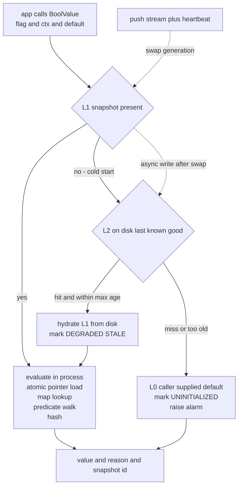
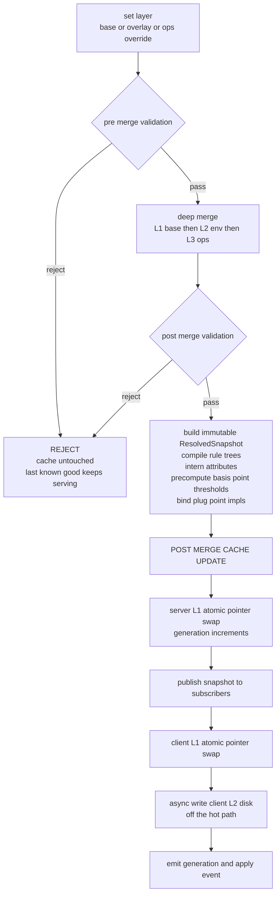
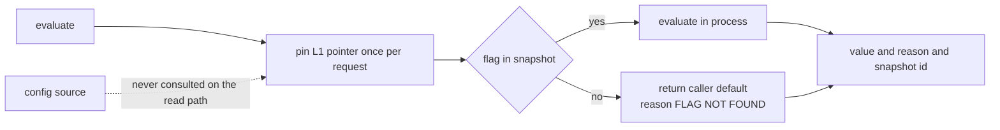
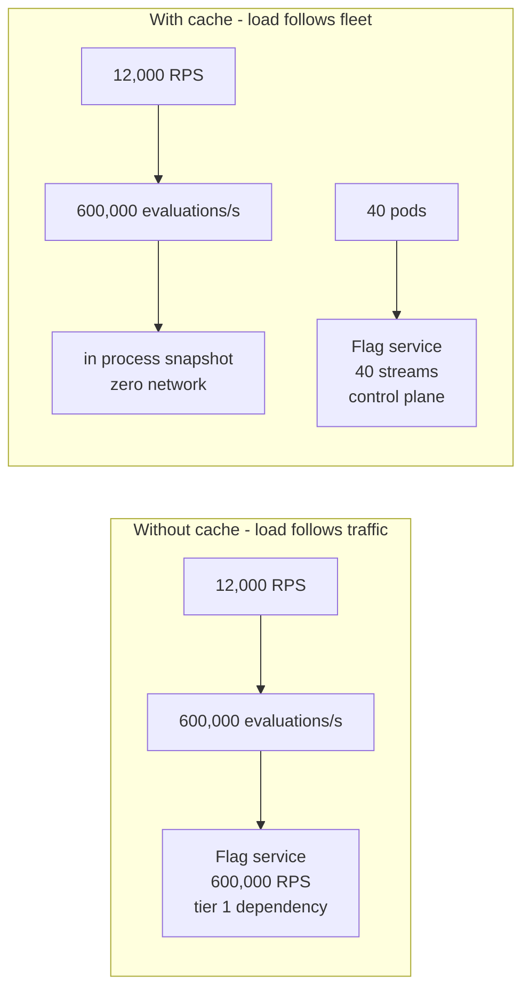
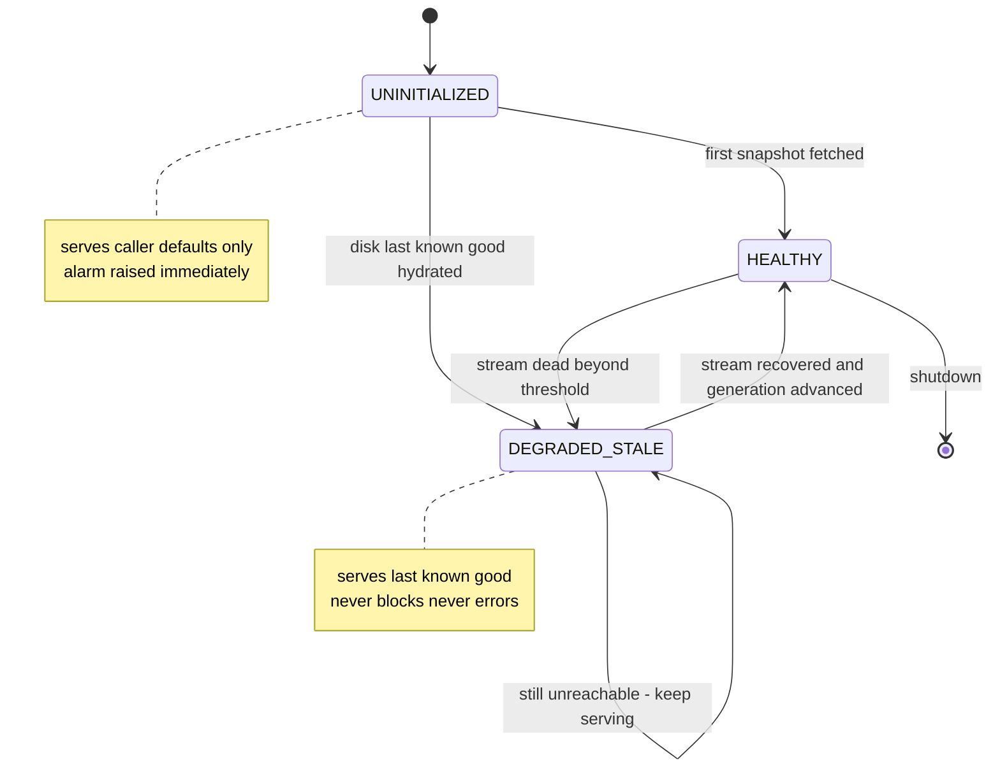

# 03 — LLD: Scale, Caching, Throughput, and Availability

**Status:** DRAFT — pending your sign-off
**Date:** 2026-08-28 · **Owner:** harsh
**Companion:** [`PLAN.md`](../PLAN.md) Phase 2 · [`02-hld.md`](02-hld.md) · [`diagrams/lld.md`](diagrams/lld.md)

---

## 1. The requirement, stated as numbers

| # | Requirement | Value |
|---|---|---|
| S1 | Backend sustained throughput | **12,000 RPS** |
| S2 | Assumed peak headroom | 2x → **24,000 RPS** |
| S3 | Flag evaluation budget per call | **sub-millisecond** |
| S4 | Addressable user population | **1,000,000,000** |
| S7 | Flags evaluated per request `F` | **30 typical, 100 p99** |
| S5 | Availability posture | evaluation must survive a total flag-service outage |
| S6 | Propagation | still under 5s — S3 must not be bought by going stale |

**Derived load.** Let `F` = flags evaluated per request.

```
F = 30  typical  ->  12,000 x 30  =    360,000 evaluations/sec
F = 100 p99      ->  24,000 x 100 =  2,400,000 evaluations/sec   peak worst case
```

The design must hold at **2.4M evaluations/sec**, not 12k. **The unit of load is
evaluations, not requests** — this is the number most capacity plans get wrong,
because `F` is invisible in the RPS figure the product team quotes.

---

## 2. The decisive calculation — why a per-evaluation RPC is disqualified

| Path | p50 | p99 | Meets sub-ms? |
|---|---|---|---|
| Remote RPC per evaluation, F=100 | 44 ms | **208 ms** | ❌ off by 200x. 100 sequential RPCs per request |
| Remote RPC, batched into 1 call | 0.44 ms | **2.08 ms** | ❌ still misses by 2x, before load |
| **Local eval on cached snapshot, F=100** | **~30 µs** | **~340 µs** | ✅ inside 1 ms with margin |
| Local eval, single flag | ~0.3 µs | ~3.4 µs | reference cost |

The remote number is not slow code. It is scheduling, cross-AZ RTT, and TLS —
irreducible. **No amount of server optimisation moves a network hop under a
millisecond at p99.** At 600k evaluations/sec it is also 600k RPC/sec against the
flag service, which is a second distributed system to run.

> **This resolves O5 in favour of a client-cached snapshot.** Not on preference —
> on arithmetic. Section A of the HLD argued against a client snapshot; §3.3 below
> answers that objection directly rather than overruling it.

**L3 is not violated.** The snapshot is cached inside the *application backend*
process. The browser and mobile tiers still never evaluate and never receive flag
config. "Backend-only evaluation" is preserved exactly.

---

## 3. Cache design

### 3.1 The hierarchy



| Tier | Contents | Lifetime | Purpose |
|---|---|---|---|
| **L0** | Caller-supplied default at the call site | compile time | Terminal fallback. Always available, cannot fail |
| **L1** | Full resolved environment snapshot, immutable | process | The hot path. Every evaluation reads only this |
| **L2** | Last-known-good snapshot on local disk | pod | Survives a restart during a flag-service outage |

### 3.2 What is deliberately NOT cached

| Rejected | Why |
|---|---|
| **Per-evaluation result cache** | Evaluation is ~0.3 µs. A map lookup plus invalidation bookkeeping costs more than it saves, and it introduces an invalidation-correctness problem where none exists. Caching a 300ns operation is a net loss |
| **Per-user bucket assignment cache** | See §5. Bucketing is pure computation. Caching it turns an O(1) design into an O(users) one — at 1B users, catastrophically |
| **Negative cache for unknown flags** | A map miss already returns the default in ~50 ns with the correct reason `FLAG_NOT_FOUND` |
| **Shared external cache such as Redis** | Adds the network hop the whole design exists to remove, plus a new availability dependency |

### 3.3 Answering section A's objection

Section A rejected a client snapshot on the grounds that it becomes **a second
evaluator that must agree with the first**, and that with O1 and O2 open, divergence
is guaranteed. The objection is correct. The resolution is not to argue with it:

| Mechanism | Guarantee |
|---|---|
| **One evaluator package** | `internal/core` is compiled into *both* the service binary and the client library. There is one implementation, not two |
| **Server-side eval is the same code path** | The service's own evaluate RPC calls the identical package. It is a debugging and admin surface, not a second implementation |
| **Golden-vector contract test** | A shared fixture corpus runs through both linkages in CI and asserts byte-identical `Result` including `Reason`, `RuleID`, and bucket |
| **Snapshot format is versioned** | A client too old to parse a snapshot refuses it and stays on the previous generation loudly, rather than mis-parsing it quietly |

Divergence is prevented structurally by having no second implementation to diverge.

### 3.4 Cache coherence and the 5s budget

The snapshot is the **only** cached object, so cache invalidation collapses into
snapshot replacement — which the HLD already solved with the atomic pointer swap.
There is no separate invalidation protocol, no TTL sweep, and no partial staleness.

**Invariant CACHE-1.** An evaluation pins the snapshot pointer **once at entry** and
uses that pointer for every flag in the request. Loading per flag would let a swap
land mid-request and produce a result set where flag A came from generation N and
flag B from generation N+1 — a cross-flag inconsistency that is nearly impossible to
reproduce in a bug report.

### 3.5 Post-merge cache update — the write path

**The cache is filled by the write path, never by the read path.** Cache population is
the final stage of the merge pipeline, not a lazy consequence of the first request that
misses.



| Stage | Rule |
|---|---|
| Cache update is the **last** stage | Nothing is cached until the snapshot is fully built and fully validated |
| Update is **all-or-nothing per environment** | Never write flags into the cache incrementally. A partially-applied cache is a config state that no author ever wrote |
| Rejected config **never reaches the cache** | The previous generation keeps serving. A rejection is a no-op on the cache, not a flush |
| L2 disk write is **asynchronous, after** the L1 swap | Disk latency must never sit between a validated snapshot and it becoming live |
| Failure to write L2 is **not** a failure to apply | L2 is a restart optimisation. A disk error degrades cold-start recovery, never the running system |

> **Invariant CACHE-2 — build then swap, never mutate.** The snapshot is constructed
> to completion in a fresh allocation and published with a single atomic pointer
> store. No reader ever observes a partially-built snapshot, because the pointer is
> not published until the object is finished and immutable.

**Why this is not a read-through cache.** A read-through cache fills on miss, which
means the first request after every config change pays a fetch, and concurrent
requests for the same cold key stampede the origin. At 2.4M evaluations/sec a
stampede is not a latency blip — it is an outage. Filling on the write path removes
the failure mode rather than mitigating it: there is no miss to stampede on.

### 3.6 Cache-first read contract

**Every evaluation is served from cache. There is no other path.**



> **Invariant CACHE-3 — the read path performs no I/O.** No network call, no disk
> read, no lock acquisition, no allocation that can fail. An evaluation touches an
> atomic load, a map lookup, a predicate walk, and a hash. Nothing else.

| Situation | Cache-first behaviour | What it is NOT |
|---|---|---|
| Flag present in snapshot | Evaluate against the pinned snapshot | Not a lookup against the config source |
| Flag absent from snapshot | Return caller default, `FLAG_NOT_FOUND` | **Not** a fetch-on-miss. An unknown flag is an answer, not a cache miss |
| Snapshot is stale | Evaluate against it anyway | Not a refresh-then-serve. Freshness is the write path's job |
| No snapshot at all | L2 disk, else caller default | Not a synchronous fetch that blocks the caller |

**The consequence worth stating plainly.** Because the read path never consults the
config source, a flag that has never been merged into a snapshot is indistinguishable
from a flag that does not exist. That is intentional — it is what makes the read path
incapable of blocking, and it is why `FLAG_NOT_FOUND` must be a monitored signal
rather than a silent default. A rising `FLAG_NOT_FOUND` rate is how a forgotten
config push announces itself.

---

## 4. Throughput and capacity

### 4.1 CPU

```
per-evaluation cost   typical flag        ~0.3 µs
                      worst realistic     ~3.4 µs   20 rules x 4 conditions

typical steady state    360,000/s x 0.3 µs =  0.11 core    negligible
peak realistic        2,400,000/s x 0.3 µs =  0.72 core    fine
peak pathological     2,400,000/s x 3.4 µs =  8.16 cores   NOT noise
```

**Reading — this changed with F=100.** At F=8 evaluation was unconditionally noise. At
F=100 the pathological corner — peak traffic, p99 flag count, and the worst flag in the
corpus at once — costs **~8 cores across the fleet**. Still affordable against 40+ pods,
but it is now a line item rather than a rounding error.

**Two consequences that follow directly:**

| # | Consequence |
|---|---|
| 1 | **The batch API is mandatory, not a convenience.** 100 individual client calls per request means 100 × per-call overhead. One batch call pins the snapshot once and amortises the entry boundary across all 100 flags |
| 2 | **Rule-count-per-flag is now a budgeted resource.** A single 20-rule flag evaluated 100 times per request is 340 µs of the 1 ms budget. Lint should warn above ~10 rules per flag, and §7 adds a rule-count gauge |

### 4.2 Memory per application pod

```
resolved snapshot 5,000 flags        ~6 MB
retained generations                 3 max
structural sharing across gens       most flags unchanged, pointers reused
steady state per pod                 ~10 to 18 MB
```

Negligible against a typical Go service heap. **This is what makes the full-snapshot
cache affordable** — the entire config corpus for an environment is smaller than one
JPEG, so there is no reason to cache a subset and no reason to evict.

### 4.3 The load inversion — the point of the whole design

| | Without client cache | With client cache |
|---|---|---|
| Flag service RPS | **2,400,000/s** at peak | **~0** |
| Flag service load driven by | user traffic | fleet size and config change rate |
| Scaling trigger | every traffic spike | adding pods, or editing a flag |
| Flag service capacity plan | a second tier-1 distributed system | a control plane |

Caching converts an **O(traffic)** problem into an **O(pods)** one. At 40 application
pods serving 12,000 RPS, the flag service holds 40 long-lived streams and pushes on
change. Traffic could grow 100x without the flag service noticing.



---

## 5. One billion customers

**The load-bearing property: sticky bucketing is computed, never stored.**

```
bucket = lemire( xxhash64( bucketKey ) , 10000 )
```

`bucketKey` is derived from the evaluation context in the request. Nothing is read,
nothing is written, nothing is remembered.

| Approach | Memory at 1B users | Verdict |
|---|---|---|
| Store user → bucket assignment | 1B x ~16 B = **~16 GB per flag** | Non-starter. And it must be replicated, invalidated, and kept consistent |
| **Compute per evaluation** | **0 bytes, O(1), independent of population** | The design |

This is why user count does **not** appear anywhere in the capacity model. One
billion users and one thousand users cost exactly the same.

### 5.1 Distribution accuracy at population scale

```
bucket space              10,000 basis points
users per basis point     1,000,000,000 / 10,000 = 100,000
```

At 100k users per bucket, sampling error is statistically irrelevant — a 10%
rollout lands within a hair of 10%. **The risk at this scale is hash quality, not
sample size**, which is exactly why §C of the HLD rejected FNV-1a on weak low-bit
diffusion: `% 10000` reads precisely those bits.

### 5.2 Cardinality — the operational trap

| Field | Metric label? | Reason |
|---|---|---|
| flag name | ✅ yes | bounded, ~5,000 |
| environment | ✅ yes | bounded, 3 |
| reason | ✅ yes | bounded, 9 |
| **user id** | ❌ **never** | 1B series would destroy the metrics backend before the flag service noticed |
| **tenant id** | ⚠️ only if bounded and small | verify the ceiling before adding it |

`user_id` belongs in a structured **log line**, sampled, never in a metric label.

---

## 6. Availability

### 6.1 The decoupling argument

| Design | Effective availability |
|---|---|
| Per-request RPC to flag service | `min(app, flag service)` — a 99.9% flag service **caps the app at 99.9%** and adds its outages to yours |
| Client-cached snapshot | app availability is **independent** of flag-service availability. A flag-service outage degrades config *freshness*, never evaluation |

This is the strongest argument for the cache, stronger than latency. It removes the
flag service from the request-path critical dependency set entirely.

### 6.2 Client state machine



### 6.3 Startup posture — the call that needs your agreement

**Position: application startup must NOT block on the flag service.**

If it does, the flag service becomes a hard dependency of every deploy and every pod
restart across the fleet — a single point of failure with fleet-wide blast radius,
which is strictly worse than the problem flags were introduced to solve.

Accepted consequence, stated plainly: a pod that starts during a total flag-service
outage **with no L2 disk cache** serves compiled-in defaults. The L2 tier exists
precisely to make this window rare rather than routine.

| Scenario | Behaviour |
|---|---|
| Normal start | Fetch snapshot, enter `HEALTHY`, serve real config |
| Flag service down, L2 present and fresh | Hydrate from disk, `DEGRADED_STALE`, serve last-known-good, alarm |
| Flag service down, no L2 | `UNINITIALIZED`, serve caller defaults, **loud** alarm |
| Flag service dies mid-life | Stay on current snapshot indefinitely. No hard expiry |

**No hard cache expiry.** Expiring the cache converts a freshness problem into an
availability outage — precisely backwards. Named risk: a kill switch will not
propagate during a total outage. That is the accepted cost of never failing closed.

### 6.4 Readiness

`/ready` gates on `state != UNINITIALIZED`. It does **not** gate on being `HEALTHY` —
a `DEGRADED_STALE` pod serving last-known-good config is a working pod, and refusing
traffic from it during a flag-service outage would convert a control-plane incident
into a data-plane one.

---

## 7. What this section commits to

| Signal | Target | Alert |
|---|---|---|
| Evaluation p99, single flag | < 50 µs | > 200 µs sustained 5 min |
| Evaluation p99, full request batch F=100 | < 500 µs | > 1 ms sustained 5 min |
| Rules per flag | ≤ 10 | lint warning above 10; alert above 20 |
| Flag service RPS from evaluation | ~0 | any sustained non-zero — means the cache is bypassed |
| `flag_client_fallback_total` | ~0 | **alert low** — see hazard H1, silent fail-open |
| `flag_client_state` | `HEALTHY` | any pod in `UNINITIALIZED` > 60s |
| `pending_changes_seconds` | < 5 | > 5 for any environment |
| Snapshot memory per pod | < 25 MB | > 50 MB |
| Bucket distribution drift | within tolerance | golden-vector diff fails the build |

---

## 8. Open items this section adds

| # | Item | Needs |
|---|---|---|
| ~~S-O1~~ | ~~Confirm `F`~~ **CLOSED: 30 typical, 100 p99.** Capacity model above reflects it | — |
| S-O2 | L2 disk cache — in or out for Phase 1? | Cheap and bounded; materially shrinks the cold-start-during-outage window |
| S-O3 | Max acceptable staleness during a total outage | Currently unbounded by design. If a compliance limit exists, it changes §6.3 |
| S-O4 | Tenant-label cardinality ceiling | Needed before `tenant_id` may be a metric label |
