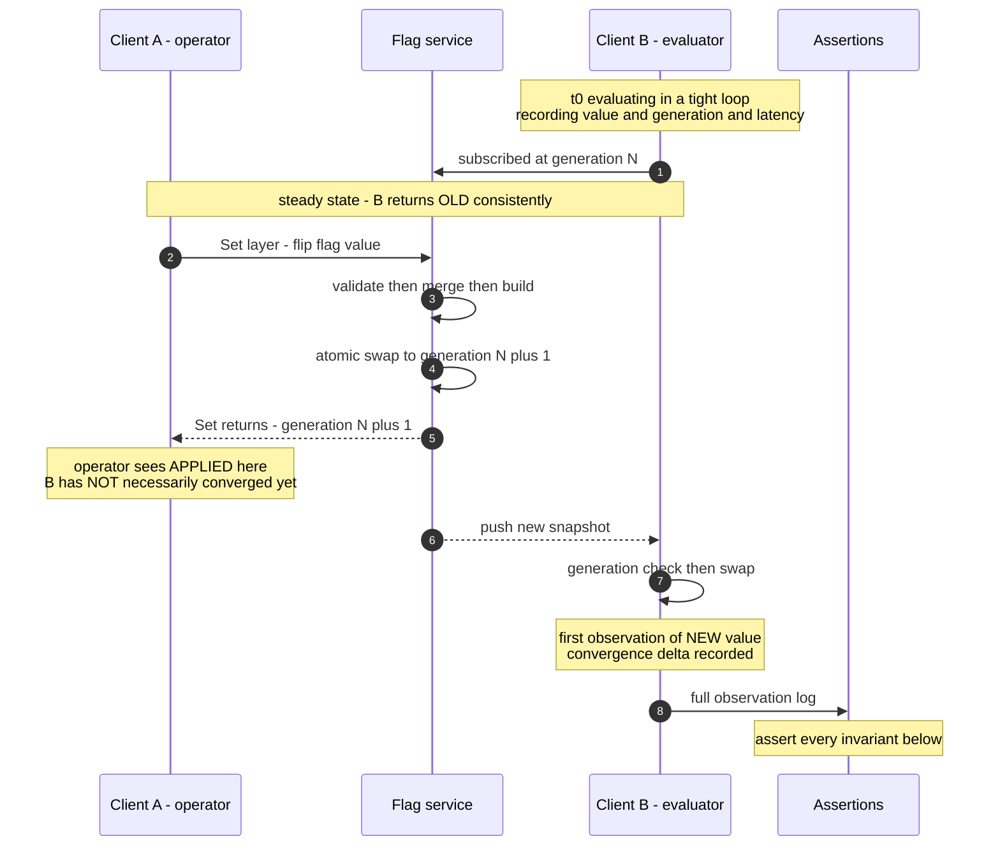

# 05 — Consistency Model, E2E Scenario, and Load Benchmark

**Status:** SPEC — implementation pending
**Date:** 2026-08-28 · **Owner:** harsh
**Companion:** [`PLAN.md`](../PLAN.md) Phase 10 · [`03-lld.md`](03-lld.md)

This document specifies (1) exactly what the system guarantees when a write and a
read race, (2) the two-client end-to-end scenario that proves it, and (3) the load
benchmark that proves the throughput claim.

---

## 1. The consistency model, stated honestly

Two actors. **Client A** applies config. **Client B** evaluates. They are different
processes and there is no coordination between them.

### 1.1 What IS guaranteed

| # | Guarantee | Mechanism |
|---|---|---|
| **G1** | **Single-generation read isolation.** One evaluation — or one batch of 100 — reads exactly one generation. Never a mixed-generation result set | Snapshot pointer pinned once at entry, invariant CACHE-1 |
| **G2** | **No torn reads.** A reader never observes a partially-built snapshot | Build to completion in a fresh allocation, publish with a single atomic store, invariant CACHE-2 |
| **G3** | **Per-client monotonic reads.** A client never regresses to an older generation | Generation compared before swap; `SnapshotID` is `instance_id + generation`, so a server restart cannot make a client think it is ahead |
| **G4** | **Bounded convergence.** Every healthy client reaches the new generation within the propagation bound | Push, plus heartbeat-detected reconnect, plus reconcile poll. Target under 5s; measured worst case ~2.04s |
| **G5** | **Integrity is never sacrificed.** A client serves valid config or last-known-good valid config. Never invalid, never partial, never a zero value | Validate before build; rejected config is a no-op on the cache |
| **G6** | **Bucketing stability across generations.** Raising a rollout percentage does not re-bucket anyone already enrolled | Monotone ramp: fixed key, `bucket < basisPoints` |

### 1.2 What is NOT guaranteed — and why that is the right call

| # | Not guaranteed | Why we chose this |
|---|---|---|
| **N1** | **Linearizability across clients.** `Set()` returning does NOT mean every client sees the new value | Acknowledging the whole fleet would make every config write as slow as the slowest pod, and would FAIL whenever any pod is unhealthy. A config write that cannot complete during a partial outage is a config write you cannot use during an incident — exactly when you need it |
| **N2** | **Read-your-writes across processes.** An operator who writes via client A and immediately evaluates via client B may observe the old value | Direct consequence of N1. The operator-facing mitigation is to report generation, not to add coordination — see §1.3 |
| **N3** | **Simultaneous fleet cutover.** During the convergence window, pod 1 may serve the new value while pod 2 serves the old | Unavoidable without a distributed transaction across the fleet. §1.4 states what this means for flag authors |
| **N4** | **Freshness during a total outage.** With no hard cache expiry, a disconnected client serves last-known-good indefinitely | Expiring the cache would convert a freshness problem into an availability outage. Named risk: a kill switch will not propagate to a disconnected client |

### 1.3 The consistency class, named

**Config distribution is AP with bounded staleness.** Under a partition between the
flag service and a client, the client chooses availability: it keeps evaluating
against last-known-good.

The property sacrificed is **freshness**, never **integrity**. A stale client returns
a value that was correct a moment ago. It never returns a torn, invalid, partial, or
zero value. That distinction is the whole design: staleness is a bounded, observable,
recoverable condition; corruption is not.

### 1.4 What this means for a flag author

Stated plainly, because it is the part that surprises people:

- **For a kill switch**, the convergence window is the time your incident continues.
  Budget for it. It is bounded, measured, and alerted — but it is not zero.
- **For a rollout**, a user may see the old value on one request and the new value on
  the next, if the two requests landed on pods at different generations. Any flag
  gating a *multi-request user journey* must be evaluated once and carried, not
  re-evaluated at each step.
- **For a schema-coupled flag** — a flag whose new value requires a code path only
  present in a new deploy — the flag must be flipped only after the deploy has fully
  rolled out, never during. This is a deploy-ordering constraint, not a flag bug.

---

## 2. The two-client E2E scenario

**Goal:** prove G1–G6 and characterise the N1 window with real measurements, in a
single test, with two independent clients and a real running service.

### 2.1 Shape

### 2.2 Assertions — each maps to a numbered guarantee

| # | Assertion | Proves |
|---|---|---|
| A1 | Every observed value is either OLD or NEW. Never a third value, never the zero value, never the caller default | G5 |
| A2 | The observation log contains **exactly one** OLD→NEW transition. No flapping back to OLD after converging | G3 |
| A3 | Every batch of 100 flags returns results that all share **one** generation | G1 |
| A4 | Zero errors, zero panics, zero `ReasonError` across the whole run | never-throw |
| A5 | Convergence delta from `Set()` returning to B's first NEW observation is **measured and reported**, and asserted under the 5s budget | G4 |
| A6 | During the window, B returns OLD **consistently** — the pre-transition segment is uniform, not intermittent | G2, G3 |
| A7 | Evaluation p99 during the swap is **not materially worse** than steady-state p99. A config swap must not be visible as a latency event | G2, atomic swap |
| A8 | After convergence, B's generation is monotonically non-decreasing for the rest of the run | G3 |
| A9 | Reported generation on B's results advances exactly once and matches the server's post-write generation | G3, G4 |

### 2.3 The variants that must also be covered

| Variant | What it catches |
|---|---|
| **Swap lands mid-batch** | Writer flips config while B is inside a 100-flag batch. A3 must still hold — this is the bug that pinning per flag instead of per request would produce, and it is nearly impossible to reproduce from a bug report |
| **Rapid successive writes** | Three writes in quick succession. B must converge to the FINAL state and must never settle on an intermediate one |
| **Invalid write mid-stream** | A rejected config must be a no-op: B's generation and values unchanged, and A receives a structured rejection listing every violation |
| **Service dies mid-run** | B keeps serving last-known-good with zero errors. State moves to `DEGRADED_STALE`. On recovery, B converges without a restart |
| **B starts cold while service is down** | B serves caller defaults, state `UNINITIALIZED`, alarm raised, and evaluation still never throws |
| **Two writers** | Concurrent `Set()` on the same environment. Generations remain monotonic and the final state matches one of the writes, not a mixture |
| **Environment isolation** | A writes to prod; a third client on dev observes **no** generation change at all |

### 2.4 Determinism requirement

The test must not be time-flaky. Poll with a deadline and assert on the *observation
log*, never on `sleep`-then-check. Report the measured convergence delta as test
output so a regression shows up as a number trending upward rather than as a sudden
failure.

---

## 3. Load benchmark

**Goal:** substantiate the throughput and latency claims in `03-lld.md` §2 and §4
with measurements from the real code path, not arithmetic.

### 3.1 Scenarios

| # | Scenario | Measures |
|---|---|---|
| **L1** | Single-flag `BoolValue`, cached snapshot, no contention | Floor cost per evaluation. Target ~0.3 µs |
| **L2** | Batch of 100 flags, one pin | The realistic p99 request shape at F=100. **Target: under 1 ms** |
| **L3** | L2 across N goroutines saturating all cores | Achieved evaluations/sec against the 2.4M peak target. Proves the read path does not contend |
| **L4** | **L3 with concurrent config churn** — a writer swapping the snapshot every 100 ms | The load-bearing one. Proves the atomic swap does not degrade readers and that GC pressure from discarded generations is acceptable |
| **L5** | Worst realistic flag: 20 rules × 4 conditions, batch of 100 | The pathological corner. Establishes whether the ~8-core figure holds |
| **L6** | Memory: snapshot resident size at 1k / 5k / 20k flags | Validates the ~6 MB at 5k flags claim and the per-pod ceiling |

### 3.2 Reported metrics

Per scenario: p50, p95, p99, p999 latency; achieved evaluations/sec; **allocations
per operation** (must be 0 on the read path — a single allocation per evaluation is
2.4M allocs/sec at peak and turns the GC into the bottleneck); bytes per operation;
and GC pause distribution for L4.

### 3.3 Pass criteria

| # | Criterion | Source |
|---|---|---|
| P1 | L2 p99 under **1 ms** | The stated sub-millisecond budget at F=100 |
| P2 | L1 allocations per op = **0** | Read path must not allocate |
| P3 | L4 p99 within **20%** of L3 p99 | A config swap must not be a latency event |
| P4 | L3 achieved throughput extrapolates to **2.4M evaluations/sec** across the fleet | Peak capacity claim |
| P5 | L6 at 5k flags under **10 MB** | Snapshot sizing claim |

**A failing pass criterion is a finding, not a test to relax.** If P1 fails, the
sub-millisecond claim in the design is wrong and the design changes — the number does
not get quietly restated.

### 3.4 Honesty requirements

- Report the machine: CPU model, core count, Go version, OS. A benchmark without a
  machine is a number without units.
- Single-machine results **extrapolate** to fleet capacity; say so rather than
  implying a measured fleet.
- Report `-benchtime` and iteration counts. A benchmark that ran 3 iterations is noise.
- If a target is missed, report the miss and the gap. Do not tune the test until it
  passes.
