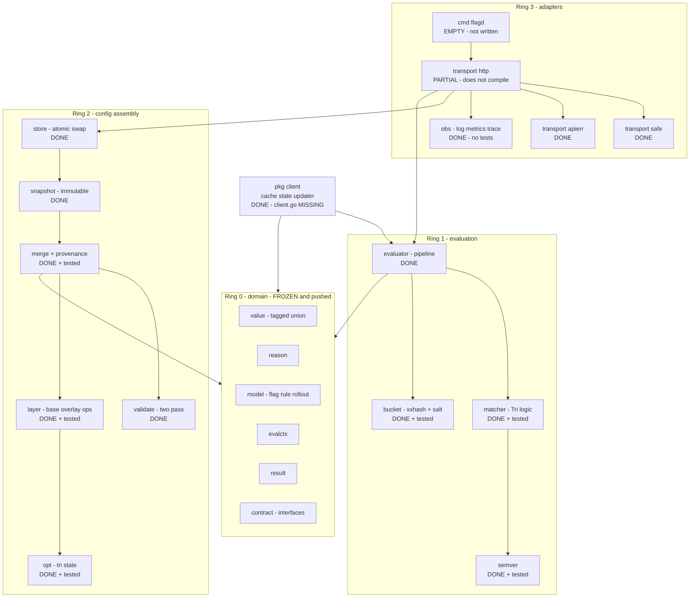

# 06 — Implementation Status

**As of:** 2026-08-28 · **Branch:** `feat/core-and-scaffold`
**Purpose:** what is actually on disk, so you can verify it and tell me what to change.
Verified by reading the tree and running the compiler — not from intent.

---

## 1. Build and test truth

| Package | Builds | Tests | Test funcs |
|---|---|---|---|
| `internal/core` | ✅ | ✅ pass | 43 |
| `internal/config` | ✅ | ✅ pass | 26 |
| `internal/obs` | ✅ | ❌ none written | 0 |
| `internal/transport/apierr` | ✅ | ❌ none | 0 |
| `internal/transport/safe` | ✅ | ❌ none | 0 |
| `internal/transport/http` | ❌ **FAILS** — 5 handlers referenced by `server.go` are undefined | ❌ | 0 |
| `pkg/client` | ✅ | ⚠️ not yet run | 19 |
| `cmd/flagd` | ⚠️ **directory is empty** | — | 0 |

**`go build ./...` currently fails.** One package, `internal/transport/http`, is
mid-write: `server.go` routes to `handleApplyLayer`, `handleSnapshotDebug`,
`handleHealth`, `handleLive`, `handleReady`, none of which are defined yet.

**Nothing beyond the ring-0 contract has been committed or pushed.**

---

## 2. What exists, by layer

---

## 3. Design decisions, and whether the code actually implements them

| Decision | Implemented as | Status |
|---|---|---|
| **O1** bucket salt defaults to flag key | `core.NamespaceStrategy.Key`, `Rollout.BucketNamespace` | ✅ + golden vectors |
| **O2** rules first, rollout on fallthrough | `core.Evaluator.Evaluate`, `EvaluationOrder` required when both present | ✅ |
| **O3** reject at config time AND fail safe at eval | `config.ValidateBase/Overlay/Ops` + `validateResolved`; evaluator returns caller default | ✅ |
| **O4** hybrid push + heartbeat + poll | `client/updater.go` | ⚠️ written, untested |
| **O5** client-cached snapshot | `client/cache.go`, `client/state.go` | ⚠️ written, entrypoint missing |
| Value never coerces | `core.Value.AsBool/AsInt/AsString` | ✅ tested |
| Absent attribute false **before** negation | `core.decideCondition` via `Tri` | ✅ tested |
| No torn reads, atomic swap | `config.Store` + `atomic.Pointer` | ✅ built, ⚠️ concurrency test not yet run |
| Rejected config is a no-op on cache | `Store.Set` returns `BuildReport`, no swap on rejection | ✅ |
| Per-flag quarantine with safety valve | `config.QuarantineBudget`, `MaxFlagsPerEnv` | ✅ |
| Provenance for forensics | `config.FlagProvenance` | ✅ |
| Rollout deep-merges, never replaces | `merge.mergeFlag` | ✅ tested |
| Rule list replace-or-append only | `config.RuleListMode` | ✅ |

**One design element the code went beyond the spec on:** the matcher uses a
four-state `Tri` (`TriTrue`, `TriFalse`, plus undecidable variants `TriBadType`,
`TriBadValue`, `TriBadOp`) rather than a plain bool. That makes "condition was false"
distinguishable from "condition could not be evaluated", and feeds a
`ConditionObserver` hook so wrong-type attributes are countable rather than silent.
This is better than what I specified. **Please confirm you want it kept** — it adds a
concept to the codebase.

---

## 4. NOT implemented — the honest list

| # | Missing | Blocks |
|---|---|---|
| M1 | `cmd/flagd/main.go` — the service does not start | Everything runtime |
| M2 | 5 HTTP handlers — the package does not compile | The whole HTTP surface |
| M3 | `pkg/client/client.go` — typed accessors and `Batch` | The public API |
| M4 | Tests for `obs`, `safe`, `apierr`, `transport/http` | Merge gate |
| M5 | **Two-client E2E scenario** | Your requested verification |
| M6 | **Load benchmark** at F=100 | Every latency and throughput claim |
| M7 | README, CONTRIBUTING | Public repo quality |
| M8 | `go test -race ./...` has never run clean | Merge gate |

---

## 5. What I want you to check

1. **The `Tri` four-state matcher** (§3) — keep it, or collapse to a bool?
2. **`Store.Set` returns `*BuildReport`, not `error`.** It aggregates every finding
   across every environment rather than failing at the first. Right call for an
   operator fixing config, but it is a non-obvious API. Agree?
3. **Env list is fixed at construction** (`DefaultEnvironments` = dev/staging/prod,
   overridable via `WithEnvironments`). Should an unknown environment in an overlay
   be a rejection, or should it auto-create the environment?
4. **`MaxFlagsPerEnv = 20000`** and `QuarantineBudget = max(20, 5%)`. Are these the
   numbers you want?
5. **No Prometheus dependency** — `obs.Metrics` is an interface with an expvar-backed
   implementation. Confirm, or should I add the real client?
