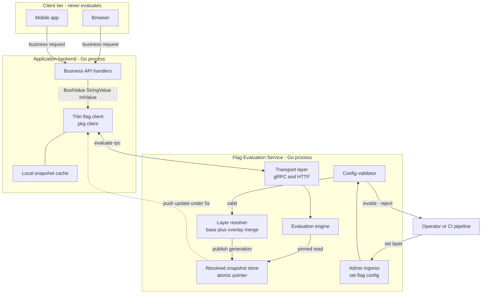
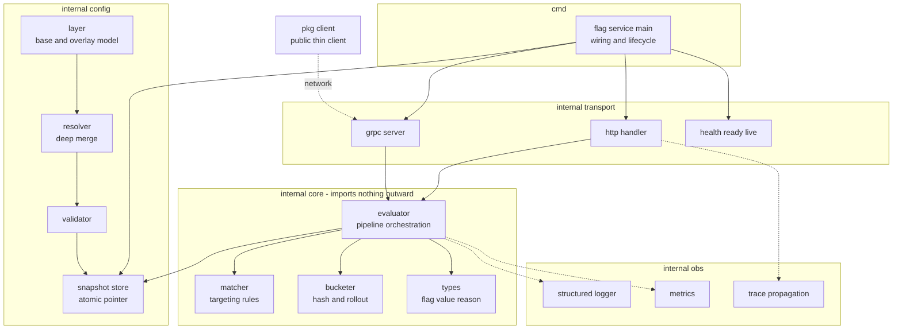
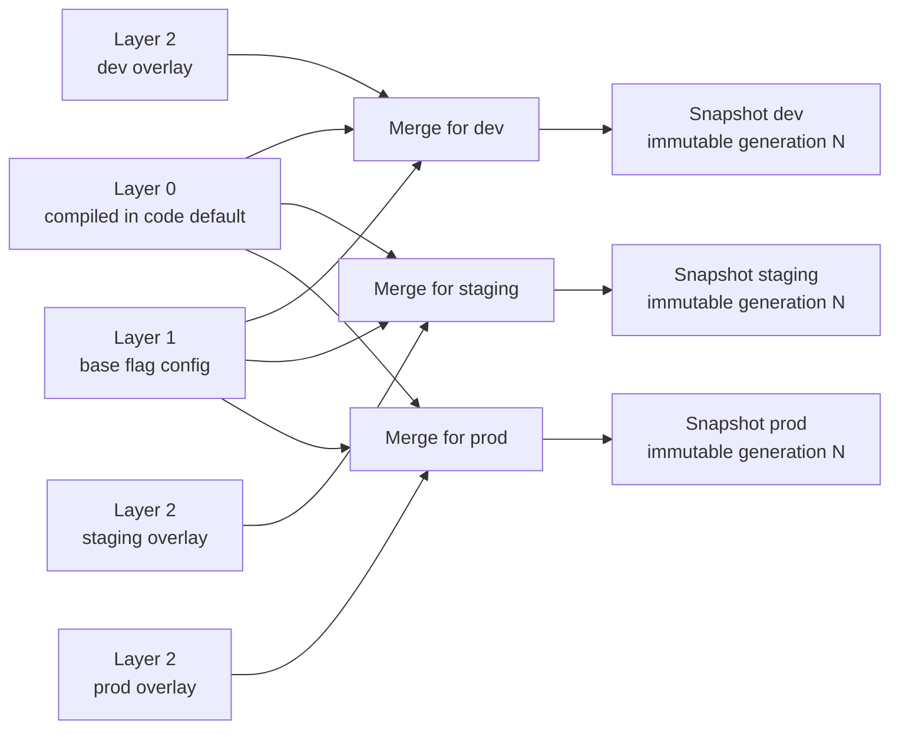
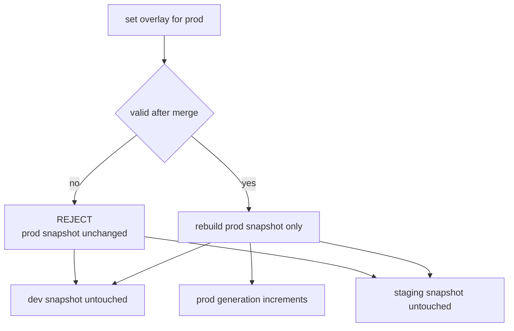
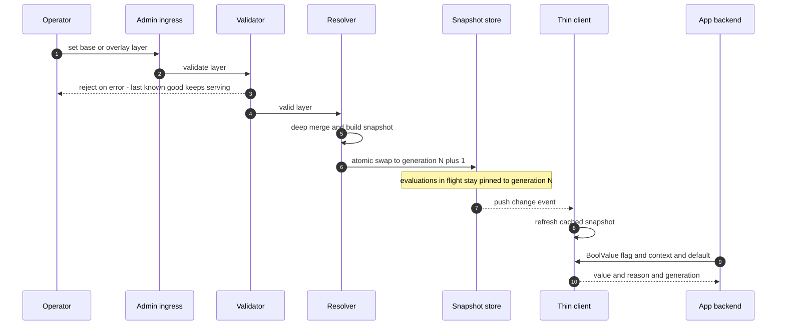
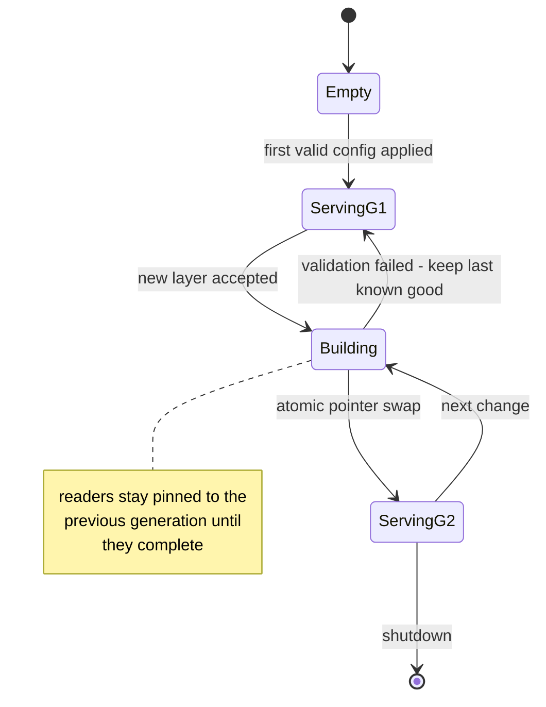

# HLD Diagrams — Feature Flag Service

Companion to `PLAN.md` Phase 1. All diagrams are Mermaid and render in GitHub,
GitLab, VS Code, and IntelliJ without a plugin.

---

## H1 — Container view

Who runs where, and what crosses the wire. Evaluation happens **only** inside the
Flag Evaluation Service; the client tier never sees flag config.

**The trade-off this shape buys.** A network hop now sits in the caller's hot path.
The mitigations are the local snapshot cache, a hard client timeout, and a fail-open
posture that returns the caller-supplied default rather than an error.

---

## H2 — Component view and dependency direction

Imports point **inward**. `internal/core` imports no transport, no config source,
and no logging implementation — only interfaces. That is what keeps the evaluation
engine unit-testable without a server.

---

## H3 — Helm-style config layering

One base layer of shared flag definitions, one overlay per environment, merged into
an immutable snapshot per environment. **The merge runs at config-write time, not per
request** — evaluation reads a prebuilt map.

Precedence rises left to right. Scalars override. The list-merge rule for **targeting
rules** is the one genuinely hard call and is settled in PLAN.md Phase 1.2 — ordered
lists do not deep-merge safely.

---

## H4 — Environment isolation

A bad prod overlay cannot reach dev. Merge and rebuild are scoped to one environment.

---

## H5 — Live update propagation, end to end

The hard requirement is **under 5 seconds, no restart**. The risky hop is the last one.

---

## H6 — Snapshot lifecycle under concurrent readers

Readers never block and never tear. An in-flight evaluation pins its snapshot once at
entry and finishes against that generation even if a swap lands mid-request.

