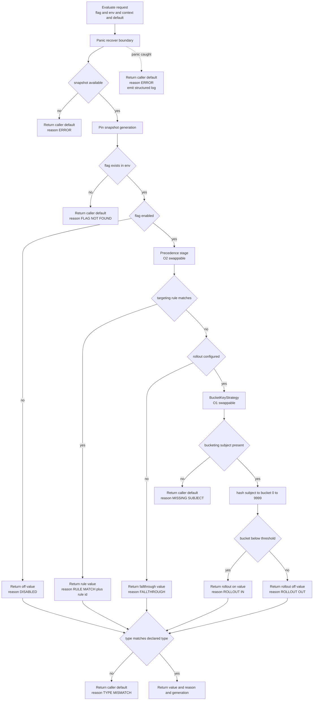
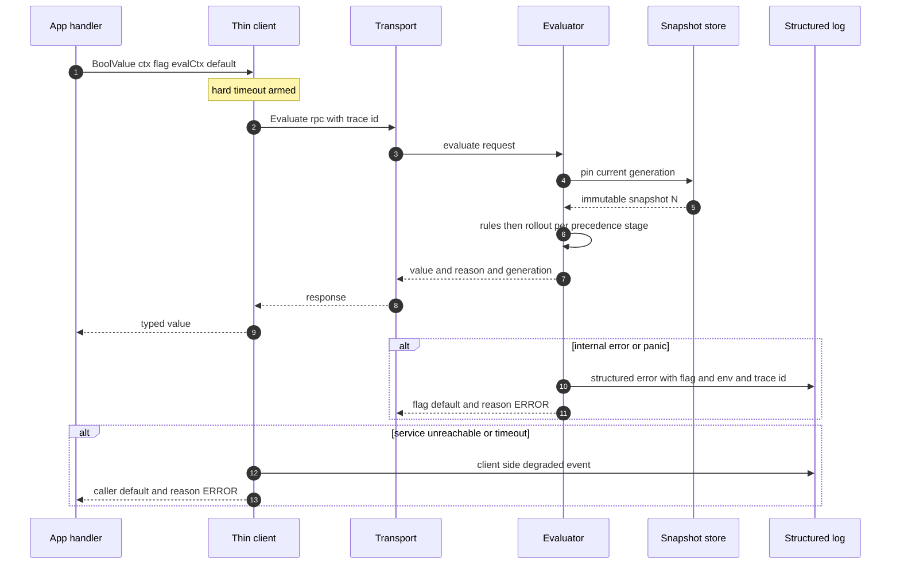
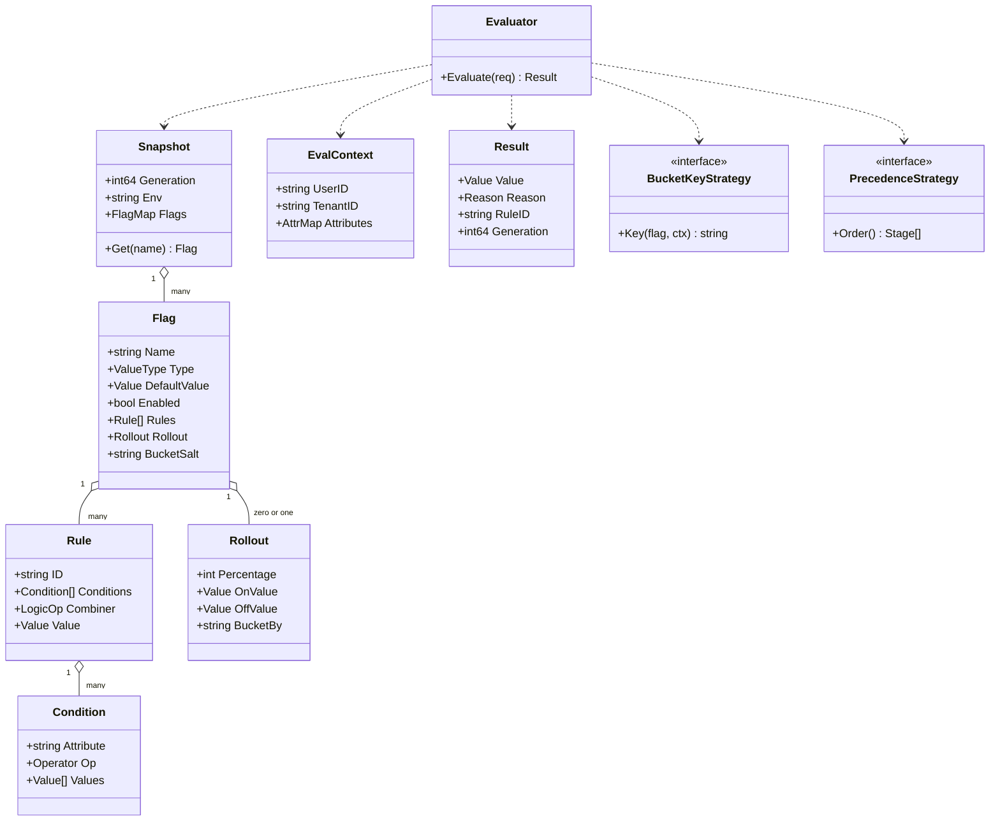
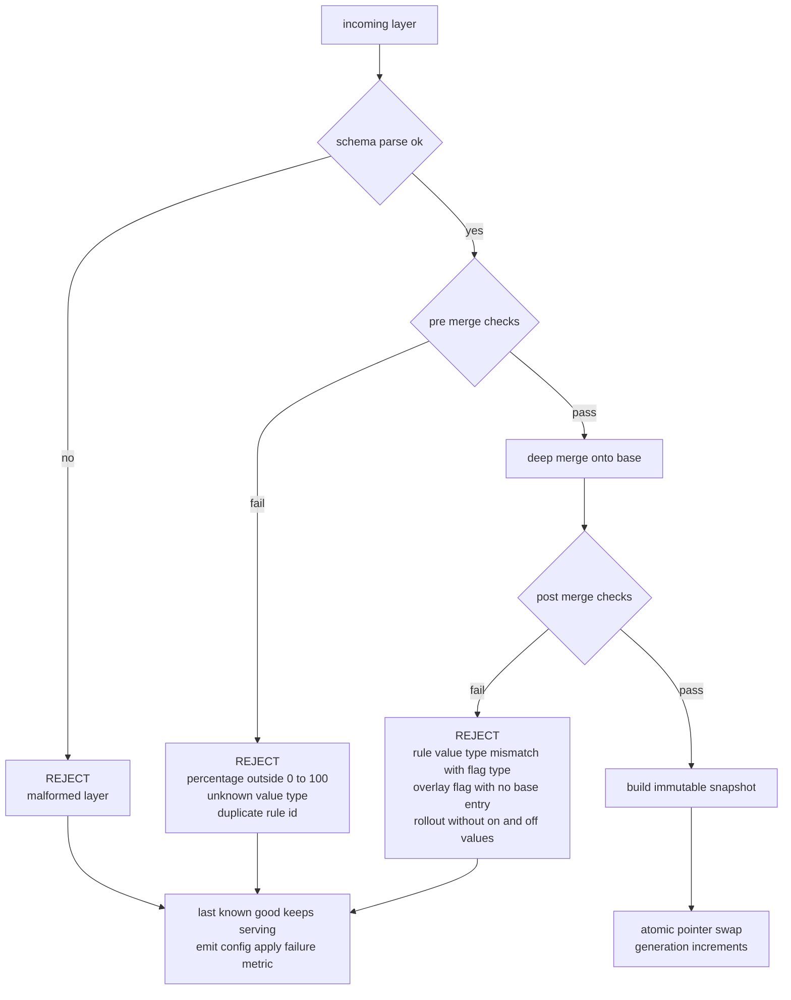
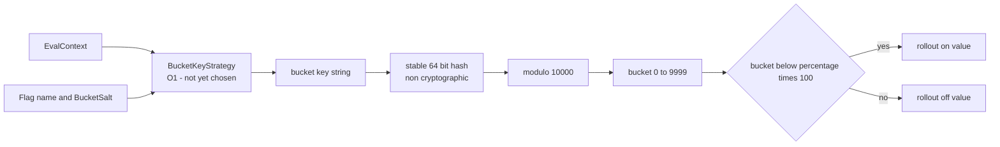
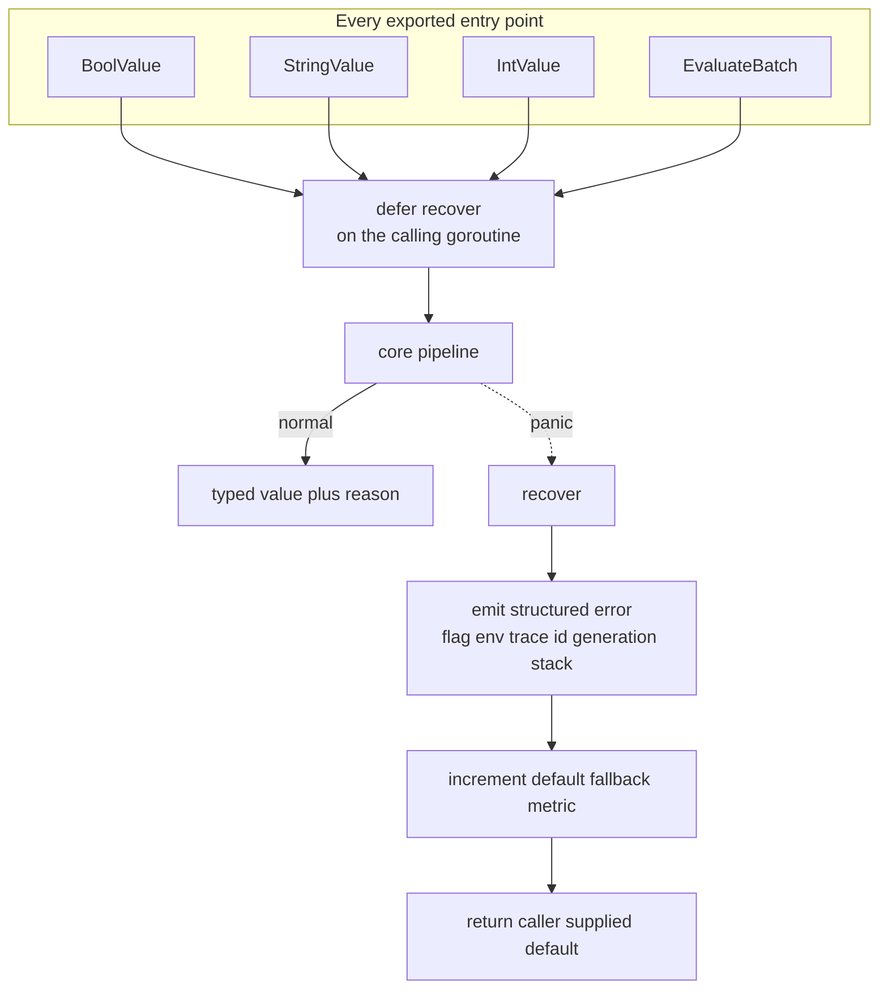

# LLD Diagrams — Feature Flag Service

Companion to `PLAN.md` Phase 2. Component-level detail: the evaluation pipeline,
type model, validation flow, and the never-throw boundary.

> **O1** = bucketing key, **O2** = rule-vs-rollout precedence. Both are still your
> open decisions. They appear below as **swappable stages**, not as chosen behaviour.

---

## L1 — Evaluation pipeline

Every terminal node returns a value. There is no path that returns an error to the
caller — that is the never-throw contract made structural rather than promised.

---

## L2 — One evaluate call, across the boundary

---

## L3 — Core type model

`BucketKeyStrategy` is the single plug point for **O1**. `PrecedenceStrategy` is the
single plug point for **O2**. Choosing either later touches one file, not the pipeline.

---

## L4 — Config validation, pre-merge and post-merge

A layer that is valid **alone** can merge into a flag that is invalid. Both passes are
needed. Nothing invalid ever replaces a serving snapshot.

---

## L5 — Sticky bucketing mechanism

Stickiness holds because the hash is pure, stable across restarts, and depends on
nothing but the key. Changing the hash or the key **re-buckets every user mid-rollout**
— treat it as a change-controlled operation, not a refactor.

Bucket space is 0–9999 rather than 0–99 so that fractional percentages such as 0.5%
are expressible without a later breaking change to the bucketing maths.

---

## L6 — The never-throw boundary

**The trap:** `recover` only catches panics on its own goroutine. Any goroutine the
engine spawns — a config watcher, a batch fan-out — needs its own boundary. A panic in
an unguarded background goroutine kills the whole process, taking every flag with it.

---

## Evaluation reason enum

| Reason | Fires when | Serves |
|---|---|---|
| `RULE_MATCH` | a targeting rule matched | rule value, rule id attached |
| `ROLLOUT_IN` | bucket below threshold | rollout on value |
| `ROLLOUT_OUT` | bucket at or above threshold | rollout off value |
| `FALLTHROUGH` | no rule matched, no rollout | flag fallthrough value |
| `DISABLED` | flag exists but is off | flag off value |
| `FLAG_NOT_FOUND` | no such flag in this env | caller default |
| `TYPE_MISMATCH` | resolved value type is not the declared type | caller default |
| `MISSING_SUBJECT` | rollout configured, bucketing subject absent | caller default |
| `ERROR` | internal fault or recovered panic | caller default |

Every non-error reason is a **normal** outcome. Only `TYPE_MISMATCH`, `ERROR`, and a
rising `FLAG_NOT_FOUND` rate are worth alerting on — the rest are the system working.
